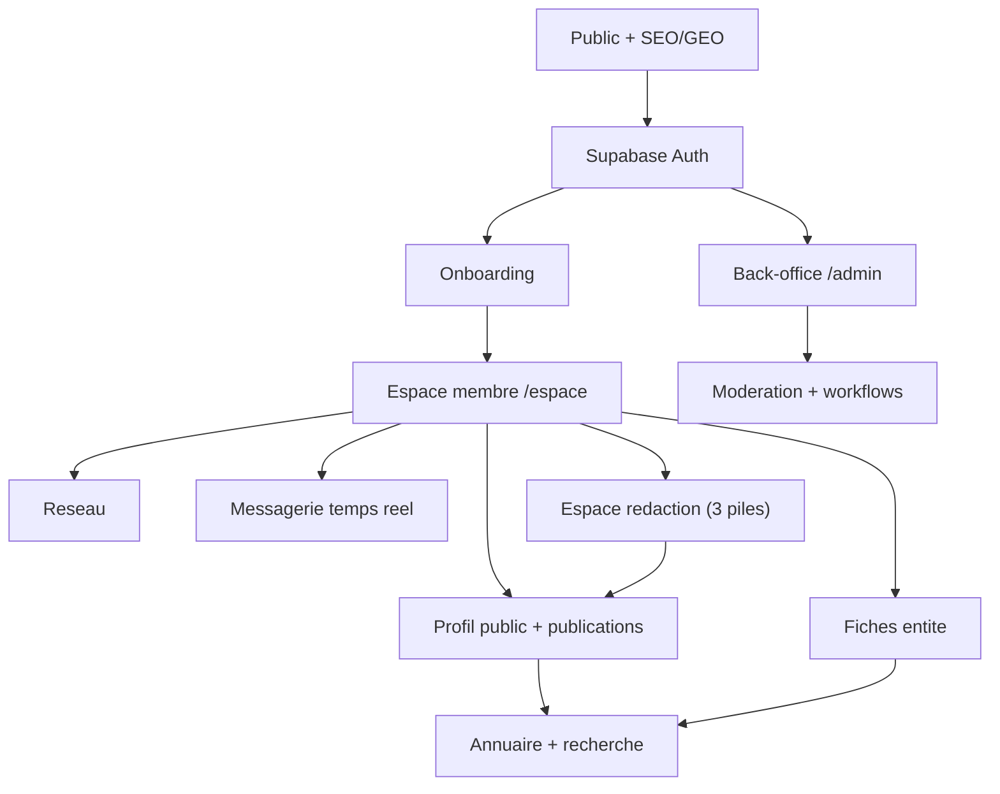
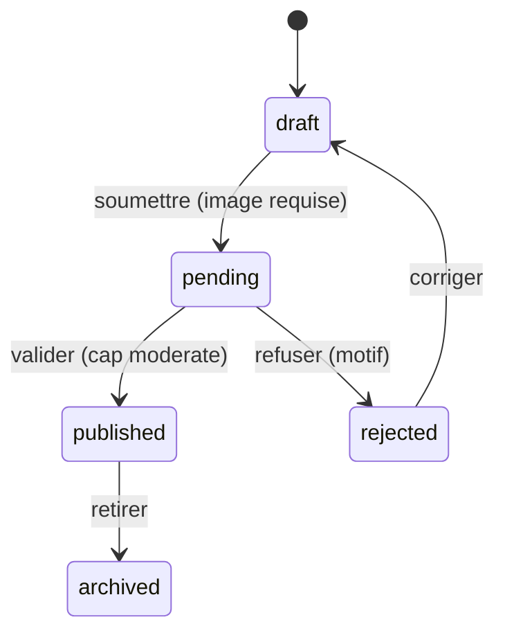
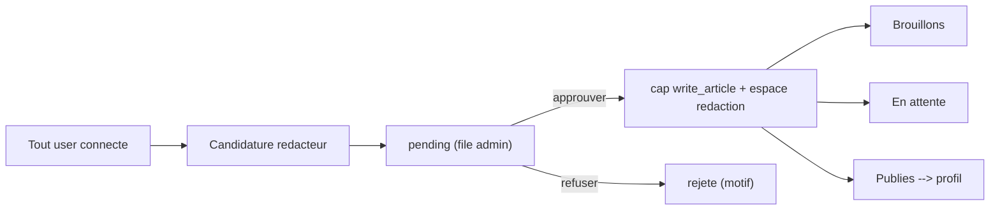
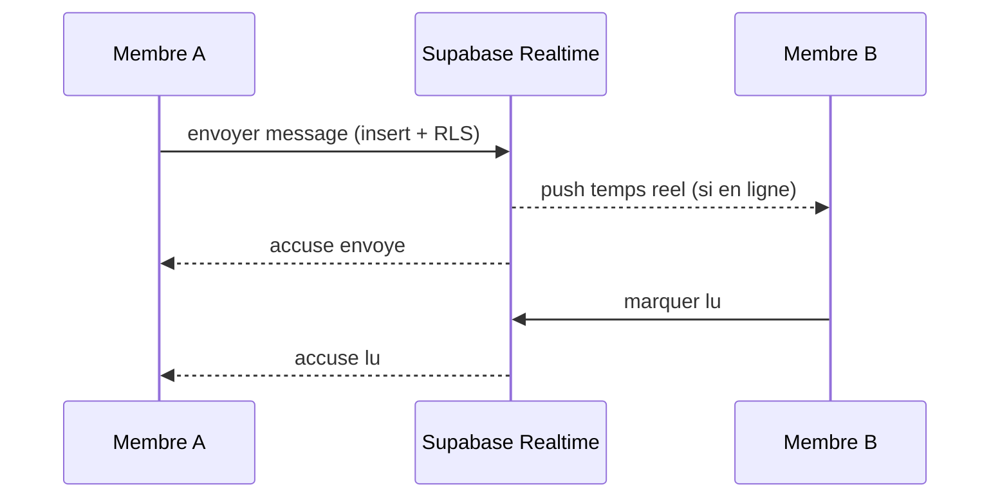
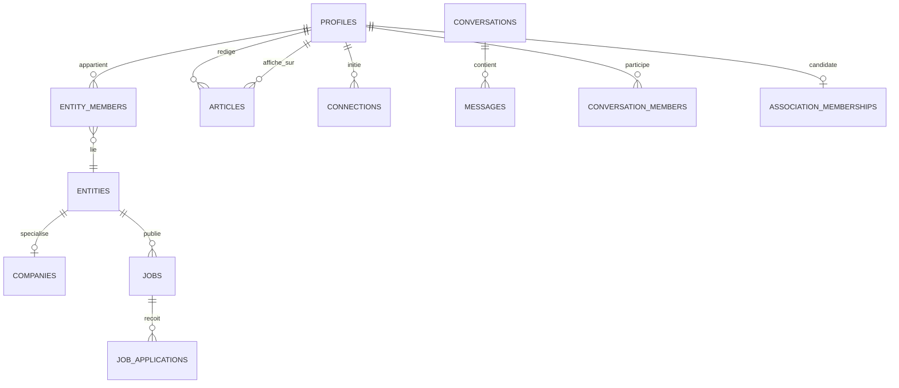

# PRODUCT REQUIREMENTS DOCUMENT — ClubProprete.com

**Le réseau professionnel de la propreté en France**

| | |
|---|---|
| **Version** | 13.0 — édition consolidée, corrigée, auditée et testée |
| **Date** | 30 juin 2026 |
| **Stack** | Next.js 15 · Supabase (Postgres + Auth + Storage + Realtime + Edge Functions) · Resend · PostHog/Plausible · Vercel · Claude Code — *(Upstash/Redis différé, cf. décision ci-dessous)* |
| **Auth** | Supabase Auth ; autorisation 100 % par capacités (`has_capability`) + RLS Postgres ; aucun claim `role` |
| **Modèle** | 46 tables (39 fonctionnelles + 7 infra) · SQL complet vérifié |

> Ce document intègre les corrections de l'audit CTO v9 (B1–B5, T1–T12, V1–V6) ET de l'audit RLS d'exécution (deadlocks 1A/1B, failles 2A/2B/2C, optimisations 3A/3B). Des tests pgTAP couvrent ces scénarios (Annexe H). Document « à plat » : une seule vérité par sujet, prêt pour l'exécution agentique (Claude Code).

---

## Table des matières

- 0. Note de lecture & décisions fermes
- 1. Résumé exécutif
- 2. Vision & périmètre
- 3. Personas
- 4. Architecture & modules
- 5. Rôles, capacités & permissions
- 6. Diagrammes (Mermaid)
- 7. Flows utilisateurs (F-01 → F-25)
- 8. UX écran par écran
- 9. Pages & espaces
- 10. Fonctionnalités clés
- 11. Modèle de données (source unique, SQL complet)
- 12. Sécurité — RLS (capacités uniquement, SQL complet)
- 13. Mécanisme d'autorisation — Auth Hook & fraîcheur
- 14. Clarifications du modèle (intégrité & cas limites)
- 15. Types de notifications (liste fermée)
- 16. RLS — couverture nominale des 46 tables
- 17. Capacités — cycle de vie & gates produit
- 18. Machine à états
- 19. Opérationnel technique
- 20. SEO / AEO / GEO
- 21. Coûts, sauvegarde, conformité FR
- 21bis. RGPD — protocole détaillé
- 22. Roadmap (MVP-blocs) & DoD
- 23. Risques
- 24. Tests & qualité (AC complets)
- 25. Synthèse & checklist de complétude
- Annexe A — SQL exécutable (migrations Phase 0)
- Annexe B — Storage (buckets & policies)
- Annexe C — Routes & permissions
- Annexe D — Design system
- Annexe E — Templates Resend
- Annexe F — Questions ouvertes
- Annexe G — Référentiels métier (listes fermées)
- Annexe H — Tests pgTAP (scénarios RLS & sécurité)

---

## 0. Note de lecture & décisions fermes

Document « à plat » : chaque sujet n'est traité qu'à un seul endroit, avec une seule version valide. Aucune couche corrective surimposée, aucun « ordre d'autorité » à mémoriser.

- **Modèle de données + SQL** : chapitre 11 (et Annexe A pour le bloc exécutable d'un seul tenant).
- **Sécurité / RLS** : chapitre 12 (SQL complet, helpers). Autorisation 100 % par capacités ; aucun claim `role`.
- **Mécanisme d'autorisation (Auth Hook + fraîcheur)** : chapitre 13.
- **Cycle de vie des capacités & gates** : chapitre 17.
- **Flows F-01→F-25** : chapitre 7 ; critères d'acceptation complets au chapitre 24.
- **Annexes A→G** : SQL exécutable, Storage, Routes, Design system, Templates Resend, Questions ouvertes, Référentiels métier.

### Décisions fermes

- Autorisation par capacités via `has_capability()` ; `main_role` = routing/identité, lu en base.
- Messagerie 1-1 d'abord ; groupes en Phase 3 (schéma prévu : `conversation_type`, `conv_member_role`).
- Modération livrée **avec** l'UGC. **Pas de table `leads`** (F-24 ouvre une conversation + notification).
- Ressources conservées (M09 : `resources` + `resource_downloads`). Centres de formation en texte libre (`programs_text`).
- Aucune monétisation. Aucune migration (projet *from scratch*). Produit FR-FR (i18n réversible, sans champ `locale`).
- **Annexe G : référentiels métier centralisés pour validation applicative (Zod).**
- **Rate limiting via Postgres (`rate_limits`) au lancement** ; Upstash/Redis différé à la montée en charge (évite un service tiers tant que la concurrence ne le justifie pas).

> **Correction v13 (audit d'exécution #3)** : la policy `media_write` distingue désormais le type de propriétaire — média de profil (`owner_id = auth.uid()`), média d'entité (`is_entity_member(owner_id)`), média d'article (auteur). Cela débloque l'upload de logos et photos d'entité, impossible auparavant car `owner_id` y vaut l'`entity_id`, jamais l'uid. Test pgTAP ajouté.

> **Corrections v12 (audit d'exécution #2)** : A (triggers de réindexation sur les tables filles companies/suppliers/training_orgs/independents — l'index de recherche reste à jour à la création ET à la modification), B (`deleted_at is null` ajouté aux SELECT `articles_read`/`jobs_read`/`missions_read`/`messages_read` — un contenu soft-deleté n'est plus lisible en accès direct), C (validation serveur de `direct_key` calculée en base), D (`guard_member_role` laisse passer le `service_role` pour la maintenance), E (`seed_test.sql` fourni pour les tests pgTAP). **Décision d'architecture** : Upstash/Redis différé — rate limiting via la table Postgres `rate_limits` au lancement, bascule Upstash à la montée en charge.

> **Corrections v11 (audit RLS d'exécution)** : 1A (création d'entité — deadlock levé), 1B (auto-owner premier membre), 2A (editor ne peut pas se promouvoir owner — trigger guard), 2B (seul le destinataire accepte une connexion), 2C (candidat mission : withdraw uniquement), 3A (has_capability via opérateur @>), 3B (recalc ne révoque pas un admin_grant). Tests pgTAP en Annexe H. **Corrections v10** : B1 (`jobs.slug`), B2 (`companies.description`), B3 (triggers search `deleted_at`), B4 (modérateur peut flagger), B5 (`recalc_entity_capabilities`), T1 (géo `jobs`), T2 (`logo_url` fournisseurs/centres), T3+T6+V6 (Annexe G + `resources.cover_image`), T5 (`profiles.current_entity_id`), T9 (bucket `verification-proofs`), T4/T7/T8/T10/T11/T12 (dettes documentées), V1–V5 (cohérence de forme).

---

## 1. Résumé exécutif

### 1.1 Le produit

ClubProprete.com est une plateforme B2B entièrement gratuite pour l'écosystème de la propreté en France. Elle réunit six facettes autour d'un cœur « réseau professionnel » de type LinkedIn vertical : profils publics riches et graphe social (connexions, suivi, recommandations, messagerie temps réel) ; annuaire B2B (sociétés, fournisseurs, centres de formation, indépendants) ; média à rédaction communautaire ouverte ; emploi (offres + candidatures) ; club associatif sur candidature validée ; et un back-office de pilotage et modération.

### 1.2 Le problème

Secteur atomisé (30 000+ entreprises), au bouche-à-oreille, sans plateforme centrale. Difficulté à recruter, à trouver des sous-traitants fiables, à se former, à se rendre visible et à se mettre en relation.

### 1.3 Les cinq causes racines et leur résolution

| Cause | Problème | Résolution |
|---|---|---|
| C1 | Rôle unique vs permissions multi-rôles ; super admin perdu | Autorisation par capacités + RLS ; super admin par variable d'env (chap. 4, 12) |
| C2 | Workflows de modération incomplets | Machine à états explicite + actions admin + audit (chap. 18) |
| C3 | Saisie non structurée (texte libre) | Autocomplétion ville, tags compétences/services, sélecteurs (chap. 8) ; référentiels en Annexe G |
| C4 | Séparation des espaces floue | Coquille /espace à navigation persistante (chap. 9) |
| C5 | Uploads cassés, erreurs avalées | Supabase Storage + feedback explicite + persistance (chap. 8, 10) |

### 1.4 Proposition de valeur

> « Le réseau professionnel de toute la propreté française : un profil qui vous rend visible, un réseau qui vous fait travailler, un média que vous écrivez — gratuitement. »

---

## 2. Vision & périmètre

| Facette | Rôle | Brique technique |
|---|---|---|
| Réseau professionnel | Identité publique, connexions, suivi, recommandations, messagerie temps réel | Profils + graphe + Supabase Realtime |
| Annuaire B2B | Découvrabilité : fiches + recherche + filtres géo | `entities` + `search_index` + RLS |
| Média / blog | Autorité & SEO : rédaction communautaire, articles sur le profil | Espace rédaction + Storage |
| Emploi | Activation : offres, candidatures, alertes | Job board vertical |
| Club associatif | Confiance : adhésion gratuite sur candidature validée | Association + statut membre |
| Back-office | Pilotage : utilisateurs, rôles, entités, demandes, modération, audit | CRM admin / super admin |

### 2.1 Principes directeurs

- **Profil au centre** : fiche, article, offre, recommandation, message — tout s'attache à une identité publique.
- **Gratuité totale** : aucune monétisation, aucune mise en avant payante.
- **Navigation stable** : coquille /espace persistante ; une fiche n'écrase jamais le profil.
- **Données propres à la saisie** : autocomplétion, tags, sélecteurs (référentiels Annexe G) ; jamais de texte libre sur les champs structurants.
- **Sécurité par conception** : autorisation portée par les RLS Postgres, alignée sur le module d'accès applicatif.

### 2.2 Hors scope (ferme)

- Toute monétisation : abonnements, fiches/profils sponsorisés, offres en vedette, affiliation, premium, publicité.
- Toute priorisation commerciale dans l'annuaire ou la recherche.
- Application mobile native (web responsive mobile-first).
- Migration de données (projet *from scratch*).

---

## 3. Personas

| Persona | Profil | Fréquence | Action principale | Prio business |
|---|---|---|---|---|
| P1 | Dirigeant de PME de nettoyage (30–200 salariés) | Hebdo → mensuel | Créer/vérifier sa fiche, recruter, trouver un sous-traitant | 🔴 Maximale |
| P2 | Indépendant / auto-entrepreneur | Hebdo | Compléter profil, candidater missions, se connecter | 🟡 Moyenne |
| P3 | Fournisseur (produits, machines, équipements, logiciels) | Mensuel | Créer fiche catégorisée, recevoir des contacts | 🟠 Haute |
| P4 | Centre / organisme de formation | Mensuel → trimestriel | Référencer organisme + formations (texte libre) | 🟠 Haute |
| P5 | Candidat / demandeur d'emploi | Ponctuel | Postuler, créer une alerte | 🟡 Moyenne (trafic) |
| P6 | Rédacteur / contributeur (tout user) | Mensuel | Candidater rédacteur, écrire et publier | 🟢 Support (autorité) |
| P7 | Membre de l'association | Hebdo → mensuel | Candidater à l'adhésion, accéder au privé + sous-traitance | 🟠 Haute (confiance) |
| P8 | Admin & Super admin | Quotidien (ops) | Valider, modérer, gérer rôles/entités, piloter | 🔴 Critique (ops) |

> **P4 (décision v9 maintenue)** : pas de catalogue structuré — les formations proposées sont en texte libre (`training_orgs.programs_text`).

---

## 4. Architecture & modules

```
PUBLIC (non connecté) : Accueil · Annuaires · Profils publics · Blog · Emploi · Formations · Association · Recherche
        │ Supabase Auth (email + OAuth) → Onboarding wizard → entité(s) + capacités
        ▼
ESPACE MEMBRE (/espace)                  BACK-OFFICE (/admin)
  nav latérale persistante :               CRM admin / super_admin :
  Mon profil · Mon réseau · Messages       Vue d'ensemble · Utilisateurs & capacités
  Ma/Mes fiche(s) + switcher               Entités · Demandes (vérif/adhésion/
  Espace rédaction (3 piles)               rédacteur/claim/retrait)
  Mes offres / candidatures                Modération & signalements
  Sous-traitance (membre) · Paramètres     Blog · Audit · Paramètres
```

| # | Module | Détail |
|---|---|---|
| M01 | Site public + SEO/AEO/GEO | Accueil, institutionnel, FAQ schema, pages géolocalisées |
| M02 | Auth (Supabase) + compte | Email + OAuth, reset, suppression RGPD, sessions |
| M03 | Onboarding wizard par situation | Branché, ville/SIRET/tags, cumul, reprise |
| M04 | Profils publics (type LinkedIn) | Header, compétences, entités, recommandations, publications |
| M05 | Annuaire entités + recherche | Sociétés, fournisseurs, centres, indépendants ; filtres service+géo |
| M06 | Graphe social | Connexions, suivi, recommandations |
| M07 | Messagerie temps réel | 1-1 (groupes en Phase 3) — Supabase Realtime |
| M08 | Média / blog + espace rédaction | Candidature ouverte, 3 piles, articles sur le profil |
| M09 | Ressources téléchargeables | Modèles, checklists ; gating email |
| M10 | Emploi | Offres, candidatures, alertes, expiration |
| M11 | Association (sur candidature) | Adhésion gratuite validée, badge, privé |
| M12 | Sous-traitance privée | Missions réservées membres, candidatures |
| M13 | Modération & signalements | Files, décisions tracées, machine à états |
| M14 | Notifications | In-app + email + préférences + file fiable |
| M15 | Back-office admin / super admin | CRM complet, audit, paramètres |
| M16 | Recherche globale | Cross-module via search_index, autocomplétion, filtres |
| M17 | Analytics & audit | KPI + journal d'audit |
| M18 | Paramètres & RGPD | Sécurité, notifications, export/suppression |

---

## 5. Rôles, capacités & permissions

Supabase Auth gère l'authentification. L'autorisation repose exclusivement sur des **capacités** : la table `user_capabilities` alimente un claim JWT `capabilities` (array), lu identiquement par le module d'accès applicatif et par les RLS via `has_capability()`. **Aucun claim `role`** : `main_role` sert au routing/identité et est lu en base.

### 5.1 Identité & capacités

- Rôles d'identité (`profiles.main_role`, contrainte `check`) : registered_user, company_owner, verified_company, supplier_owner, verified_supplier, training_org_owner, verified_training_org, independent, verified_independent, candidate, author, admin, super_admin.
- `association_member` est un **statut** dérivé de la table d'adhésion, pas un rôle.
- **Capacités stockées** : `write_article`, `publish_job`, `publish_mission`, `access_subcontracting`, `moderate`, `admin_panel`. (cf. chap. 17 pour les gates implicites)
- **Super admin** : emails lus depuis `SUPER_ADMIN_EMAILS` (valeur confirmée : `clement@pershingsolution.com`) ; élévation idempotente au démarrage et au login (pose `moderate` + `admin_panel`).
- **Cumul** : un utilisateur peut détenir plusieurs entités et capacités simultanément.

### 5.2 Matrice rôles × permissions (extrait)

✔ autorisé · — interdit · (val) validation requise · C/M/S créer/modifier/supprimer.

| Action / Rôle | Visit. | Inscrit | Entr. vérif. | Fourn./Centre | Indép. | Cand. | Réd. | Admin | S.admin |
|---|---|---|---|---|---|---|---|---|---|
| Voir pages & fiches publiques | ✔ | ✔ | ✔ | ✔ | ✔ | ✔ | ✔ | ✔ | ✔ |
| Profil public + publications | ✔(lect.) | C/M | C/M | C/M | C/M | C/M | C/M | M | M |
| Créer/éditer sa fiche entité | — | C | C/M | C/M | C/M | — | — | M tout | M tout |
| Demander vérification fiche | — | — | C(val) | C(val) | C(val) | — | — | ✔ | ✔ |
| Connexion / suivi / recommandation | — | ✔ | ✔ | ✔ | ✔ | ✔ | ✔ | ✔ | ✔ |
| Messagerie temps réel | — | ✔ | ✔ | ✔ | ✔ | ✔ | ✔ | ✔ | ✔ |
| Candidater rédacteur | — | C(val) | C(val) | C(val) | C(val) | C(val) | déjà | ✔ | ✔ |
| Écrire / publier un article | — | — | — | — | — | — | C/M(val) | M/S | M/S |
| Publier une offre d'emploi | — | — | C(vérif.) | — | — | — | — | C/M/S | C/M/S |
| Postuler à une offre | — | ✔ | ✔ | ✔ | ✔ | ✔ | ✔ | — | — |
| Candidater à l'association | — | C(val) | C(val) | C(val) | C(val) | C(val) | C(val) | ✔ | ✔ |
| Accès sous-traitance (membre) | — | — | memb. | memb. | memb. | — | — | ✔ | ✔ |
| Modérer contenus & entités | — | — | — | — | — | — | — | ✔ | ✔ |
| Gérer capacités & paramètres | — | — | — | — | — | — | — | (part.) | ✔ |

---

## 6. Diagrammes (Mermaid)

Syntaxe Mermaid valide (ASCII littéral, copier-coller compatible). Relations ER en notation standard `||--o{`.

### 6.1 Architecture produit


### 6.2 Cycle de vie d'un article


### 6.3 Devenir rédacteur


### 6.4 Messagerie temps réel (1-1)


### 6.5 Modèle relationnel (extrait)


---
## 7. Flows utilisateurs (catalogue unique F-01 → F-25)

Chaque flow : objectif, étapes, critères d'acceptation. Catalogue complet et sans collision. Les flows impactés par l'audit v10 sont annotés.

### F-01 — Inscription & onboarding par situation

**Objectif :** Convertir un visiteur en profil propre, branché selon la/les situation(s).

> T8 (dette MVP) : la reprise de l'onboarding s'appuie sur l'état des entités déjà créées. Si l'utilisateur s'arrête avant la création d'entité, il recommence à l'étape 1 — acceptable pour le MVP (pas de table `onboarding_state`).

**Étapes :**
1. Inscription Supabase Auth (email ou OAuth) + email de confirmation (CTA renvoyer si non cliqué).
2. Étape Contact : ville autocomplétée → INSEE+CP+région+lat/lng (jamais NULL).
3. Étape Situation(s) : cases MULTIPLES possibles (société, fournisseur, centre, indépendant, demandeur).
4. Étapes spécifiques par situation cochée (SIRET, tags services/compétences, famille→sous-catégorie — référentiels Annexe G).
5. Récap → crée entité(s), pose `main_role` (situation la plus forte), cumule capacités, init profil. Reprise possible à chaque étape.

**Critères d'acceptation :**
- Géo normalisée non NULL ; compétences en tags ; cumul de situations supporté ; aucun re-passage ne rétrograde `main_role`.

### F-02 — Connexion / déconnexion

**Objectif :** Authentifier et router selon l'identité.

**Étapes :**
1. Connexion email/OAuth.
2. Élévation super admin si email ∈ SUPER_ADMIN_EMAILS (pose capacités).
3. Routing : capacité `admin_panel` → /admin ; sinon /espace.

**Critères d'acceptation :**
- Super admin élevé au login sans script ; routing correct ; déconnexion invalide la session.

### F-03 — Reset mot de passe

**Objectif :** Récupération sans fuite d'information.

**Étapes :**
1. Demande (réponse neutre anti-énumération).
2. Email Supabase Auth (lien expirant).
3. Nouveau mot de passe.

**Critères d'acceptation :**
- Réponse toujours neutre ; lien à usage unique et expirant.

### F-04 — Suppression de compte (RGPD)

**Objectif :** Supprimer et anonymiser.

**Étapes :**
1. Confirmation forte.
2. Soft-delete + masquage annuaire + anonymisation PII (profil-tombstone).
3. Messages : expéditeur anonymisé, contenu conservé pour le destinataire.
4. Purge Storage (avatars/cv/proofs/exports).
5. Email de confirmation + déconnexion.

**Critères d'acceptation :**
- Fiche retirée de l'annuaire ; PII anonymisées ; historique du destinataire préservé ; fichiers Storage purgés.

### F-05 — Création / édition de fiche entité

**Objectif :** Doter une entité d'une fiche riche et vérifiable.

**Étapes :**
1. Depuis /espace (profil conservé).
2. Champs structurés (site, Maps, GBP, géo, services ≠ segments, sous-catégorie ; description ; logo).
3. Sauvegarde → entité active (publiée) ; score de complétion.

**Critères d'acceptation :**
- Profil jamais écrasé ; champs persistés ; services validés serveur (référentiel Annexe G).

### F-06 — Vérification de fiche (toute entité)

**Objectif :** Badge vérifié pour société, fournisseur, centre, indépendant.

> B5 + T9 : la révocation conditionnelle de `publish_job` est portée par `recalc_entity_capabilities` ; les preuves vont dans le bucket `verification-proofs` (Annexe B).

**Étapes :**
1. Demande par créneaux structurés + questionnaire (preuves → bucket `verification-proofs`).
2. File admin → approuver (`verified=true` + rôle `verified_*` + pose `publish_job` via `recalc_entity_capabilities`) / refuser (motif).
3. En cas de refus OU de perte ultérieure de vérification : **appel de `recalc_entity_capabilities(user_id)`** qui révoque `publish_job` si plus aucune entité vérifiée.
4. Refresh des capacités/session (cf. chap. 13).

**Critères d'acceptation :**
- Les 4 types d'entités peuvent être vérifiés ; badge sans reconnexion ; `publish_job` posée à l'approbation et révoquée si la dernière vérification tombe (B5).

### F-07 — Revendication de fiche (claim)

**Objectif :** Revendiquer une fiche pré-créée.

**Étapes :**
1. « C'est mon entreprise » → preuve (domaine email ou justificatif).
2. File admin → approuver (rattachement) / refuser (motif).

**Critères d'acceptation :**
- Aucune fiche détournée sans preuve ; rattachement éditable après approbation.

### F-08 — Annuaire & recherche

**Objectif :** Trouver et entrer en relation.

**Étapes :**
1. Recherche globale via `search_index` (autocomplétion + catégorie).
2. Filtres service + géo + vérifié ; liste + carte.
3. Consultation → connexion / suivi / contact / message.

**Critères d'acceptation :**
- Résultats filtrables ; URL partageable ; états vides utiles.

### F-09 — Connexions, suivi & recommandations

**Objectif :** Construire le graphe social.

**Étapes :**
1. Connexion : l'émetteur crée une demande (pending) ; SEUL le destinataire peut l'accepter (2B).
2. Suivi unilatéral ; recommandation rattachée au profil (modérable).

**Critères d'acceptation :**
- Liens créés/supprimables ; l'émetteur ne peut pas auto-accepter (2B) ; recommandations signalables ; blocage respecté.

### F-10 — Offre d'emploi & candidature

**Objectif :** Recruter et postuler.

> B1 : `jobs.slug` (unique) alimente la route `/emploi/{slug}`. T1 : `jobs.lat/lng` indexés pour la recherche géolocalisée.

**Étapes :**
1. Publication (slug généré applicatif `slugify(titre)+hash` ; gating réel, auto-publication entité vérifiée) → /emploi/{slug} + alertes.
2. `expires_at` (défaut +60 j), clôture/réouverture par le recruteur.
3. Candidature (anti-doublon) → suivi (submitted→…→hired|rejected|withdrawn).

**Critères d'acceptation :**
- Offre vérifiée visible sous `/emploi/{slug}` ; offre expirée/soft-deleted retirée de la recherche ; candidature suivie ; alertes envoyées.

### F-11 — Association (candidature & sous-traitance)

**Objectif :** Rejoindre le club gratuit validé.

**Étapes :**
1. Candidature adhésion → file admin → approuver/refuser (motif).
2. À l'approbation : statut membre actif immédiat → `access_subcontracting` + `publish_mission` → espace privé + sous-traitance.

**Critères d'acceptation :**
- Adhésion approuvable ; sous-traitance débloquée sans reconnexion.

### F-12 — Devenir rédacteur & espace rédaction (3 piles)

**Objectif :** Ouvrir la rédaction à tout user ; exposer ses articles sur son profil.

**Étapes :**
1. Tout user connecté candidate (expertise, motivation) — rate-limité.
2. File admin → approuver (cap `write_article` + espace rédaction) / refuser (motif).
3. Espace à 3 piles : Brouillons · En attente · Publiés.
4. Rédaction (image fiable via Storage) → soumission → pending → validation → published.
5. Article published affiché sur la fiche profil de l'auteur.

**Critères d'acceptation :**
- Candidature ouverte à TOUT user ; 3 piles avec compteurs ; upload fiable et persistant ; article publié visible sur le profil.

### F-13 — Cycle de vie d'un article

**Objectif :** Workflow éditorial gardé.

**Étapes :**
1. draft → pending (image requise) → published | rejected (motif).
2. published → archived ; published → révision (article enfant) → validation → remplace.
3. Article published listé sur le profil ; soft-deleted → disparaît de la recherche (B3).

**Critères d'acceptation :**
- Transitions gardées serveur + RLS ; révision sans casser la version en ligne ; `deleted_at` retire de `search_index`.

### F-14 — Modération / signalement

**Objectif :** Traiter contenus litigieux.

> B4 : la RLS `messages_update` autorise `auth.uid() = sender_id OR has_capability('moderate')` — le modérateur peut donc poser `flagged=true`.

**Étapes :**
1. « Signaler » (article/profil/message/recommandation/entité) → `report`.
2. Pour un message : le modérateur peut poser `flagged=true` (RLS `messages_update` autorise `moderate`), ce qui rend le message lisible par la modération.
3. Décision : dismiss | hide | warn | suspend | ban | delete (motif) ; auto-hide possible ; escalade d'urgence.
4. Récidive : 3 signalements validés → suspension auto 24 h ; notifications + audit.

**Critères d'acceptation :**
- Décision tracée ; un modérateur peut effectivement flagger puis lire un message signalé (B4) ; messages non signalés restent privés.

### F-15 — Messagerie temps réel (1-1)

**Objectif :** Échange direct entre membres.

**Étapes :**
1. Depuis un profil/fiche → « Message » → conversation 1-1 (clé `direct_key` unique).
2. Temps réel via Realtime ; accusés envoyé/lu (global par conversation, cf. T4) ; présence.
3. Pièces jointes (Storage, ≤5 Mo, ≤5 par message) ; blocage ; notifications hors-ligne via file.
4. Fallback polling si Realtime indisponible (cf. chap. 19).

**Critères d'acceptation :**
- Message livré en temps réel ; non-participant exclu (RLS) ; envoi refusé si bloqué ; hors-ligne notifié ; seconde conversation directe A-B refusée (UNIQUE `direct_key`).

### F-16 — Partage sortant & Open Graph

**Objectif :** Amplifier le contenu.

**Étapes :**
1. Boutons de partage (LinkedIn, lien, email) sur profils, fiches, articles, offres.
2. OG + Twitter Card complets par type de page.

**Critères d'acceptation :**
- Le partage génère l'URL canonique + un aperçu riche ; pas de SDK tiers intrusif.

### F-17 — Modification d'un article publié

**Objectif :** Éditer sans casser l'intégrité.

**Étapes :**
1. Édition d'un published → crée une révision (article enfant, draft).
2. Soumission → pending → validation → remplace la version publiée.
3. Corrections mineures : édition directe réservée `moderate`, journalisée.

**Critères d'acceptation :**
- La version publiée reste en ligne pendant la révision ; remplacement seulement après validation.

### F-18 — Clôture / expiration d'offre

**Objectif :** Éviter les offres obsolètes.

**Étapes :**
1. `expires_at` (défaut +60 j) ; `closed` manuel ; `archived` auto à expiration.
2. closed/archived/soft-deleted retirée de /emploi et de `search_index`.

**Critères d'acceptation :**
- Offre expirée disparaît de l'annuaire ; recruteur peut clôturer/rouvrir.

### F-19 — Vérification multi-entités & retrait

**Objectif :** Couvrir fournisseurs/centres/indépendants et gérer le retrait.

> B5 : `recalc_entity_capabilities` est appelée aussi au retrait d'entité, pas seulement à la vérification.

**Étapes :**
1. `verification_requests` pointe vers `entity_id` ; questionnaire adapté.
2. Approbation → `verified=true` + rôle `verified_*` + `recalc_entity_capabilities` (pose `publish_job`).
3. **Retrait/archivage d'une entité** → appel de `recalc_entity_capabilities(user_id)` pour chaque membre, afin de révoquer `publish_job` si plus aucune entité vérifiée.

**Critères d'acceptation :**
- Un fournisseur/centre/indépendant obtient un badge ; élévation sans reconnexion ; le retrait d'entité recalcule correctement `publish_job` (B5).

### F-20 — Portabilité des données (export RGPD)

**Objectif :** Droit à la portabilité.

> T11 : pas de table `gdpr_requests` — l'état transite par `notification_queue` (type `gdpr_export_ready`) + bucket `exports`.

**Étapes :**
1. Paramètres → « Exporter mes données » → génération async (`notification_queue`, type `gdpr_export_ready`).
2. Export JSON (profil, fiches, articles, messages envoyés, candidatures, connexions) stocké dans le bucket `exports`.
3. Lien signé expirant envoyé (template `gdpr_export_ready`).

**Critères d'acceptation :**
- Export complet au format réutilisable, dans un délai borné ; aucun état persistant en table dédiée (T11).

### F-21 — Ajout d'une entité secondaire (multi-entités)

**Objectif :** Gérer le cumul sans destruction.

**Étapes :**
1. /espace → « Ajouter une activité » → mini-wizard.
2. Crée `entity` + `entity_member` ; switcher d'entité affiché (persisté via `profiles.current_entity_id`).
3. `main_role` inchangé ; capacités cumulées.

**Critères d'acceptation :**
- Plusieurs entités cohabitent ; switcher contextualise et persiste (T5) ; aucun rôle/donnée dégradé.

### F-22 — Invitation & co-gestion d'entité

**Objectif :** Co-gérer une fiche.

**Étapes :**
1. Owner → « Inviter un collègue » (email + rôle manager/editor).
2. `entity_member` (invite_status=pending) + email + notification.
3. Invité accepte → co-édition ; owner peut révoquer ; editor ne peut pas inviter.

**Critères d'acceptation :**
- Collègue invité co-édite après acceptation ; editor ni invite ni supprime ; un editor NE PEUT PAS se promouvoir owner (2A, trigger guard) ; révocation immédiate.

### F-23 — Messagerie de groupe (Phase 3)

**Objectif :** Spécifié, activé en Phase 3.

**Étapes :**
1. `conversations.type='group'` ; `conversation_members.role` group_admin|member ; ajout/retrait par admin de groupe ; quitter (`left_at`).
2. En Phase 1-2 : seules les conversations 'direct' existent.

**Critères d'acceptation :**
- Le schéma prévoit les groupes sans migration ; activation Phase 3.

### F-24 — Notifications & contact

**Objectif :** Informer et recevoir un contact.

> Décision v9 maintenue : aucune table `leads`. Le contact ouvre une conversation 1-1 + notification.

**Étapes :**
1. Événement → notification in-app + email (via file) selon préférences.
2. Centre de notifications (cloche, non-lus, tout lire).
3. Contact depuis profil/fiche → ouvre une conversation + notification.

**Critères d'acceptation :**
- Action admin notifie la cible ; un contact ouvre une conversation (PAS de table `leads`) ; préférences respectées.

### F-25 — Retrait d'une fiche tierce (droit d'opposition)

**Objectif :** Conformité annuaire (LCEN/RGPD).

**Étapes :**
1. Sur fiche non revendiquée (`source_consent='seed_unconsented'`) : lien « Revendiquer ou demander le retrait ».
2. « Demander le retrait » → formulaire (email pro, motif, preuve) → `entity_removal_requests` (open).
3. File admin → approuver (entité archivée + retirée annuaire/`search_index` + `recalc_entity_capabilities` des membres) / refuser (motif).
4. Confirmation par email ; trace audit.

**Critères d'acceptation :**
- Une entreprise tierce obtient le retrait de sa fiche non consentie ; disparition de l'annuaire et de la recherche ; tracé.

---

## 8. UX écran par écran

> **Les 4 états UI obligatoires sur chaque écran de données** : Vide (message + CTA) · Chargement (skeletons, layout stable) · Erreur (message explicite + reprise) · Succès (contenu + feedback).

### Profil public (/p/{slug})
```
[photo] Prénom Nom            [Se connecter] [Suivre] [Message]
        Headline · Ville (69) · ✔ Vérifié · ★ Membre
À propos | Compétences (tags) | Entités liées
Publications | ▸ ses articles publiés (comme LinkedIn)
Recommandations | ▸ « Pro et fiable » — A. Martin
```
**CTA :** « Se connecter » (primaire) ; « Suivre », « Message » (secondaires).

**États UI :** Vide : sections masquées + invite. Erreur : slug inexistant → 404 ; section publications en échec → reste visible.

### Espace rédaction — 3 piles (/espace/redaction)
```
Espace rédaction                       [ + Nouvel article ]
Brouillons (3)   |  En attente (1)  |  Publiés (7 ↗ profil)
```
**CTA :** « + Nouvel article » (primaire) ; actions par carte.

**États UI :** Vide : par pile + CTA. Mobile : 3 piles → onglets.

### Messagerie (/espace/messages)
```
Conversations │  A. Martin · en ligne ●
 A. Martin ●2 │  Bonjour, dispo ?
              │  [+ pièce jointe] [écrire........] [Envoyer]
```
**CTA :** « Envoyer » (primaire) ; sélection de conversation.

**États UI :** Erreur : perte Realtime → bannière + reconnexion auto + file d'envoi ; destinataire bloqué → envoi refusé.

### Annuaire (/annuaire/{type})
```
[🔍 nettoyage à Lyon....] Service[▾] Géo[▾] ☑Vérifié
42 résultats · tri pertinence ▾
[card société ✔] [card société] [card fournisseur] ...   Liste ⇄ Carte
```
**CTA :** « Voir la fiche » (card) ; filtres.

**États UI :** Vide : « Aucun résultat — élargissez la zone ». Mobile : carte par défaut, filtres en drawer.

### Back-office — demandes (/admin/demandes)
```
Demandes [Vérif.][Adhésions][Rédacteurs][Claims][Retraits]
Statut[pending▾]  [Export] [Bulk ▾]
Détail → [Approuver] [Refuser ▾ motif obligatoire]
```
**CTA :** « Approuver » / « Refuser » (motif obligatoire) ; bulk.

**États UI :** Vide : « Aucune demande ». Erreur : action concurrente → refresh ; refus sans motif → bloqué.

### 8.1 Accessibilité (WCAG 2.1 AA)

Contraste ≥ 4,5:1 ; cibles ≥ 44×44 px ; navigation clavier complète + focus visible ; toasts en `aria-live=polite` ; `prefers-reduced-motion` & `prefers-color-scheme` respectés ; zoom 200 % sans perte.

### 8.2 Microcopy (clés i18n)

| Clé | Texte |
|---|---|
| `error_upload_image` | « L'image n'a pas pu être chargée. Vérifiez qu'elle fait moins de 5 Mo (JPG ou PNG) et réessayez. » |
| `empty_messages` | « Vous n'avez pas encore de messages. Trouvez un professionnel près de chez vous pour démarrer. » |
| `success_article_submitted` | « Votre article « {titre} » est soumis. Il sera relu avant publication et vous serez notifié. » |
| `success_verification_requested` | « Demande envoyée. Nous vous appellerons sur le créneau choisi : {date} {matin/après-midi}. » |
| `error_rate_limited` | « Trop de tentatives. Réessayez dans {delay}. » |

> Toute la microcopy est centralisée par clés techniques (i18n réversible — décision FR-FR sans champ `locale`).

---

## 9. Pages & espaces

### 9.1 Pages publiques (indexables)

| Page | Objectif | Schema.org |
|---|---|---|
| Accueil / | Convertir + recherche + preuve sociale | FAQPage, Organization, WebSite |
| Annuaire /annuaire/{type}[/{région}/{ville}] | Découvrir/filtrer + longue traîne géo | ItemList, BreadcrumbList, Place |
| Profil /p/{slug} | Identité pro + publications | Person, ProfilePage |
| Fiche /{type}/{slug} | Vitrine + contact | LocalBusiness/Organization |
| Blog /blog + /blog/{slug} | Média, auteur cliquable | Article, Person, FAQPage |
| Emploi /emploi + /emploi/{slug} | Job board + candidature | JobPosting |
| Formations, Association, Ressources, Devenir rédacteur, Légal | Institutionnel + conversion | FAQPage / Organization |

### 9.2 Espace membre (/espace/*) — coquille persistante, noindex

Sidebar : Mon profil · Mon réseau · Messages · Ma/Mes fiche(s) (+ switcher persisté `current_entity_id`) · Espace rédaction · Mes offres · Mes candidatures · Sous-traitance · Paramètres. Centre = dashboard actif (feed + suggestions) ; recherche globale dans le header.

### 9.3 Back-office (/admin/*) — noindex, RLS réservé

Vue d'ensemble (KPI) · Utilisateurs & capacités · Entités · Demandes (vérif/adhésion/rédacteur/claim/retrait) · Modération & signalements · Blog · Ressources · Paramètres · Audit.

### 9.4 Responsive

Sidebar → bottom navigation (5 onglets) ; rédaction 3 piles → onglets ; messagerie → stack ; annuaire → carte + filtres en drawer. Breakpoints sm 640 / md 768 / lg 1024 / xl 1280.

---

## 10. Fonctionnalités clés (règles & critères)

### 10.1 Score de complétion de fiche (barème)

| Élément | Points |
|---|---|
| Nom + SIRET | 10 |
| Ville normalisée (INSEE) | 10 |
| ≥ 1 service (référentiel) | 12 |
| Segments clients | 6 |
| Logo | 10 |
| ≥ 3 photos | 8 |
| Site web | 8 |
| Lien Google Maps | 6 |
| Lien Google Business | 6 |
| Zones d'intervention | 6 |
| Description | 8 |
| Fiche vérifiée | 10 |

Seuils : < 50 % Incomplet · 50–79 % Correct · ≥ 80 % Optimisé. Calcul serveur (RPC), recalcul à chaque sauvegarde.

> B2 : le champ « Description » (8 pts) est désormais stockable — `companies.description` ajouté (et intégré à `search_index`).

### 10.2 Référentiels (données propres)

- Services propreté (énum applicative validée serveur) ≠ segments clients — **listes fermées en Annexe G**.
- Compétences en tags (table `skills`). Villes via geo.api.gouv.fr (INSEE+CP+région+lat/lng). SIRET via recherche-entreprises.api.gouv.fr.
- Taxonomie fournisseurs : famille → sous-catégorie sélectionnable (Annexe G).

### 10.3 Upload fiable (Storage)

Validation client (type, ≤5 Mo) + feedback explicite ; soumission bloquée si image requise absente ; persistance vérifiée après refresh ; jamais d'erreur avalée. Buckets détaillés en Annexe B.

---
## 11. Modèle de données (source unique, SQL complet)

Postgres / Supabase, snake_case. Unique schéma du document. **46 tables** : 39 fonctionnelles + 7 d'infrastructure. `profiles` a pour PK `user_id` (référence `auth.users`) ; toutes les FK « →profiles » ciblent `profiles.user_id`. Le SQL ci-dessous est la migration Phase 0 (regroupée exécutable en Annexe A).

### 11.1 Liste nominale des 46 tables

| # | Table | # | Table |
|---|---|---|---|
| 1 | profiles | 24 | connections |
| 2 | user_capabilities | 25 | follows |
| 3 | skills | 26 | recommendations |
| 4 | profile_skills | 27 | conversations |
| 5 | entities | 28 | conversation_members |
| 6 | companies | 29 | messages |
| 7 | suppliers | 30 | message_attachments |
| 8 | training_orgs | 31 | blocks |
| 9 | independents | 32 | notifications |
| 10 | company_services | 33 | notification_preferences |
| 11 | entity_members | 34 | reports |
| 12 | verification_requests | 35 | moderation_decisions |
| 13 | claim_requests | 36 | media |
| 14 | entity_removal_requests | 37 | audit_logs |
| 15 | article_categories | 38 | resources (M09) |
| 16 | articles | 39 | resource_downloads (M09) |
| 17 | author_applications | 40 | search_index (infra) |
| 18 | jobs | 41 | seo_metadata (infra) |
| 19 | job_applications | 42 | slug_history (infra) |
| 20 | job_alerts | 43 | email_deliveries (infra) |
| 21 | association_memberships | 44 | notification_queue (infra) |
| 22 | missions | 45 | rate_limits (infra) |
| 23 | mission_applications | 46 | user_sessions (infra) |

> **Décisions tranchées (modèle)** : pas de table `leads` (F-24) ; ressources conservées (M09) ; centres en texte libre (`programs_text`).

### 11.2 SQL — extensions, énums, helpers, tables 1–23 (avec triggers)

Extensions requises : `pgcrypto`, `postgis`, `pg_trgm`, `unaccent`. Suivent les énums, les 6 fonctions helper `SECURITY DEFINER` (dont `recalc_entity_capabilities` — B5), le trigger générique `updated_at`, le trigger de création de profil au signup, puis les tables 1 à 23.

```sql
-- ============================================================================
-- ClubProprete.com — Schéma canonique (Phase 0) — PRD v9.0
-- Postgres / Supabase. Source unique de vérité du modèle de données.
-- 46 tables (39 fonctionnelles + 7 infrastructure).
-- ============================================================================

-- ---------- EXTENSIONS ----------
create extension if not exists pgcrypto;     -- gen_random_uuid()
create extension if not exists postgis;      -- géo (geography point, distance)
create extension if not exists pg_trgm;      -- autocomplétion trigram
create extension if not exists unaccent;     -- recherche sans accents

-- ---------- ENUMS ----------
create type entity_type        as enum ('company','supplier','training_org','independent');
create type entity_status      as enum ('active','suspended','archived');
create type source_consent     as enum ('claimed','self','seed_unconsented');
create type verif_status       as enum ('draft','pending','approved','rejected');
create type claim_status       as enum ('pending','approved','rejected');
create type removal_status     as enum ('open','approved','rejected');
create type article_status     as enum ('draft','pending','published','rejected','archived');
create type job_status         as enum ('draft','published','closed','archived');
create type application_status as enum ('submitted','viewed','interview','hired','rejected','withdrawn');
create type membership_status  as enum ('pending','approved','rejected','revoked');
create type mission_status     as enum ('draft','published','closed','archived');
create type conversation_type  as enum ('direct','group');
create type member_role        as enum ('owner','manager','editor');
create type conv_member_role   as enum ('group_admin','member');
create type report_status      as enum ('open','dismissed','actioned');
create type mod_action         as enum ('dismiss','hide','warn','suspend','ban','delete');
create type mod_scope          as enum ('content','user');
create type notif_channel      as enum ('in_app','email','push');
create type queue_status       as enum ('pending','processing','delivered','failed');
create type visibility_level   as enum ('public','members','connections','private');
create type email_status       as enum ('sent','delivered','bounced','failed');

-- ============================================================================
-- HELPER FUNCTIONS (SECURITY DEFINER) — utilisées par les RLS pour éviter
-- la récursion de policies. Toutes en search_path verrouillé.
-- ============================================================================

-- has_capability : la capacité est-elle présente dans le JWT courant ?
-- 3A : opérateur de confinement @> (indexable, non ambigu — ce n'est PAS l'opérateur ? proscrit).
create or replace function public.has_capability(cap text)
returns boolean
language sql stable
security definer
set search_path = public
as $$
  select coalesce(
    (auth.jwt() -> 'capabilities') @> jsonb_build_array(cap),
    false);
$$;

-- is_entity_member : l'utilisateur est-il membre (accepté) de l'entité ?
create or replace function public.is_entity_member(p_entity_id uuid, p_user_id uuid)
returns boolean
language sql stable
security definer
set search_path = public
as $$
  select exists (
    select 1 from public.entity_members m
    where m.entity_id = p_entity_id
      and m.user_id = p_user_id
      and m.invite_status = 'accepted'
  );
$$;

-- is_entity_owner : l'utilisateur est-il owner de l'entité ?
create or replace function public.is_entity_owner(p_entity_id uuid, p_user_id uuid)
returns boolean
language sql stable
security definer
set search_path = public
as $$
  select exists (
    select 1 from public.entity_members m
    where m.entity_id = p_entity_id
      and m.user_id = p_user_id
      and m.role = 'owner'
      and m.invite_status = 'accepted'
  );
$$;

-- is_conversation_participant : membre actif (non parti) de la conversation ?
create or replace function public.is_conversation_participant(p_conversation_id uuid, p_user_id uuid)
returns boolean
language sql stable
security definer
set search_path = public
as $$
  select exists (
    select 1 from public.conversation_members c
    where c.conversation_id = p_conversation_id
      and c.user_id = p_user_id
      and c.left_at is null
  );
$$;

-- is_blocked : p_blocker a-t-il bloqué p_blocked ?
create or replace function public.is_blocked(p_blocker_id uuid, p_blocked_id uuid)
returns boolean
language sql stable
security definer
set search_path = public
as $$
  select exists (
    select 1 from public.blocks b
    where b.blocker_id = p_blocker_id
      and b.blocked_id = p_blocked_id
  );
$$;

-- recalc_entity_capabilities (B5) : recalcule publish_job selon les entités vérifiées.
-- Si l'utilisateur n'a plus aucune entité vérifiée dont il est membre, révoque publish_job.
-- Sinon, garantit que publish_job est active. Appelée par F-06 (rejet/perte de vérif.) et F-19 (retrait entité).
create or replace function public.recalc_entity_capabilities(p_user_id uuid)
returns void
language plpgsql
security definer
set search_path = public
as $$
declare
  v_has_verified boolean;
begin
  select exists (
    select 1
    from public.entity_members m
    join public.entities e on e.id = m.entity_id
    where m.user_id = p_user_id
      and m.invite_status = 'accepted'
      and e.verified = true
      and e.deleted_at is null
      and e.status = 'active'
  ) into v_has_verified;

  if v_has_verified then
    -- réactive si présente et révoquée, sinon pose
    insert into public.user_capabilities(user_id, capability, source, granted_at, revoked_at)
    values (p_user_id, 'publish_job', 'role:verified_company', now(), null)
    on conflict (user_id, capability) do update
      set revoked_at = null, granted_at = now(), source = 'role:verified_company';
  else
    update public.user_capabilities
      set revoked_at = now()
    where user_id = p_user_id and capability = 'publish_job'
      and source = 'role:verified_company'          -- 3B : ne révoque pas un admin_grant manuel
      and revoked_at is null;
  end if;

  insert into public.audit_logs(actor_id, action, target_type, target_id, reason)
  values (p_user_id, 'recalc_capabilities', 'user', p_user_id,
          case when v_has_verified then 'publish_job actif' else 'publish_job révoqué' end);
end;
$$;

-- ============================================================================
-- TRIGGER GÉNÉRIQUE updated_at
-- ============================================================================
create or replace function public.set_updated_at()
returns trigger language plpgsql as $$
begin
  new.updated_at := now();
  return new;
end;
$$;

-- ============================================================================
-- BLOC 1 — IDENTITÉ, CAPACITÉS, COMPÉTENCES
-- ============================================================================

-- 1. profiles (PK = user_id, référence auth.users ; pas de colonne id distincte)
create table public.profiles (
  user_id      uuid primary key references auth.users(id) on delete cascade,
  first_name   text,
  last_name    text,
  slug         text unique not null,
  phone        text,
  headline     text,
  bio          text,
  photo_url    text,
  visibility   visibility_level not null default 'public',
  city_name    text,
  insee_code   text,
  postal_code  text,
  department   text,
  region       text,
  lat          double precision,
  lng          double precision,
  main_role    text not null default 'registered_user'
    check (main_role in ('registered_user','company_owner','verified_company',
      'supplier_owner','verified_supplier','training_org_owner','verified_training_org',
      'independent','verified_independent','candidate','author','admin','super_admin')),  -- V2
  current_entity_id uuid,   -- T5 : persiste le switcher d'entité (FK ajoutée après entities, cf. ALTER plus bas)
  deleted_at   timestamptz,
  created_at   timestamptz not null default now(),
  updated_at   timestamptz not null default now()
);
create index idx_profiles_visibility on public.profiles(visibility) where deleted_at is null;
create index idx_profiles_insee on public.profiles(insee_code);
create index idx_profiles_slug_trgm on public.profiles using gin (slug gin_trgm_ops);
create trigger trg_profiles_updated before update on public.profiles
  for each row execute function public.set_updated_at();

-- Création de profil après signup (auth.users -> profiles)
create or replace function public.handle_new_user()
returns trigger language plpgsql security definer set search_path = public as $$
begin
  insert into public.profiles (user_id, slug)
  values (new.id, 'u-' || left(replace(new.id::text,'-',''),12));
  return new;
end;
$$;
create trigger trg_on_auth_user_created
  after insert on auth.users
  for each row execute function public.handle_new_user();

-- 2. user_capabilities (PK (user_id, capability) ; historique des cycles via audit_logs)
create table public.user_capabilities (
  user_id    uuid not null references public.profiles(user_id) on delete cascade,
  capability text not null,
  source     text not null,           -- 'default' | 'role:verified_company' | 'status:association_member' | 'admin_grant'
  granted_at timestamptz not null default now(),
  revoked_at timestamptz,
  primary key (user_id, capability)
);
create index idx_user_capabilities_active on public.user_capabilities(user_id) where revoked_at is null;

-- 3. skills
create table public.skills (
  id     uuid primary key default gen_random_uuid(),
  label  text unique not null,
  family text
);

-- 4. profile_skills
create table public.profile_skills (
  profile_id uuid not null references public.profiles(user_id) on delete cascade,
  skill_id   uuid not null references public.skills(id) on delete cascade,
  primary key (profile_id, skill_id)
);

-- ============================================================================
-- BLOC 2 — ENTITÉS (parente + spécialisations) & MEMBRES
-- ============================================================================

-- 5. entities (parente)
create table public.entities (
  id             uuid primary key default gen_random_uuid(),
  type           entity_type not null,
  slug           text unique not null,
  status         entity_status not null default 'active',
  verified       boolean not null default false,
  source_consent source_consent not null default 'self',
  city_name      text,
  insee_code     text,
  postal_code    text,
  department     text,
  region         text,
  lat            double precision,
  lng            double precision,
  deleted_at     timestamptz,
  created_at     timestamptz not null default now(),
  updated_at     timestamptz not null default now()
);
create index idx_entities_lookup on public.entities(type, status, verified) where deleted_at is null;
create index idx_entities_insee on public.entities(insee_code);
create trigger trg_entities_updated before update on public.entities
  for each row execute function public.set_updated_at();

-- T5 : FK différée de profiles.current_entity_id (entities existe désormais)
alter table public.profiles
  add constraint fk_profiles_current_entity
  foreign key (current_entity_id) references public.entities(id) on delete set null;

-- 6. companies (PK = FK vers entities)
create table public.companies (
  entity_id           uuid primary key references public.entities(id) on delete cascade,
  name                text not null,
  legal_name          text,
  siret               text unique,
  legal_form          text,
  founded_year        int check (founded_year between 1800 and extract(year from now())::int),
  headcount           text,
  director_name       text,
  website             text,
  linkedin            text,
  google_maps_url     text,
  google_business_url text,
  address             text,
  service_areas       text[],
  intervention_radius int,
  segments            text[],
  description         text,              -- B2 : champ « Description » du score de complétion + recherche
  logo_url            text
);

-- 7. suppliers
create table public.suppliers (
  entity_id    uuid primary key references public.entities(id) on delete cascade,
  name         text not null,
  family       text not null,
  sub_category text not null,
  website      text,
  description  text,
  logo_url     text                  -- T2 : cohérence avec companies
);

-- 8. training_orgs (programs_text : texte libre, pas de catalogue structuré — décision v9)
create table public.training_orgs (
  entity_id      uuid primary key references public.entities(id) on delete cascade,
  name           text not null,
  certifications text[],
  website        text,
  logo_url       text,                -- T2 : cohérence avec companies
  programs_text  text                -- « formations proposées » en texte libre
);

-- 9. independents
create table public.independents (
  entity_id     uuid primary key references public.entities(id) on delete cascade,
  user_id       uuid not null references public.profiles(user_id) on delete cascade,
  headline      text,
  service_areas text[]
);

-- 10. company_services (services validés serveur vs énum)
create table public.company_services (
  id           uuid primary key default gen_random_uuid(),
  entity_id    uuid not null references public.entities(id) on delete cascade,
  service_type text not null,
  unique (entity_id, service_type)
);
create index idx_company_services_entity on public.company_services(entity_id);

-- 11. entity_members (co-gestion ; FK propre)
create table public.entity_members (
  id            uuid primary key default gen_random_uuid(),
  entity_id     uuid not null references public.entities(id) on delete cascade,
  user_id       uuid not null references public.profiles(user_id) on delete cascade,
  role          member_role not null default 'owner',
  invited_by    uuid references public.profiles(user_id) on delete set null,
  invite_status text not null default 'accepted' check (invite_status in ('pending','accepted')),  -- V3 : text+check volontaire (binaire, pas d'enum)
  created_at    timestamptz not null default now(),
  unique (entity_id, user_id)
);
create index idx_entity_members_user on public.entity_members(user_id);

-- 2A : empêche un membre non-owner de modifier son propre champ role (élévation editor -> owner).
-- Seuls un owner de l'entité ou un modérateur peuvent changer un role.
create or replace function public.guard_member_role()
returns trigger language plpgsql security definer set search_path = public as $$
begin
  -- D : laisser passer les scripts de maintenance hors contexte utilisateur (service_role / auth.uid() NULL)
  if auth.uid() is null or current_setting('role', true) = 'service_role' then
    return new;
  end if;
  if new.role is distinct from old.role then
    if not ( public.is_entity_owner(old.entity_id, auth.uid())
             or public.has_capability('moderate') ) then
      raise exception 'Seul un owner ou un modérateur peut modifier le rôle d''un membre';
    end if;
  end if;
  return new;
end;
$$;
create trigger trg_guard_member_role
  before update on public.entity_members
  for each row execute function public.guard_member_role();

-- ============================================================================
-- BLOC 3 — DEMANDES (vérification, claim, retrait)
-- ============================================================================

-- 12. verification_requests
create table public.verification_requests (
  id              uuid primary key default gen_random_uuid(),
  entity_id       uuid not null references public.entities(id) on delete cascade,
  status          verif_status not null default 'pending',
  seniority       text,
  headcount       text,
  requested_slots jsonb,
  decided_by      uuid references public.profiles(user_id) on delete set null,
  reason          text,
  created_at      timestamptz not null default now(),
  decided_at      timestamptz
);
create index idx_verif_status on public.verification_requests(status);

-- 13. claim_requests
create table public.claim_requests (
  id         uuid primary key default gen_random_uuid(),
  entity_id  uuid not null references public.entities(id) on delete cascade,
  user_id    uuid not null references public.profiles(user_id) on delete cascade,
  status     claim_status not null default 'pending',
  proof      text,
  reason     text,
  decided_by uuid references public.profiles(user_id) on delete set null,
  created_at timestamptz not null default now(),
  decided_at timestamptz
);

-- 14. entity_removal_requests (droit d'opposition — fiches tierces)
create table public.entity_removal_requests (
  id             uuid primary key default gen_random_uuid(),
  entity_id      uuid not null references public.entities(id) on delete cascade,
  requester_email text not null,
  requester_role text,
  proof          text,
  status         removal_status not null default 'open',
  decided_by     uuid references public.profiles(user_id) on delete set null,
  reason         text,
  created_at     timestamptz not null default now(),
  decided_at     timestamptz
);

-- ============================================================================
-- BLOC 4 — ÉDITORIAL
-- ============================================================================

-- 15. article_categories
create table public.article_categories (
  id    uuid primary key default gen_random_uuid(),
  label text not null,
  slug  text unique not null
);

-- 16. articles
create table public.articles (
  id                uuid primary key default gen_random_uuid(),
  author_id         uuid not null references public.profiles(user_id) on delete cascade,
  title             text not null,
  slug              text unique not null,
  excerpt           text,
  content           text,
  featured_image    text,
  category_id       uuid references public.article_categories(id) on delete set null,
  status            article_status not null default 'draft',
  parent_article_id uuid references public.articles(id) on delete set null,
  published_at      timestamptz,
  deleted_at        timestamptz,
  created_at        timestamptz not null default now(),
  updated_at        timestamptz not null default now()
);
create index idx_articles_status on public.articles(status) where deleted_at is null;
create index idx_articles_author on public.articles(author_id);
create trigger trg_articles_updated before update on public.articles
  for each row execute function public.set_updated_at();

-- 17. author_applications
create table public.author_applications (
  id         uuid primary key default gen_random_uuid(),
  user_id    uuid not null references public.profiles(user_id) on delete cascade,
  expertise  text,
  motivation text,
  status     text not null default 'pending' check (status in ('pending','approved','rejected')),  -- V4 : text+check volontaire
  reason     text,
  created_at timestamptz not null default now(),
  decided_at timestamptz
);

-- ============================================================================
-- BLOC 5 — EMPLOI & SOUS-TRAITANCE
-- ============================================================================

-- 18. jobs
create table public.jobs (
  id            uuid primary key default gen_random_uuid(),
  entity_id     uuid not null references public.entities(id) on delete cascade,
  title         text not null,
  slug          text unique not null,          -- B1 : route /emploi/{slug} ; généré applicatif (slugify(title)+hash court) avant insert
  contract_type text,                           -- référentiel fermé : cf. Annexe G (CDI, CDD, Freelance, Stage, Alternance)
  city_name     text,
  insee_code    text,
  region        text,
  lat           double precision,               -- T1 : recherche d'emploi géolocalisée
  lng           double precision,               -- T1
  description   text,
  skills        text[],
  status        job_status not null default 'draft',
  expires_at    timestamptz,
  published_at  timestamptz,
  closed_at     timestamptz,
  deleted_at    timestamptz,
  created_at    timestamptz not null default now(),
  updated_at    timestamptz not null default now()
);
create index idx_jobs_status on public.jobs(status) where deleted_at is null;
create index idx_jobs_entity on public.jobs(entity_id);
create trigger trg_jobs_updated before update on public.jobs
  for each row execute function public.set_updated_at();

-- 19. job_applications
create table public.job_applications (
  id                   uuid primary key default gen_random_uuid(),
  job_id               uuid not null references public.jobs(id) on delete cascade,
  candidate_profile_id uuid not null references public.profiles(user_id) on delete cascade,
  cv_url               text,
  message              text,
  status               application_status not null default 'submitted',
  created_at           timestamptz not null default now(),
  updated_at           timestamptz not null default now(),
  unique (job_id, candidate_profile_id)
);
create trigger trg_job_applications_updated before update on public.job_applications
  for each row execute function public.set_updated_at();

-- 20. job_alerts
create table public.job_alerts (
  id         uuid primary key default gen_random_uuid(),
  user_id    uuid not null references public.profiles(user_id) on delete cascade,
  role_query text,
  area       text,
  frequency  text not null default 'daily' check (frequency in ('daily','weekly')),
  created_at timestamptz not null default now()
);

-- 21. association_memberships
create table public.association_memberships (
  id           uuid primary key default gen_random_uuid(),
  user_id      uuid not null references public.profiles(user_id) on delete cascade,
  status       membership_status not null default 'pending',
  requested_at timestamptz not null default now(),
  decided_by   uuid references public.profiles(user_id) on delete set null,
  reason       text,
  decided_at   timestamptz,
  unique (user_id)
);

-- 22. missions
create table public.missions (
  id          uuid primary key default gen_random_uuid(),
  creator_id  uuid not null references public.profiles(user_id) on delete cascade,
  title       text not null,
  description text,
  city_name   text,
  insee_code  text,
  region      text,
  status      mission_status not null default 'draft',
  deleted_at  timestamptz,
  created_at  timestamptz not null default now(),
  updated_at  timestamptz not null default now()
);
create trigger trg_missions_updated before update on public.missions
  for each row execute function public.set_updated_at();

-- 23. mission_applications
create table public.mission_applications (
  id               uuid primary key default gen_random_uuid(),
  mission_id       uuid not null references public.missions(id) on delete cascade,
  applicant_user_id uuid not null references public.profiles(user_id) on delete cascade,
  status           application_status not null default 'submitted',
  created_at       timestamptz not null default now(),
  unique (mission_id, applicant_user_id)
);
```

### 11.3 SQL — tables 24–46, contraintes messagerie & triggers search_index

Inclut : l'unicité de conversation directe (`direct_key`) + le trigger « exactement 2 membres » ; la limite 5 Mo par pièce jointe ; et les triggers d'alimentation de `search_index` (entities/profiles/articles/jobs) avec suppression à la dé-publication **et au soft-delete** (B3) et alimentation géo des offres (T1).

```sql
-- ============================================================================
-- BLOC 6 — GRAPHE SOCIAL & MESSAGERIE
-- ============================================================================

-- 24. connections
create table public.connections (
  id           uuid primary key default gen_random_uuid(),
  from_user_id uuid not null references public.profiles(user_id) on delete cascade,
  to_user_id   uuid not null references public.profiles(user_id) on delete cascade,
  status       text not null default 'pending' check (status in ('pending','accepted')),  -- V5 : text+check volontaire
  created_at   timestamptz not null default now(),
  check (from_user_id <> to_user_id),
  unique (from_user_id, to_user_id)
);
create index idx_connections_to on public.connections(to_user_id);

-- 25. follows
create table public.follows (
  id           uuid primary key default gen_random_uuid(),
  from_user_id uuid not null references public.profiles(user_id) on delete cascade,
  to_user_id   uuid not null references public.profiles(user_id) on delete cascade,
  created_at   timestamptz not null default now(),
  check (from_user_id <> to_user_id),
  unique (from_user_id, to_user_id)
);

-- 26. recommendations
create table public.recommendations (
  id           uuid primary key default gen_random_uuid(),
  from_user_id uuid not null references public.profiles(user_id) on delete cascade,
  to_user_id   uuid not null references public.profiles(user_id) on delete cascade,
  quality      text,
  text         text,
  created_at   timestamptz not null default now(),
  check (from_user_id <> to_user_id)
);
create index idx_recommendations_to on public.recommendations(to_user_id);

-- 27. conversations
create table public.conversations (
  id         uuid primary key default gen_random_uuid(),
  type       conversation_type not null default 'direct',
  title      text,
  direct_key text unique,   -- empêche deux conversations 'direct' entre les 2 mêmes users (cf. trigger)
  created_by uuid references public.profiles(user_id) on delete set null,
  created_at timestamptz not null default now(),
  updated_at timestamptz not null default now()
);
create trigger trg_conversations_updated before update on public.conversations
  for each row execute function public.set_updated_at();

-- 28. conversation_members
create table public.conversation_members (
  conversation_id uuid not null references public.conversations(id) on delete cascade,
  user_id         uuid not null references public.profiles(user_id) on delete cascade,
  role            conv_member_role not null default 'member',
  last_read_at    timestamptz,
  left_at         timestamptz,
  primary key (conversation_id, user_id)
);

-- direct_key : clé déterministe = least(u1,u2)||'_'||greatest(u1,u2) pour les conversations 'direct'.
-- C : la clé est CALCULÉE en base à partir des 2 membres réels (pas seulement côté appli),
-- ce qui empêche une clé A_B associée à des membres A et C. UNIQUE garantit l'unicité.
create or replace function public.enforce_direct_two_members()
returns trigger language plpgsql security definer set search_path = public as $$
declare
  v_type conversation_type;
  v_count int;
  v_members uuid[];
  v_key text;
begin
  select type into v_type from public.conversations where id = new.conversation_id;
  if v_type = 'direct' then
    select count(*), array_agg(user_id order by user_id)
      into v_count, v_members
      from public.conversation_members
      where conversation_id = new.conversation_id;
    if v_count > 2 then
      raise exception 'Une conversation directe ne peut avoir que 2 membres';
    end if;
    -- quand les 2 membres sont présents, (re)calcule et fige la clé canonique en base
    if v_count = 2 then
      v_key := v_members[1]::text || '_' || v_members[2]::text;
      update public.conversations set direct_key = v_key where id = new.conversation_id;
    end if;
  end if;
  return new;
end;
$$;
create trigger trg_direct_two_members
  after insert on public.conversation_members
  for each row execute function public.enforce_direct_two_members();

-- 29. messages
create table public.messages (
  id              uuid primary key default gen_random_uuid(),
  conversation_id uuid not null references public.conversations(id) on delete cascade,
  sender_id       uuid not null references public.profiles(user_id) on delete cascade,
  body            text,
  flagged         boolean not null default false,
  created_at      timestamptz not null default now(),
  edited_at       timestamptz,
  deleted_at      timestamptz
);
create index idx_messages_conv on public.messages(conversation_id, created_at);

-- 30. message_attachments (limite applicative : 5 par message — vérifiée serveur)
create table public.message_attachments (
  id         uuid primary key default gen_random_uuid(),
  message_id uuid not null references public.messages(id) on delete cascade,
  url        text not null,
  kind       text,
  size_bytes bigint check (size_bytes <= 5242880)   -- 5 Mo
);
create index idx_attachments_message on public.message_attachments(message_id);

-- 31. blocks
create table public.blocks (
  id         uuid primary key default gen_random_uuid(),
  blocker_id uuid not null references public.profiles(user_id) on delete cascade,
  blocked_id uuid not null references public.profiles(user_id) on delete cascade,
  created_at timestamptz not null default now(),
  check (blocker_id <> blocked_id),
  unique (blocker_id, blocked_id)
);

-- ============================================================================
-- BLOC 7 — NOTIFICATIONS, MODÉRATION, MÉDIAS, AUDIT
-- ============================================================================

-- 32. notifications
create table public.notifications (
  id         uuid primary key default gen_random_uuid(),
  user_id    uuid not null references public.profiles(user_id) on delete cascade,
  type       text not null,
  payload    jsonb not null default '{}'::jsonb,
  read_at    timestamptz,
  created_at timestamptz not null default now()
);
create index idx_notifications_user on public.notifications(user_id, created_at desc);

-- 33. notification_preferences
create table public.notification_preferences (
  user_id uuid not null references public.profiles(user_id) on delete cascade,
  type    text not null,
  channel notif_channel not null,
  enabled boolean not null default true,
  primary key (user_id, type, channel)
);

-- 34. reports
create table public.reports (
  id          uuid primary key default gen_random_uuid(),
  reporter_id uuid not null references public.profiles(user_id) on delete cascade,
  target_type text not null check (target_type in ('article','profile','message','recommendation','entity')),
  target_id   uuid not null,
  reason      text,
  status      report_status not null default 'open',
  created_at  timestamptz not null default now()
);
create index idx_reports_status on public.reports(status);

-- 35. moderation_decisions (immuable)
create table public.moderation_decisions (
  id             uuid primary key default gen_random_uuid(),
  report_id      uuid references public.reports(id) on delete set null,
  target_type    text not null,
  target_id      uuid not null,
  moderator_id   uuid not null references public.profiles(user_id) on delete set null,
  action         mod_action not null,
  scope          mod_scope not null default 'content',
  duration_hours int,
  reason         text not null,
  created_at     timestamptz not null default now()
);

-- 36. media
create table public.media (
  id         uuid primary key default gen_random_uuid(),
  owner_type text not null,
  owner_id   uuid not null,
  url        text not null,
  kind       text,
  ord        int default 0,
  created_at timestamptz not null default now()
);
create index idx_media_owner on public.media(owner_type, owner_id);

-- 37. audit_logs (immuable, partitionnable par created_at)
create table public.audit_logs (
  id          uuid primary key default gen_random_uuid(),
  actor_id    uuid references public.profiles(user_id) on delete set null,
  action      text not null,
  target_type text,
  target_id   uuid,
  reason      text,
  created_at  timestamptz not null default now()
);
create index idx_audit_created on public.audit_logs(created_at desc);

-- ============================================================================
-- BLOC 8 — RESSOURCES TÉLÉCHARGEABLES (M09 — décision v9 : conservé)
-- ============================================================================

-- 38. resources
create table public.resources (
  id          uuid primary key default gen_random_uuid(),
  title       text not null,
  slug        text unique not null,
  description text,
  file_url    text not null,
  kind        text,           -- 'docx','pdf',...
  cover_image text,           -- T6 : visuel de la card ressource (optionnel)
  audience    text,
  status      text not null default 'draft' check (status in ('draft','published')),
  created_by  uuid references public.profiles(user_id) on delete set null,
  created_at  timestamptz not null default now(),
  updated_at  timestamptz not null default now()
);
create trigger trg_resources_updated before update on public.resources
  for each row execute function public.set_updated_at();

-- 39. resource_downloads (lead léger : email + ressource, sans table leads dédiée)
create table public.resource_downloads (
  id          uuid primary key default gen_random_uuid(),
  resource_id uuid not null references public.resources(id) on delete cascade,
  user_id     uuid references public.profiles(user_id) on delete set null,
  email       text,
  created_at  timestamptz not null default now()
);
create index idx_resource_downloads_resource on public.resource_downloads(resource_id);

-- ============================================================================
-- BLOC 9 — INFRASTRUCTURE (7 tables, service_role)
-- ============================================================================

-- 40. search_index
create table public.search_index (
  id         uuid primary key default gen_random_uuid(),
  type       text not null check (type in ('entity','profile','article','job')),
  ref_id     uuid not null,
  title      text,
  content    text,
  geo_point  geography(point),
  filters    jsonb,
  tsv        tsvector,
  updated_at timestamptz not null default now(),
  unique (type, ref_id)
);
create index idx_search_tsv on public.search_index using gin(tsv);
create index idx_search_geo on public.search_index using gist(geo_point);
create index idx_search_filters on public.search_index using gin(filters);
create index idx_search_title_trgm on public.search_index using gin (title gin_trgm_ops);

-- 41. seo_metadata
create table public.seo_metadata (
  id          uuid primary key default gen_random_uuid(),
  page_type   text not null,
  ref_id      uuid,
  title       text,
  description text,
  og_image    text,
  schema_type text
);

-- 42. slug_history (301)
create table public.slug_history (
  old_slug        text primary key,
  entity_type     text not null check (entity_type in ('profile','entity','article')),
  ref_id          uuid not null,
  redirect_to_slug text not null,
  created_at      timestamptz not null default now()
);

-- 43. email_deliveries
create table public.email_deliveries (
  id          uuid primary key default gen_random_uuid(),
  user_id     uuid references public.profiles(user_id) on delete set null,
  template    text not null,
  to_email    text not null,
  status      email_status not null default 'sent',
  provider_id text,
  error       text,
  created_at  timestamptz not null default now(),
  updated_at  timestamptz not null default now()
);
create trigger trg_email_deliveries_updated before update on public.email_deliveries
  for each row execute function public.set_updated_at();

-- 44. notification_queue
create table public.notification_queue (
  id           uuid primary key default gen_random_uuid(),
  user_id      uuid not null references public.profiles(user_id) on delete cascade,
  channel      notif_channel not null,
  type         text not null,
  payload      jsonb not null default '{}'::jsonb,
  status       queue_status not null default 'pending',
  retry_count  int not null default 0,
  scheduled_at timestamptz not null default now(),
  processed_at timestamptz,
  error        text
);
create index idx_queue_pending on public.notification_queue(scheduled_at) where status = 'pending';

-- 45. rate_limits
create table public.rate_limits (
  key          text primary key,
  window_start timestamptz not null,
  count        int not null default 0
);

-- 46. user_sessions
create table public.user_sessions (
  id         uuid primary key default gen_random_uuid(),
  user_id    uuid not null references public.profiles(user_id) on delete cascade,
  ip         text,
  user_agent text,
  created_at timestamptz not null default now(),
  revoked_at timestamptz
);
create index idx_user_sessions_user on public.user_sessions(user_id);

-- ============================================================================
-- TRIGGERS search_index (alimentation source -> index)
-- ============================================================================

-- entities -> search_index
-- Réindexation d'une entité (A) : lit tout à frais (parente + spécialisation).
-- Appelée par le trigger sur entities ET par les triggers sur les tables filles,
-- ce qui corrige (1) la course à la création (la fille existe quand le trigger fille part)
-- et (2) l'oubli de mise à jour quand seul le nom/description de la fille change.
create or replace function public.reindex_entity(p_entity_id uuid)
returns void language plpgsql security definer set search_path = public as $$
declare
  e record; v_name text; v_desc text;
begin
  select * into e from public.entities where id = p_entity_id;
  if not found then
    delete from public.search_index where type='entity' and ref_id = p_entity_id;
    return;
  end if;
  if e.status <> 'active' or e.deleted_at is not null then
    delete from public.search_index where type='entity' and ref_id = p_entity_id;
    return;
  end if;
  select coalesce(c.name, s.name, t.name, i.headline, 'entité'),
         coalesce(c.description, s.description, t.programs_text, i.headline, '')
    into v_name, v_desc
  from public.entities en
  left join public.companies c     on c.entity_id = en.id
  left join public.suppliers s     on s.entity_id = en.id
  left join public.training_orgs t on t.entity_id = en.id
  left join public.independents i  on i.entity_id = en.id
  where en.id = p_entity_id;

  insert into public.search_index(type, ref_id, title, content, geo_point, filters, tsv, updated_at)
  values ('entity', p_entity_id, v_name, v_desc,
          case when e.lng is not null and e.lat is not null
               then st_setsrid(st_makepoint(e.lng, e.lat),4326)::geography end,
          jsonb_build_object('type', e.type, 'verified', e.verified, 'region', e.region),
          to_tsvector('french', unaccent(coalesce(v_name,'') || ' ' || coalesce(v_desc,''))),
          now())
  on conflict (type, ref_id) do update
    set title=excluded.title, content=excluded.content, geo_point=excluded.geo_point,
        filters=excluded.filters, tsv=excluded.tsv, updated_at=now();
end;
$$;

-- Trigger sur entities (parente)
create or replace function public.sync_search_entity()
returns trigger language plpgsql security definer set search_path = public as $$
begin
  if (TG_OP = 'DELETE') then
    delete from public.search_index where type='entity' and ref_id = old.id;
    return old;
  end if;
  perform public.reindex_entity(new.id);
  return new;
end;
$$;
create trigger trg_search_entity
  after insert or update or delete on public.entities
  for each row execute function public.sync_search_entity();

-- Triggers sur les tables filles (A) : toute modif de nom/description/… réindexe l'entité parente.
create or replace function public.sync_search_entity_child()
returns trigger language plpgsql security definer set search_path = public as $$
begin
  if (TG_OP = 'DELETE') then
    perform public.reindex_entity(old.entity_id);
    return old;
  end if;
  perform public.reindex_entity(new.entity_id);
  return new;
end;
$$;
create trigger trg_search_company   after insert or update or delete on public.companies
  for each row execute function public.sync_search_entity_child();
create trigger trg_search_supplier  after insert or update or delete on public.suppliers
  for each row execute function public.sync_search_entity_child();
create trigger trg_search_training  after insert or update or delete on public.training_orgs
  for each row execute function public.sync_search_entity_child();
create trigger trg_search_independent after insert or update or delete on public.independents
  for each row execute function public.sync_search_entity_child();


-- profiles -> search_index (public uniquement)
create or replace function public.sync_search_profile()
returns trigger language plpgsql security definer set search_path = public as $$
begin
  if (TG_OP = 'DELETE') then
    delete from public.search_index where type='profile' and ref_id = old.user_id; return old;
  end if;
  if new.visibility <> 'public' or new.deleted_at is not null then
    delete from public.search_index where type='profile' and ref_id = new.user_id; return new;
  end if;
  insert into public.search_index(type, ref_id, title, content, geo_point, filters, tsv, updated_at)
  values ('profile', new.user_id,
          trim(coalesce(new.first_name,'')||' '||coalesce(new.last_name,'')),
          coalesce(new.headline,'')||' '||coalesce(new.bio,''),
          case when new.lng is not null and new.lat is not null
               then st_setsrid(st_makepoint(new.lng,new.lat),4326)::geography end,
          jsonb_build_object('region', new.region),
          to_tsvector('french', unaccent(coalesce(new.first_name,'')||' '||coalesce(new.last_name,'')||' '||coalesce(new.headline,'')||' '||coalesce(new.bio,''))),
          now())
  on conflict (type, ref_id) do update
    set title=excluded.title, content=excluded.content, geo_point=excluded.geo_point,
        filters=excluded.filters, tsv=excluded.tsv, updated_at=now();
  return new;
end;
$$;
create trigger trg_search_profile
  after insert or update or delete on public.profiles
  for each row execute function public.sync_search_profile();

-- articles -> search_index (published) & jobs -> search_index (published & non expirées)
create or replace function public.sync_search_article()
returns trigger language plpgsql security definer set search_path = public as $$
begin
  if (TG_OP='DELETE') then delete from public.search_index where type='article' and ref_id=old.id; return old; end if;
  if new.status <> 'published' or new.deleted_at is not null then delete from public.search_index where type='article' and ref_id=new.id; return new; end if;  -- B3
  insert into public.search_index(type, ref_id, title, content, filters, tsv, updated_at)
  values ('article', new.id, new.title, coalesce(new.excerpt,''),
          jsonb_build_object('category', new.category_id),
          to_tsvector('french', unaccent(coalesce(new.title,'')||' '||coalesce(new.excerpt,''))), now())
  on conflict (type, ref_id) do update
    set title=excluded.title, content=excluded.content, filters=excluded.filters, tsv=excluded.tsv, updated_at=now();
  return new;
end;
$$;
create trigger trg_search_article
  after insert or update or delete on public.articles
  for each row execute function public.sync_search_article();

create or replace function public.sync_search_job()
returns trigger language plpgsql security definer set search_path = public as $$
begin
  if (TG_OP='DELETE') then delete from public.search_index where type='job' and ref_id=old.id; return old; end if;
  if new.status <> 'published' or new.deleted_at is not null or (new.expires_at is not null and new.expires_at <= now()) then  -- B3
    delete from public.search_index where type='job' and ref_id=new.id; return new;
  end if;
  insert into public.search_index(type, ref_id, title, content, geo_point, filters, tsv, updated_at)
  values ('job', new.id, new.title, coalesce(new.description,''),
          case when new.lng is not null and new.lat is not null                       -- T1 : géo emploi
               then st_setsrid(st_makepoint(new.lng, new.lat),4326)::geography end,
          jsonb_build_object('contract_type', new.contract_type, 'region', new.region),
          to_tsvector('french', unaccent(coalesce(new.title,'')||' '||coalesce(new.description,''))), now())
  on conflict (type, ref_id) do update
    set title=excluded.title, content=excluded.content, geo_point=excluded.geo_point,
        filters=excluded.filters, tsv=excluded.tsv, updated_at=now();
  return new;
end;
$$;
create trigger trg_search_job
  after insert or update or delete on public.jobs
  for each row execute function public.sync_search_job();
```

### 11.4 Conventions

- Soft-delete (`deleted_at`) sur profiles, entities, articles, jobs, missions, messages — masquage RGPD ; les triggers `search_index` retirent l'élément dès `deleted_at is not null` (B3).
- `updated_at` automatique (trigger) sur les tables éditables ; index sur (type,status,verified), insee_code, slug, messages(conversation_id, created_at).
- Anti-doublon : UNIQUE sur candidatures emploi/missions, connexions, follows, services, `direct_key`.

---

## 12. Sécurité — RLS (capacités uniquement, SQL complet)

RLS activée sur les 46 tables. Autorisation 100 % par capacités via `has_capability(text)` ; **aucun claim `role`** ; l'opérateur jsonb ambigu `?` n'est jamais utilisé. Les helpers `SECURITY DEFINER` (chap. 11) évitent la récursion. Tout INSERT a un `with check` explicite.

**Helpers utilisés** : `has_capability`, `is_entity_member`, `is_entity_owner`, `is_conversation_participant`, `is_blocked`, `recalc_entity_capabilities`.

### 12.1 Activation RLS & policies (SQL complet)

> B4 : la policy `messages_update` autorise `auth.uid() = sender_id OR has_capability('moderate')` (le modérateur peut flagger).

> **Corrections d'exécution v11** : `entities` — INSERT séparé du UPDATE/DELETE pour lever le deadlock de création (1A) ; `entity_members` — auto-attribution du premier owner autorisée (1B) et trigger `guard_member_role` empêchant un editor de se promouvoir owner (2A) ; `connections` — seul le destinataire accepte (2B) ; `mission_applications` — recruteur gère le statut, candidat limité à `withdrawn` (2C). `has_capability` utilise l'opérateur de confinement `@>` (3A).

> **À vérifier avant exécution (3C)** : le format de retour de `custom_access_token_hook` (`jsonb_set(event,'{claims,capabilities}',caps)`) doit être confirmé contre la doc Supabase Auth à jour ; une variante `jsonb_build_object('claims', ...)` existe selon la version de l'API des hooks. À valider par un test réel, non tranché ici.

```sql
-- ============================================================================
-- ClubProprete.com — RLS POLICIES (Phase 0) — PRD v9.0
-- Autorisation 100% par capacités. Aucun claim 'role'.
-- Toutes les policies utilisent les helpers SECURITY DEFINER (has_capability,
-- is_entity_member, is_entity_owner, is_conversation_participant, is_blocked)
-- pour éviter la récursion RLS. Opérateur ? proscrit.
-- ============================================================================

-- Activation RLS sur les 46 tables
alter table public.profiles                enable row level security;
alter table public.user_capabilities       enable row level security;
alter table public.skills                  enable row level security;
alter table public.profile_skills          enable row level security;
alter table public.entities                enable row level security;
alter table public.companies               enable row level security;
alter table public.suppliers               enable row level security;
alter table public.training_orgs           enable row level security;
alter table public.independents            enable row level security;
alter table public.company_services        enable row level security;
alter table public.entity_members          enable row level security;
alter table public.verification_requests   enable row level security;
alter table public.claim_requests          enable row level security;
alter table public.entity_removal_requests enable row level security;
alter table public.article_categories      enable row level security;
alter table public.articles                enable row level security;
alter table public.author_applications     enable row level security;
alter table public.jobs                    enable row level security;
alter table public.job_applications        enable row level security;
alter table public.job_alerts              enable row level security;
alter table public.association_memberships enable row level security;
alter table public.missions                enable row level security;
alter table public.mission_applications    enable row level security;
alter table public.connections             enable row level security;
alter table public.follows                 enable row level security;
alter table public.recommendations         enable row level security;
alter table public.conversations           enable row level security;
alter table public.conversation_members    enable row level security;
alter table public.messages                enable row level security;
alter table public.message_attachments     enable row level security;
alter table public.blocks                  enable row level security;
alter table public.notifications           enable row level security;
alter table public.notification_preferences enable row level security;
alter table public.reports                 enable row level security;
alter table public.moderation_decisions    enable row level security;
alter table public.media                   enable row level security;
alter table public.audit_logs              enable row level security;
alter table public.resources               enable row level security;
alter table public.resource_downloads      enable row level security;
alter table public.search_index            enable row level security;
alter table public.seo_metadata            enable row level security;
alter table public.slug_history            enable row level security;
alter table public.email_deliveries        enable row level security;
alter table public.notification_queue      enable row level security;
alter table public.rate_limits             enable row level security;
alter table public.user_sessions           enable row level security;

-- ---------- profiles ----------
create policy profiles_read on public.profiles for select
  using ( (visibility = 'public' and deleted_at is null)
          or auth.uid() = user_id
          or public.has_capability('moderate') );
create policy profiles_update on public.profiles for update
  using ( auth.uid() = user_id or public.has_capability('moderate') )
  with check ( auth.uid() = user_id or public.has_capability('moderate') );
-- INSERT via trigger handle_new_user (service) ; pas de policy insert publique.

-- ---------- user_capabilities ----------
create policy usercap_read on public.user_capabilities for select
  using ( auth.uid() = user_id or public.has_capability('admin_panel') );
create policy usercap_write on public.user_capabilities for all
  using ( public.has_capability('admin_panel') )
  with check ( public.has_capability('admin_panel') );

-- ---------- skills / profile_skills ----------
create policy skills_read on public.skills for select using ( true );
create policy skills_admin on public.skills for all
  using ( public.has_capability('admin_panel') ) with check ( public.has_capability('admin_panel') );
create policy pskills_read on public.profile_skills for select using ( true );
create policy pskills_write on public.profile_skills for all
  using ( auth.uid() = profile_id ) with check ( auth.uid() = profile_id );

-- ---------- entities ----------
create policy entities_read on public.entities for select
  using ( (status = 'active' and deleted_at is null)
          or public.is_entity_member(id, auth.uid())
          or public.has_capability('moderate') );
create policy entities_insert on public.entities for insert
  with check ( auth.uid() is not null );                          -- 1A : tout authentifié peut créer une entité
create policy entities_update on public.entities for update
  using ( public.is_entity_member(id, auth.uid()) or public.has_capability('moderate') )
  with check ( public.is_entity_member(id, auth.uid()) or public.has_capability('moderate') );
create policy entities_delete on public.entities for delete
  using ( public.is_entity_member(id, auth.uid()) or public.has_capability('moderate') );

-- ---------- companies / suppliers / training_orgs / independents (via entities) ----------
create policy companies_read on public.companies for select
  using ( exists (select 1 from public.entities e where e.id = entity_id
                  and ((e.status='active' and e.deleted_at is null)
                       or public.is_entity_member(e.id, auth.uid())
                       or public.has_capability('moderate'))) );
create policy companies_write on public.companies for all
  using ( public.is_entity_member(entity_id, auth.uid()) or public.has_capability('moderate') )
  with check ( public.is_entity_member(entity_id, auth.uid()) or public.has_capability('moderate') );

create policy suppliers_read on public.suppliers for select
  using ( exists (select 1 from public.entities e where e.id = entity_id
                  and ((e.status='active' and e.deleted_at is null)
                       or public.is_entity_member(e.id, auth.uid())
                       or public.has_capability('moderate'))) );
create policy suppliers_write on public.suppliers for all
  using ( public.is_entity_member(entity_id, auth.uid()) or public.has_capability('moderate') )
  with check ( public.is_entity_member(entity_id, auth.uid()) or public.has_capability('moderate') );

create policy training_read on public.training_orgs for select
  using ( exists (select 1 from public.entities e where e.id = entity_id
                  and ((e.status='active' and e.deleted_at is null)
                       or public.is_entity_member(e.id, auth.uid())
                       or public.has_capability('moderate'))) );
create policy training_write on public.training_orgs for all
  using ( public.is_entity_member(entity_id, auth.uid()) or public.has_capability('moderate') )
  with check ( public.is_entity_member(entity_id, auth.uid()) or public.has_capability('moderate') );

create policy independents_read on public.independents for select
  using ( exists (select 1 from public.entities e where e.id = entity_id
                  and ((e.status='active' and e.deleted_at is null)
                       or public.is_entity_member(e.id, auth.uid())
                       or public.has_capability('moderate'))) );
create policy independents_write on public.independents for all
  using ( public.is_entity_member(entity_id, auth.uid()) or public.has_capability('moderate') )
  with check ( public.is_entity_member(entity_id, auth.uid()) or public.has_capability('moderate') );

-- ---------- company_services ----------
create policy cservices_read on public.company_services for select
  using ( exists (select 1 from public.entities e where e.id = entity_id
                  and e.status='active' and e.deleted_at is null) );
create policy cservices_write on public.company_services for all
  using ( public.is_entity_member(entity_id, auth.uid()) or public.has_capability('moderate') )
  with check ( public.is_entity_member(entity_id, auth.uid()) or public.has_capability('moderate') );

-- ---------- entity_members ----------
create policy emembers_read on public.entity_members for select
  using ( auth.uid() = user_id
          or public.is_entity_member(entity_id, auth.uid())
          or public.has_capability('moderate') );
create policy emembers_insert on public.entity_members for insert
  with check (
    public.is_entity_owner(entity_id, auth.uid())
    or ( auth.uid() = user_id and role = 'owner'                  -- 1B : premier owner sur une entité sans membre
         and not exists (select 1 from public.entity_members m where m.entity_id = entity_members.entity_id) )
    or public.has_capability('moderate') );
-- 2A : un membre peut mettre à jour SA ligne (accepter l'invitation, se retirer) mais
-- la modification du champ role est réservée owner/moderate — garantie par le trigger guard_member_role.
create policy emembers_update on public.entity_members for update
  using ( public.is_entity_owner(entity_id, auth.uid()) or auth.uid() = user_id or public.has_capability('moderate') )
  with check ( public.is_entity_owner(entity_id, auth.uid()) or auth.uid() = user_id or public.has_capability('moderate') );
create policy emembers_delete on public.entity_members for delete
  using ( public.is_entity_owner(entity_id, auth.uid()) or public.has_capability('moderate') );

-- ---------- verification_requests ----------
create policy verif_read on public.verification_requests for select
  using ( public.is_entity_member(entity_id, auth.uid()) or public.has_capability('moderate') );
create policy verif_insert on public.verification_requests for insert
  with check ( public.is_entity_member(entity_id, auth.uid()) );
create policy verif_update on public.verification_requests for update
  using ( public.has_capability('moderate') ) with check ( public.has_capability('moderate') );

-- ---------- claim_requests ----------
create policy claim_read on public.claim_requests for select
  using ( auth.uid() = user_id or public.has_capability('moderate') );
create policy claim_insert on public.claim_requests for insert
  with check ( auth.uid() = user_id );
create policy claim_update on public.claim_requests for update
  using ( public.has_capability('moderate') ) with check ( public.has_capability('moderate') );

-- ---------- entity_removal_requests ----------
create policy removal_read on public.entity_removal_requests for select
  using ( public.has_capability('moderate') );
create policy removal_insert on public.entity_removal_requests for insert
  with check ( true );  -- demande publique (anti-bot applicatif + rate limit)
create policy removal_update on public.entity_removal_requests for update
  using ( public.has_capability('moderate') ) with check ( public.has_capability('moderate') );

-- ---------- article_categories ----------
create policy artcat_read on public.article_categories for select using ( true );
create policy artcat_admin on public.article_categories for all
  using ( public.has_capability('admin_panel') ) with check ( public.has_capability('admin_panel') );

-- ---------- articles ----------
create policy articles_read on public.articles for select
  using ( (status = 'published' and deleted_at is null)          -- B : ne pas exposer un article soft-deleté
          or auth.uid() = author_id
          or public.has_capability('moderate') );
create policy articles_insert on public.articles for insert
  with check ( auth.uid() = author_id and public.has_capability('write_article') );
create policy articles_update on public.articles for update
  using ( (auth.uid() = author_id and status in ('draft','rejected')) or public.has_capability('moderate') )
  with check ( (auth.uid() = author_id) or public.has_capability('moderate') );
create policy articles_delete on public.articles for delete
  using ( (auth.uid() = author_id and status = 'draft') or public.has_capability('moderate') );

-- ---------- author_applications ----------
create policy authapp_read on public.author_applications for select
  using ( auth.uid() = user_id or public.has_capability('moderate') );
create policy authapp_insert on public.author_applications for insert
  with check ( auth.uid() = user_id );
create policy authapp_update on public.author_applications for update
  using ( public.has_capability('moderate') ) with check ( public.has_capability('moderate') );

-- ---------- jobs ----------
create policy jobs_read on public.jobs for select
  using ( (status = 'published' and deleted_at is null)          -- B
          or public.is_entity_member(entity_id, auth.uid())
          or public.has_capability('moderate') );
create policy jobs_insert on public.jobs for insert
  with check ( public.has_capability('publish_job') and public.is_entity_member(entity_id, auth.uid()) );
create policy jobs_update on public.jobs for update
  using ( public.is_entity_member(entity_id, auth.uid()) or public.has_capability('moderate') )
  with check ( public.is_entity_member(entity_id, auth.uid()) or public.has_capability('moderate') );

-- ---------- job_applications ----------
create policy japp_read on public.job_applications for select
  using ( auth.uid() = candidate_profile_id
          or exists (select 1 from public.jobs j where j.id = job_id and public.is_entity_member(j.entity_id, auth.uid()))
          or public.has_capability('moderate') );
create policy japp_insert on public.job_applications for insert
  with check ( auth.uid() = candidate_profile_id );
create policy japp_update on public.job_applications for update
  using ( auth.uid() = candidate_profile_id
          or exists (select 1 from public.jobs j where j.id = job_id and public.is_entity_member(j.entity_id, auth.uid())) )
  with check ( auth.uid() = candidate_profile_id
          or exists (select 1 from public.jobs j where j.id = job_id and public.is_entity_member(j.entity_id, auth.uid())) );

-- ---------- job_alerts ----------
create policy jalerts_all on public.job_alerts for all
  using ( auth.uid() = user_id ) with check ( auth.uid() = user_id );

-- ---------- association_memberships ----------
create policy assoc_read on public.association_memberships for select
  using ( auth.uid() = user_id or public.has_capability('moderate') );
create policy assoc_insert on public.association_memberships for insert
  with check ( auth.uid() = user_id );
create policy assoc_update on public.association_memberships for update
  using ( public.has_capability('moderate') ) with check ( public.has_capability('moderate') );

-- ---------- missions ----------
create policy missions_read on public.missions for select
  using ( (public.has_capability('access_subcontracting') and deleted_at is null)   -- B
          or auth.uid() = creator_id
          or public.has_capability('moderate') );
create policy missions_insert on public.missions for insert
  with check ( public.has_capability('publish_mission') and auth.uid() = creator_id );
create policy missions_update on public.missions for update
  using ( auth.uid() = creator_id or public.has_capability('moderate') )
  with check ( auth.uid() = creator_id or public.has_capability('moderate') );

-- ---------- mission_applications ----------
create policy mapp_read on public.mission_applications for select
  using ( auth.uid() = applicant_user_id
          or exists (select 1 from public.missions m where m.id = mission_id and m.creator_id = auth.uid())
          or public.has_capability('moderate') );
create policy mapp_insert on public.mission_applications for insert
  with check ( auth.uid() = applicant_user_id and public.has_capability('access_subcontracting') );
-- 2C : le recruteur (créateur) gère le statut ; le candidat ne peut que se désister (withdrawn).
create policy mapp_update_recruiter on public.mission_applications for update
  using ( exists (select 1 from public.missions m where m.id = mission_id and m.creator_id = auth.uid()) )
  with check ( exists (select 1 from public.missions m where m.id = mission_id and m.creator_id = auth.uid()) );
create policy mapp_update_candidate on public.mission_applications for update
  using ( auth.uid() = applicant_user_id )
  with check ( auth.uid() = applicant_user_id and status = 'withdrawn' );

-- ---------- connections ----------
create policy conn_read on public.connections for select
  using ( auth.uid() = from_user_id or auth.uid() = to_user_id
          or exists (select 1 from public.profiles p where p.user_id = to_user_id and p.visibility='public') );
create policy conn_insert on public.connections for insert
  with check ( auth.uid() = from_user_id and not public.is_blocked(to_user_id, auth.uid()) );
create policy conn_update on public.connections for update
  using ( auth.uid() = to_user_id )                               -- 2B : seul le destinataire accepte
  with check ( auth.uid() = to_user_id );
create policy conn_delete on public.connections for delete
  using ( auth.uid() = from_user_id or auth.uid() = to_user_id );

-- ---------- follows ----------
create policy follows_read on public.follows for select
  using ( auth.uid() = from_user_id or auth.uid() = to_user_id
          or exists (select 1 from public.profiles p where p.user_id = to_user_id and p.visibility='public') );
create policy follows_write on public.follows for all
  using ( auth.uid() = from_user_id )
  with check ( auth.uid() = from_user_id and not public.is_blocked(to_user_id, auth.uid()) );

-- ---------- recommendations ----------
create policy reco_read on public.recommendations for select
  using ( exists (select 1 from public.profiles p where p.user_id = to_user_id and p.visibility='public')
          or auth.uid() = from_user_id or auth.uid() = to_user_id
          or public.has_capability('moderate') );
create policy reco_insert on public.recommendations for insert
  with check ( auth.uid() = from_user_id and not public.is_blocked(to_user_id, auth.uid()) );
create policy reco_modify on public.recommendations for update
  using ( auth.uid() = from_user_id or public.has_capability('moderate') )
  with check ( auth.uid() = from_user_id or public.has_capability('moderate') );
create policy reco_delete on public.recommendations for delete
  using ( auth.uid() = from_user_id or public.has_capability('moderate') );

-- ---------- conversations ----------
create policy conv_read on public.conversations for select
  using ( public.is_conversation_participant(id, auth.uid()) );
create policy conv_insert on public.conversations for insert
  with check ( auth.uid() = created_by );
create policy conv_update on public.conversations for update
  using ( public.is_conversation_participant(id, auth.uid()) )
  with check ( public.is_conversation_participant(id, auth.uid()) );

-- ---------- conversation_members ----------
create policy cmembers_read on public.conversation_members for select
  using ( public.is_conversation_participant(conversation_id, auth.uid()) );
create policy cmembers_insert on public.conversation_members for insert
  with check ( public.is_conversation_participant(conversation_id, auth.uid())
               or auth.uid() = user_id );
create policy cmembers_update on public.conversation_members for update
  using ( auth.uid() = user_id ) with check ( auth.uid() = user_id );

-- ---------- messages ----------
create policy messages_read on public.messages for select
  using ( ( public.is_conversation_participant(conversation_id, auth.uid())
            and not public.is_blocked(sender_id, auth.uid())
            and deleted_at is null )                              -- B : message soft-deleté masqué au participant
          or ( public.has_capability('moderate') and flagged = true ) );
create policy messages_insert on public.messages for insert
  with check ( auth.uid() = sender_id
               and public.is_conversation_participant(conversation_id, auth.uid())
               and not exists (
                 select 1 from public.conversation_members cm
                 join public.blocks b on b.blocker_id = cm.user_id and b.blocked_id = auth.uid()
                 where cm.conversation_id = messages.conversation_id ) );
create policy messages_update on public.messages for update
  using ( auth.uid() = sender_id or public.has_capability('moderate') )       -- B4 : modérateur peut flagger
  with check ( auth.uid() = sender_id or public.has_capability('moderate') );

-- ---------- message_attachments ----------
create policy attach_read on public.message_attachments for select
  using ( exists (select 1 from public.messages m
                  where m.id = message_id
                  and public.is_conversation_participant(m.conversation_id, auth.uid())) );
create policy attach_insert on public.message_attachments for insert
  with check ( exists (select 1 from public.messages m
                       where m.id = message_id and m.sender_id = auth.uid()) );
create policy attach_delete on public.message_attachments for delete
  using ( exists (select 1 from public.messages m
                  where m.id = message_id and m.sender_id = auth.uid()) );

-- ---------- blocks ----------
create policy blocks_read on public.blocks for select using ( auth.uid() = blocker_id );
create policy blocks_write on public.blocks for all
  using ( auth.uid() = blocker_id ) with check ( auth.uid() = blocker_id );

-- ---------- notifications ----------
create policy notif_read on public.notifications for select using ( auth.uid() = user_id );
create policy notif_update on public.notifications for update
  using ( auth.uid() = user_id ) with check ( auth.uid() = user_id );
-- INSERT par service role (Edge Function) ; pas de policy insert client.

-- ---------- notification_preferences ----------
create policy notifpref_all on public.notification_preferences for all
  using ( auth.uid() = user_id ) with check ( auth.uid() = user_id );

-- ---------- reports ----------
create policy reports_read on public.reports for select
  using ( auth.uid() = reporter_id or public.has_capability('moderate') );
create policy reports_insert on public.reports for insert
  with check ( auth.uid() = reporter_id );
create policy reports_update on public.reports for update
  using ( public.has_capability('moderate') ) with check ( public.has_capability('moderate') );

-- ---------- moderation_decisions ----------
create policy moddec_read on public.moderation_decisions for select
  using ( public.has_capability('moderate') );
create policy moddec_insert on public.moderation_decisions for insert
  with check ( public.has_capability('moderate') );
-- pas d'UPDATE/DELETE : table immuable.

-- ---------- media ----------
create policy media_read on public.media for select
  using ( true );  -- lecture publique (les URLs pointent vers Storage à policies propres)
create policy media_write on public.media for all
  using (
    public.has_capability('moderate')
    or ( owner_type = 'profile' and owner_id = auth.uid() )
    or ( owner_type = 'entity'  and public.is_entity_member(owner_id, auth.uid()) )   -- point 2 : upload logo/photo d'entité par un membre
    or ( owner_type = 'article' and exists (
           select 1 from public.articles a where a.id = owner_id and a.author_id = auth.uid()) ) )
  with check (
    public.has_capability('moderate')
    or ( owner_type = 'profile' and owner_id = auth.uid() )
    or ( owner_type = 'entity'  and public.is_entity_member(owner_id, auth.uid()) )
    or ( owner_type = 'article' and exists (
           select 1 from public.articles a where a.id = owner_id and a.author_id = auth.uid()) ) );

-- ---------- audit_logs ----------
create policy audit_read on public.audit_logs for select
  using ( public.has_capability('admin_panel') );
-- INSERT par service role ; immuable.

-- ---------- resources ----------
create policy resources_read on public.resources for select
  using ( status = 'published' or public.has_capability('admin_panel') );
create policy resources_admin on public.resources for all
  using ( public.has_capability('admin_panel') ) with check ( public.has_capability('admin_panel') );

-- ---------- resource_downloads ----------
create policy rdl_insert on public.resource_downloads for insert with check ( true );
create policy rdl_read on public.resource_downloads for select
  using ( public.has_capability('admin_panel') or auth.uid() = user_id );

-- ---------- search_index / seo_metadata ----------
create policy search_read on public.search_index for select using ( true );
-- écriture par triggers (security definer) ; pas de policy write client.
create policy seo_read on public.seo_metadata for select using ( true );
create policy seo_admin on public.seo_metadata for all
  using ( public.has_capability('admin_panel') ) with check ( public.has_capability('admin_panel') );

-- ---------- slug_history (résolution 301 côté serveur) ----------
-- service role uniquement : aucune policy permissive (RLS active = deny par défaut).

-- ---------- email_deliveries / notification_queue / rate_limits ----------
-- service role uniquement : RLS active, aucune policy = deny total côté client.

-- ---------- user_sessions ----------
create policy usess_read on public.user_sessions for select
  using ( auth.uid() = user_id or public.has_capability('admin_panel') );
-- écriture par service role.
```

### 12.2 Tables service-role (deny par défaut)

`slug_history`, `email_deliveries`, `notification_queue`, `rate_limits` ont la RLS activée **sans aucune policy permissive** : tout accès client est refusé ; seul le service role (Edge Functions / triggers) y accède. Volontaire — couvre l'exhaustivité des 46 tables.

---

## 13. Mécanisme d'autorisation — Auth Hook & fraîcheur des capacités

Spécifie comment les capacités de `user_capabilities` arrivent dans le JWT, et comment une décision admin prend effet « sans reconnexion ».

### 13.1 Custom Access Token Hook

Supabase ne place pas automatiquement une table custom dans le JWT. Un **Custom Access Token Hook** (fonction Postgres déclarée comme hook d'authentification) injecte le claim `capabilities` à chaque émission/rafraîchissement de token.

```sql
create or replace function public.custom_access_token_hook(event jsonb)
returns jsonb language plpgsql stable as $$
declare
  caps jsonb;
  uid uuid := (event->>'user_id')::uuid;
begin
  select coalesce(jsonb_agg(capability), '[]'::jsonb) into caps
  from public.user_capabilities
  where user_id = uid and revoked_at is null;
  -- injecte le claim ; PAS de claim 'role' (volontairement absent)
  return jsonb_set(event, '{claims,capabilities}', caps);
end;
$$;
-- Déclaration : Auth > Hooks > Custom Access Token = public.custom_access_token_hook
grant execute on function public.custom_access_token_hook to supabase_auth_admin;
grant select on public.user_capabilities to supabase_auth_admin;
```

- **Lecture en RLS** : `has_capability(cap)` lit `auth.jwt() -> 'capabilities'` via `jsonb_array_elements_text` (jamais l'opérateur `?`).
- **Source unique** : le module d'accès applicatif lit le même array ; `user_capabilities` reste l'autorité, le JWT n'en est qu'un miroir signé.

### 13.2 Fraîcheur des capacités (élévation « sans reconnexion »)

| Situation | Mécanisme | Effet |
|---|---|---|
| Décision admin (vérif./adhésion/rédacteur approuvés) | Écriture `user_capabilities` (ou `recalc_entity_capabilities`) → notification Realtime sur canal privé | Le client appelle `supabase.auth.refreshSession()` → nouveau JWT |
| Utilisateur hors-ligne | Rien à forcer ; le hook recalcule au prochain login/refresh | Capacité présente dès la session suivante |
| Révocation / suspension | `revoked_at` + révocation de session | Accès retiré au plus tard au prochain refresh ; immédiat si session révoquée |
| Défense en profondeur | Les actions sensibles re-vérifient `user_capabilities` en base | Pas de fenêtre d'abus |

---

## 14. Clarifications du modèle (intégrité & cas limites)

### 14.1 Clé primaire de `profiles` & cibles des FK

`profiles` a pour PK `user_id` (référence `auth.users`). Pas de colonne `id` distincte. Toutes les FK « →profiles » (author_id, sender_id, from_user_id…) ciblent `profiles.user_id`. Les jointures se font sur `user_id`.

### 14.2 Suppression de compte vs conservation des messages

Le « masquage en cascade » à la suppression s'applique aux **surfaces publiques** (profil public, fiches, annuaire, articles), **pas** au contenu relationnel privé (messages). À la suppression : `deleted_at` + PII anonymisées (profil-tombstone) ; la ligne `profiles` subsiste (cible de FK valide) ; les surfaces publiques filtrent sur `deleted_at is null` ; la messagerie ne filtre PAS les messages sur le `deleted_at` de l'expéditeur (destinataire conserve l'historique, expéditeur = « Utilisateur supprimé »). La RLS `messages_read` reste « participant non bloqué OR (moderate & flagged) ».

### 14.3 Périmètre d'alimentation de `search_index`

| Table source | Condition d'indexation | type | Champs |
|---|---|---|---|
| entities (+spé.) | `status='active' AND deleted_at IS NULL` | 'entity' | nom, description (société/fournisseur)/programs_text, géo, filters{type,verified,services,region} |
| profiles | `visibility='public' AND deleted_at IS NULL` | 'profile' | nom, headline/bio/skills, géo, filters{region} |
| articles | `status='published' AND deleted_at IS NULL` (B3) | 'article' | title, excerpt, filters{category} |
| jobs | `status='published' AND deleted_at IS NULL AND non expiré` (B3) | 'job' | title, description, **géo (T1)**, filters{contract_type,region} |

À la dé-publication / expiration / suppression / passage privé / **soft-delete** : le trigger SUPPRIME la ligne de `search_index`. `missions` n'est pas indexée (contenu privé).

> **Correction A (v12)** : les tables filles (`companies`, `suppliers`, `training_orgs`, `independents`) portent chacune un trigger `sync_search_entity_child` qui réindexe l'entité parente via `reindex_entity(entity_id)`. Cela corrige (1) la course à la création — la fille existe quand son trigger part, donc le titre/description sont corrects dès le départ — et (2) l'absence de mise à jour de l'index quand seul le nom/description de la fille change.

---

## 15. Types de notifications (liste fermée)

`notification_preferences(user_id, type, channel, enabled)` se réfère à cette liste. Essentiel = toujours envoyé (in_app + email), non désactivable.

| type | Déclencheur | Canaux | Essentiel |
|---|---|---|---|
| `connection_request` | Demande de connexion reçue | in_app, email | Non |
| `connection_accepted` | Connexion acceptée | in_app, email | Non |
| `new_follower` | Nouveau suivi | in_app | Non |
| `new_recommendation` | Recommandation reçue | in_app, email | Non |
| `new_message` | Message reçu hors-ligne | in_app, email | Non (groupé 10 min) |
| `group_added` | Ajout à un groupe (Phase 3) | in_app | Non |
| `verification_decision` | Vérification approuvée/refusée | in_app, email | Oui |
| `claim_decision` | Revendication traitée | in_app, email | Oui |
| `author_decision` | Candidature rédacteur traitée | in_app, email | Oui |
| `article_status` | Article publié/refusé | in_app, email | Oui (refus) |
| `membership_decision` | Adhésion association traitée | in_app, email | Oui |
| `removal_decision` | Demande de retrait traitée | in_app, email | Oui |
| `job_application_received` | Candidature reçue (recruteur) | in_app, email | Non |
| `application_status` | Statut de candidature modifié | in_app, email | Non |
| `job_alert` | Offre correspondant à une alerte | email | Non |
| `moderation_action` | Décision de modération sur mon contenu | in_app, email | Oui |
| `admin_queue` | Nouvelle demande en file (admins) | in_app | Oui (rôle) |
| `mission_application` | Candidature à une mission | in_app, email | Non |
| `gdpr_export_ready` | Export RGPD prêt (lien signé) | in_app, email | Oui |

> T11 : `gdpr_export_ready` porte l'état transitoire de l'export RGPD (pas de table `gdpr_requests`).

---

## 16. RLS — couverture nominale des 46 tables (checklist)

Politique de chacune des 46 tables, une ligne par table. Vérifiée en CI (un test échoue si une table du schéma n'a pas de policy ou de justification service-role).

| # | Table | Politique (résumé) |
|---|---|---|
| 1 | profiles | SELECT public si visibility=public sinon own ; moderate. UPDATE own/moderate. INSERT trigger. |
| 2 | user_capabilities | SELECT own/admin_panel. Écriture admin_panel. Lue par le hook (supabase_auth_admin). |
| 3 | skills | SELECT public. Écriture admin_panel. |
| 4 | profile_skills | SELECT public. Écriture own. |
| 5 | entities | SELECT active/member/moderate. INSERT tout authentifié (1A). UPDATE/DELETE member/moderate. |
| 6 | companies | SELECT via entities. Écriture member/moderate. |
| 7 | suppliers | SELECT via entities. Écriture member/moderate. |
| 8 | training_orgs | SELECT via entities. Écriture member/moderate. |
| 9 | independents | SELECT via entities. Écriture member/moderate. |
| 10 | company_services | SELECT via entities active. Écriture member/moderate. |
| 11 | entity_members | SELECT own/member/moderate. INSERT owner OU auto-owner 1er membre (1B). UPDATE owner/own + trigger guard rôle (2A). DELETE owner/moderate. |
| 12 | verification_requests | SELECT member/moderate. INSERT member. UPDATE moderate. |
| 13 | claim_requests | SELECT own/moderate. INSERT own. UPDATE moderate. |
| 14 | entity_removal_requests | SELECT moderate. INSERT public (anti-bot). UPDATE moderate. |
| 15 | article_categories | SELECT public. Écriture admin_panel. |
| 16 | articles | SELECT published **et non soft-deleté (B)**/own/moderate. INSERT write_article+own. UPDATE own(draft/rejected)/moderate. DELETE own(draft)/moderate. |
| 17 | author_applications | SELECT own/moderate. INSERT own. UPDATE moderate. |
| 18 | jobs | SELECT published **et non soft-deleté (B)**/member/moderate. INSERT publish_job+member. UPDATE member/moderate. |
| 19 | job_applications | SELECT candidat/recruteur/moderate. INSERT candidat. UPDATE candidat/recruteur. |
| 20 | job_alerts | ALL own. |
| 21 | association_memberships | SELECT own/moderate. INSERT own. UPDATE moderate. |
| 22 | missions | SELECT access_subcontracting **(non soft-deleté, B)**/créateur/moderate. INSERT publish_mission. UPDATE créateur/moderate. |
| 23 | mission_applications | SELECT candidat/créateur/moderate. INSERT candidat+access_subcontracting. UPDATE : recruteur (statut) / candidat (withdrawn uniquement) (2C). |
| 24 | connections | SELECT concernés/profil public. INSERT from+not blocked. UPDATE : destinataire uniquement (2B). DELETE concernés. |
| 25 | follows | SELECT concernés/profil public. Écriture from+not blocked. |
| 26 | recommendations | SELECT public(cible)/concernés/moderate. INSERT from+not blocked. UPDATE/DELETE from/moderate. |
| 27 | conversations | SELECT participant. INSERT créateur. UPDATE participant. |
| 28 | conversation_members | SELECT participant. INSERT participant/own. UPDATE own. |
| 29 | messages | SELECT participant non bloqué **et non soft-deleté (B)** OR (moderate & flagged). INSERT sender+participant+not blocked. UPDATE own OR moderate (B4). |
| 30 | message_attachments | SELECT participants. INSERT expéditeur. DELETE expéditeur. |
| 31 | blocks | SELECT blocker own. Écriture blocker own. |
| 32 | notifications | SELECT own. UPDATE own(read_at). INSERT service role. |
| 33 | notification_preferences | ALL own. |
| 34 | reports | SELECT reporter/moderate. INSERT own. UPDATE moderate. |
| 35 | moderation_decisions | SELECT moderate. INSERT moderate. Immuable. |
| 36 | media | SELECT public. Écriture : moderate OU profil own OU membre d'entité (owner_type='entity') OU auteur d'article (point 2, v13). |
| 37 | audit_logs | SELECT admin_panel. INSERT service role. Immuable. |
| 38 | resources | SELECT published/admin_panel. Écriture admin_panel. |
| 39 | resource_downloads | INSERT public (gating email). SELECT admin_panel/own. |
| 40 | search_index | SELECT public. Écriture triggers (service). |
| 41 | seo_metadata | SELECT public. Écriture admin_panel. |
| 42 | slug_history | Service role uniquement (deny par défaut côté client). |
| 43 | email_deliveries | Service role uniquement. |
| 44 | notification_queue | Service role uniquement. |
| 45 | rate_limits | Service role uniquement. |
| 46 | user_sessions | SELECT own/admin_panel. Écriture service role. |

> Les 46 tables ont chacune leur ligne. Tables 42–45 : strictement service-role (RLS active, aucune policy = deny client).

---

## 17. Capacités — cycle de vie & gates produit

### 17.1 Gates (utilisées dans les policies RLS)

| Capacité | Gate RLS ? | Effet |
|---|---|---|
| `write_article` | OUI | articles_insert : nécessaire pour créer un article |
| `publish_job` | OUI | jobs_insert : nécessaire (+ entité vérifiée) pour publier une offre |
| `publish_mission` | OUI | missions_insert : créer une mission de sous-traitance |
| `access_subcontracting` | OUI | missions_read + mission_applications_insert |
| `moderate` | OUI | bypass modération sur ~20 tables ; flagging des messages (B4) |
| `admin_panel` | OUI | back-office, gestion capacités/catégories/SEO, lecture audit |
| `send_message / connect / follow / recommend` | NON (implicite) | Actions ouvertes à tout authentifié ; gate = participation/propriété/blocage. Non stockées (pas de capacité décorative). |

> **Décision tranchée** : `send_message`, `connect`, `follow`, `recommend` ne sont pas stockées dans `user_capabilities`. Capacités réellement stockées : `write_article`, `publish_job`, `publish_mission`, `access_subcontracting`, `moderate`, `admin_panel`.

### 17.2 Pose / retrait par événement

| Événement | Capacités posées | Capacités retirées |
|---|---|---|
| Inscription | (aucune — actions de base ouvertes par RLS) | — |
| Entité passée `verified=true` | `publish_job` (via `recalc_entity_capabilities`) | — |
| Adhésion association approuvée | `access_subcontracting`, `publish_mission` | — |
| Candidature rédacteur approuvée | `write_article` | — |
| Nomination admin/super_admin | `moderate`, `admin_panel` | — |
| Suspension utilisateur | — | write_article, publish_job, publish_mission, access_subcontracting |
| Perte de vérification / retrait d'entité | — | `publish_job` si plus aucune entité vérifiée (**`recalc_entity_capabilities`**, B5) |
| Révocation adhésion | — | access_subcontracting, publish_mission |

### 17.3 `recalc_entity_capabilities` (B5)

Fonction `SECURITY DEFINER` (chap. 11) appelée par **F-06** (rejet/perte de vérification), **F-19** (retrait d'entité) et **F-25** (retrait de fiche tierce). Elle vérifie si l'utilisateur a encore au moins une entité vérifiée active ; si non, pose `revoked_at = now()` sur `publish_job` ; sinon (ré)active la capacité. Chaque appel écrit une entrée `audit_logs`.

### 17.4 Cycle `granted_at` / `revoked_at` & limite d'historique

- Pose : insert `(user_id, capability, source, granted_at)`. Retrait : update `revoked_at = now()` (on ne supprime pas la ligne).
- **Limite assumée** : la PK `(user_id, capability)` empêche de conserver plusieurs cycles successifs. À une re-pose, `revoked_at` repasse à NULL et `granted_at`/`source` sont mis à jour.
- **Compensation** : chaque pose/retrait écrit dans `audit_logs` (action `capability_grant`/`capability_revoke`/`recalc_capabilities`) — l'historique complet y est traçable.
- **Hook JWT** : le claim `capabilities` agrège les capacités où `revoked_at is null` (chap. 13).

### 17.5 `publish_job` conditionnelle, groupes, i18n, Mermaid

- **publish_job** : accordée seulement si l'entité employeur est vérifiée (cohérence 5.1↔5.2) ; recalculée par `recalc_entity_capabilities`.
- **Modération de groupe (Phase 3)** : un message de groupe signalé pose `flagged=true` ; lecture modération identique. `hide` masque pour tous ; warn/suspend/ban visent l'auteur.
- **i18n** : produit FR-FR ; microcopy par clés techniques (réversible) ; pas de champ `locale`.
- **Mermaid** : code ASCII littéral (connecteurs `||--o{`), copier-coller compatible.

---
## 18. Machine à états (état par état)

Chaque transition est gardée côté serveur (capacité + RLS) et journalisée (`audit_logs`).

### Entité (`entities.status` + `verified`)
| De | Vers | Déclencheur (qui) |
|---|---|---|
| (création) | active | owner (création de fiche) |
| active | active + verified=true | cap:moderate (approbation vérification) |
| active | suspended | cap:moderate (modération) |
| suspended | active | cap:moderate (levée) |
| active / suspended | archived | owner (soft-delete) ou cap:moderate (+ recalc_entity_capabilities) |

### Vérification (`verification_requests.status`)
| De | Vers | Déclencheur (qui) |
|---|---|---|
| draft | pending | owner (envoi) |
| pending | approved | cap:moderate (+ verified=true + recalc_entity_capabilities) |
| pending | rejected | cap:moderate (motif ; recalc_entity_capabilities) |

### Article (`articles.status`)
| De | Vers | Déclencheur (qui) |
|---|---|---|
| draft | pending | auteur (image requise) |
| pending | published | cap:moderate |
| pending | rejected | cap:moderate (motif) |
| rejected | draft | auteur (corriger) |
| published | archived | auteur ou cap:moderate |
| published | (révision) | auteur → article enfant (parent_article_id) |

### Offre (`jobs.status`)
| De | Vers | Déclencheur (qui) |
|---|---|---|
| draft | published | cap:publish_job (auto si entité vérifiée) |
| published | closed | recruteur |
| published / closed | archived | auto à expires_at ou recruteur |
| closed | published | recruteur (réouverture) |

### Candidature (`job_applications` / `mission_applications.status`)
| De | Vers | Déclencheur (qui) |
|---|---|---|
| submitted | viewed | recruteur |
| viewed | interview | recruteur |
| interview | hired | rejected | recruteur |
| submitted/viewed/interview | withdrawn | candidat |

### Demandes & signalement
| De | Vers | Déclencheur (qui) |
|---|---|---|
| association_memberships | pending → approved | rejected ; approved → revoked | cap:moderate |
| author_applications | pending → approved (+ write_article) | rejected | cap:moderate |
| claim_requests | pending → approved (rattachement) | rejected | cap:moderate |
| entity_removal_requests | open → approved (archivage + recalc) | rejected | cap:moderate |
| reports | open → dismissed | actioned (→ moderation_decision) | cap:moderate |

---

## 19. Opérationnel technique

### 19.1 Frontières serveur / client & cache
- Mutations internes : Server Actions (Zod + `has_capability` + audit). Endpoints publics/externes : Route Handlers / Edge Functions. Accès Supabase serveur par défaut ; client via RLS pour le temps réel.
- RSC + RPC d'agrégation (anti N+1) ; ISR par tags ; pagination keyset ; TanStack Query pour l'interactif. Budget : LCP < 2,5 s, INP bas, CLS < 0,1.

### 19.2 Rate limiting
| Action | Limite | Fenêtre | Portée |
|---|---|---|---|
| Inscription | 5 | 1 h | IP |
| Connexion (échecs) | 5 | 15 min | email+IP |
| Reset mdp | 3 | 1 h | email |
| Candidature rédacteur | 1 active +2 | 7 j | user |
| Messages envoyés | 30 | 1 min | user |
| Nouvelles conversations | 20 | 1 j | user |
| Connexions | 50 | 1 j | user |
| Signalements | 20 | 1 j | user |
| Demande de retrait (F-25) | 5 | 1 j | IP |
| Contact | 10 | 1 j | user |
| Recherche (anonyme) | 120 | 1 min | IP |
| Export RGPD | 2 | 1 j | user |

Implémentation : **table Postgres `rate_limits` (sliding window) au lancement** — pas de dépendance externe. Bascule vers Upstash Redis différée à la montée en charge (décision d'architecture, chap. 0). Réponse 429 + Retry-After + clé `error_rate_limited`.

### 19.3 Messagerie — contraintes & résilience
- **Unicité conversation directe** : `direct_key = least(u1,u2)||'_'||greatest(u1,u2)`, UNIQUE. **Correction C (v12)** : la clé est CALCULÉE et posée en base par le trigger `enforce_direct_two_members` à partir des 2 membres réels — l'application ne peut pas poser une clé incohérente avec les membres.
- **Exactement 2 membres** : trigger `enforce_direct_two_members` (exception au-delà de 2 pour type='direct').
- **Blocage à l'envoi** : `messages_insert` vérifie qu'aucun membre n'a bloqué l'expéditeur.
- **Pièces jointes** : ≤ 5 par message, ≤ 5 Mo chacune (`check size_bytes`).
- **File d'envoi / offline** : messages hors-ligne en file côté client ; retry à la reconnexion ; fallback Realtime→polling (5/30/60 s).
- **T4 (dette MVP)** : l'accusé de lecture est **global par conversation** (`conversation_members.last_read_at`), pas par message. Accusé par message → Phase 2.

### 19.4 Notifications — orchestrateur
- **Worker** : Edge Function planifiée (cron ~1 min) consomme `notification_queue` (status='pending', scheduled_at<=now).
- **Envoi** : email via Resend (template selon type, Annexe E) ; statut dans `email_deliveries` ; in_app = insert `notifications`.
- **Déduplication** : clé (user_id, type, hash(payload)) ; groupage `new_message` (1 email/10 min/conversation).
- **Bounce / retry** : bounced → désactive emails non essentiels ; échec transitoire → retry exponentiel (max 5) puis 'failed'.

### 19.5 Recherche — spec
- **Alimentation** : triggers AFTER I/U/D (chap. 11) ; suppression à la dé-publication/expiration/passage privé/**soft-delete** (B3).
- **Pondération** : `setweight` A=title, B=content ; tri `ts_rank` combiné à la proximité géo (`ST_Distance`).
- **Autocomplétion** : préfixe sur `title` via `pg_trgm` + `unaccent` ; débouncée client, rate-limitée serveur.
- **Géo** : `ST_DWithin` (bounding box) + distance ; rayon paramétrable. **Offres incluses (T1)**.
- **Pagination** : keyset (curseur sur (rank, id)), pas d'OFFSET.
- **Reindex complet** : `rebuild_search_index()` vide et réalimente depuis les tables source.
- **Bascule Meilisearch** : si p95 > 200 ms sur 3 mesures consécutives.

### 19.6 Sécurité opérationnelle
- **CSP** : `default-src 'self'` ; `img-src 'self' data: {Storage}` ; `script-src 'self'` ; `style-src 'self' 'unsafe-inline'` ; `connect-src 'self' {Supabase}` (+ {Upstash} si adopté) ; `frame-ancestors 'none'`. + HSTS, X-Content-Type-Options:nosniff, Referrer-Policy:strict-origin-when-cross-origin.
- **Sanitization éditeur riche** : allow-list stricte (p, h2-h4, strong, em, ul/ol/li, a[href], blockquote, img[src,alt]) ; le reste retiré, serveur, avant stockage ET au rendu.
- **Validation Zod** : schémas serveur ; patterns (email RFC, slug `^[a-z0-9-]+$`, SIRET 14 chiffres, URL https) — référentiels Annexe G.
- **CSRF** : Server Actions protégées (origin check) ; jamais d'action mutative en GET.
- **Bot protection** : captcha léger sur inscription, contact, retrait (F-25) ; rate limits IP.
- **Step-up super_admin (T12)** : implémenté côté **middleware Next.js** (session applicative), pas en base ; re-auth requise avant changement de capacité critique ou suppression de masse.
- **Sessions** : durée courte + rotation du refresh token ; révocation forcée à la suspension.
- **Secrets & alerting** : variables d'env Vercel/Supabase, jamais commitées ; rotation documentée ; Sentry + alertes de seuil.

---

## 20. SEO / AEO / GEO

- Pages publiques SSG/ISR ; pages géo programmatiques `/annuaire/{type}/{région}/{ville}` en ISR on-demand ; sitemap régénéré à chaque publication.
- **Seuil ville** : page indexable seulement si ≥ 1 entité active ; sinon 301 vers la région (anti contenu mince). Canonicals ; noindex sur filtres ; 301 via `slug_history`.
- Schema.org par type (FAQPage, Organization, ItemList, LocalBusiness, Person, Article, JobPosting, Course).

**Calendrier éditorial (12 mois)** : pré-lancement 20 articles piliers (CCN propreté IDCC 3043, grille salaire 2026, sous-traitance, CACES, logiciels) ; mois 1-3 : 2/sem + ouverture communautaire ; mois 4-12 : 2/sem + 4 pages géo enrichies/mois.

**KPIs** : trafic organique, pages indexées, position moyenne (10-20 mots-clés), CTR, backlinks (Search Console + Plausible sans cookies). **GEO** : suivi des citations (ChatGPT/Perplexity/Gemini/AI Overviews) sur un panel de prompts métier.

---

## 21. Coûts, sauvegarde, modération solo, secrets, conformité FR

### 21.1 Coûts d'infra (ordres de grandeur)
| Service | Usage | Logique de coût |
|---|---|---|
| Supabase | Postgres+Auth+Storage+Realtime | Tier de départ ; surveiller le pic Realtime concurrent et le stockage |
| Vercel | Next.js + ISR + Edge | Tier de départ ; trafic + invocations |
| Upstash (différé) | Rate limiting à la montée en charge | 0 au lancement (rate limiting via Postgres `rate_limits`) ; adopté plus tard si la concurrence le justifie |
| Resend | Emails | Quota gratuit puis au volume |
| PostHog / Plausible | Analytics | Plausible faible sans cookies ; PostHog au volume (option self-host) |

Poste à surveiller en priorité : Realtime. Le fallback polling protège disponibilité ET facture. Alertes de seuil dès la Phase 1.

### 21.2 Sauvegarde / restauration
Backups DB quotidiens (Supabase) ; RPO ≤ 24 h, RTO ≤ quelques heures ; test de restauration documenté avant l'ouverture publique ; migrations + seed versionnés.

### 21.3 Modération par un solo (garde-fous)
Auto-modération niveau 1 (liste noire mots-clés → auto-hide + alerte ; hash de contenu masqué → auto-hide) ; récidive auto (3 signalements validés → suspension 24 h) ; file plafonnée des candidatures rédacteur ; SLA « best effort ».

### 21.4 Environnements & secrets
Staging + prod séparés ; secrets en variables d'env, jamais commités ; compromission super_admin : rotation `SUPER_ADMIN_EMAILS` + step-up + révocation des sessions + audit.

### 21.5 Conformité française
| Sujet | Traitement |
|---|---|
| Mentions légales (LCEN) | Page complète (éditeur, hébergeur, directeur de publication) dès le lancement |
| Fiches tierces non consenties | Flow F-25 + `source_consent='seed_unconsented'` + lien de retrait sur chaque fiche non revendiquée |
| Cookies / CNIL | Plausible sans cookies ; PostHog sans cookies ou bannière conforme ; aucune pub |
| RGPD | Suppression (F-04), portabilité (F-20), anonymisation des messages (chap. 21bis) |

---

## 21bis. RGPD — protocole détaillé

| Sujet | Règle |
|---|---|
| Délai de traitement | Demandes RGPD traitées sous 30 jours. |
| Export (portabilité) | JSON : profil, fiches gérées, articles, candidatures, connexions/follows, recommandations émises, messages envoyés. Lien signé expirant (bucket `exports`, 60 min). État via `notification_queue` type `gdpr_export_ready` (T11). |
| Conservation par type | Compte actif : tant qu'il existe. Après suppression : PII anonymisées immédiatement ; logs d'audit conservés ; pièces jointes purgées après délai légal (défaut 30 j, Annexe F). |
| Purge Storage | À la suppression : avatars/cv/proofs/exports supprimés ; message-attachments purgés après délai légal (texte conservé, expéditeur anonymisé). |
| Registre des traitements | Finalité, base légale (contrat / intérêt légitime / consentement emails non essentiels), durées. |
| Contestation / refus | Demande de retrait/opposition refusée → motivée et notifiée ; recours CNIL indiqué. |

> Cohérence messagerie : la suppression anonymise l'expéditeur (profil-tombstone) mais conserve le texte pour le destinataire (intérêt légitime) — l'effacement porte sur les PII, pas sur le contenu relationnel du tiers.

---

## 22. Roadmap (MVP-blocs, solo + Claude Code) & Definition of Done

Découpage en MVP-blocs livrables, estimations revues à la hausse (+50 %). DoD bloquante par bloc ; scope figé. Modération livrée AVEC l'UGC.

| Bloc | Effort (revu) | Contenu | DoD (sortie) |
|---|---|---|---|
| Phase 0 — Discovery | ~1-2 sem. | Annexe A (schéma + RLS) exécutée ; helpers + Auth Hook ; seed plan ; CI (Playwright + pgTAP) | Migrations + seed exécutables ; tests RLS pgTAP au vert ; hook capabilities fonctionnel |
| MVP 1 — Socle annuaire | ~6-9 sem. | Auth, capacités, /espace, profils, fiches (4 types), annuaire + search_index, vérification, back-office minimal, seed (200/80/50) | AC MVP1 verts (E2E + RLS) ; Lighthouse a11y/perf > 90 ; 200 profils / 80 fiches dont 50 vérifiées |
| MVP 2 — Contenu & modération | ~5-8 sem. | Espace rédaction (3 piles), articles sur profil, ressources (M09), notifications (queue + Resend), modération (signalement + flagging + auto-hide + file) | AC MVP2 verts ; modération opérationnelle AVANT ouverture UGC ; 20 articles seed |
| MVP 3 — Réseau & messagerie | ~5-8 sem. | Connexions/suivi/reco, messagerie 1-1 (Realtime + fallback + pièces jointes + blocage), centre de notifications | AC MVP3 verts ; tests négatifs messagerie (RLS, blocage, unicité directe) |
| MVP 4 — Emploi & club | ~6-9 sem. | Offres (slug, géo, expiration), candidatures + suivi, alertes, association, sous-traitance, messagerie de groupe (Phase 3) | AC MVP4 verts ; SEO programmatique géo en place |
| Post-MVP — Intelligence | à déclencher | Matching, scoring, enrichissement, autorité GEO | Déclenché si qualité taxonomie > seuil |

**DoD générique par bloc** : tous les AC verts (E2E Playwright + pgTAP) ; non-fonctionnels (perf, a11y, charge) verts ; 4 états UI + wireframes mobile revus ; aucune régression ; audit sécurité ciblé avant ouverture publique.

---

## 23. Risques

| ID | Risque | Prob. | Impact | Mitigation & owner |
|---|---|---|---|---|
| R1 | Effet réseau vide au lancement | Élevée | 🟠 | Seed chiffré (200/80/50) + preuve sociale. Owner : produit |
| R2 | Cohérence RLS ↔ module d'accès | Moyenne | 🔴 | Source unique = capacités (has_capability) ; non-régression à chaque PR. Owner : dev |
| R3 | Modération solo saturée | Moyenne | 🟠 | Auto-modération + récidive auto + file plafonnée. Owner : produit |
| R4 | Realtime saturé | Moyenne | 🟠 | Fallback polling + file + canaux sobres (chap. 19). Owner : dev |
| R5 | Recherche lente | Moyenne | 🟠 | search_index GIN/GiST ; Meilisearch si p95 > 200 ms. Owner : dev |
| R6 | Périmètre = délai non maîtrisé | Élevée | 🟠 | Roadmap MVP-blocs + freeze de scope (chap. 22). Owner : produit |
| R7 | RGPD / fiches tierces | Moyenne | 🟠 | F-25 + anonymisation + validation juridique (chap. 21bis). Owner : produit |
| R8 | XSS via éditeur riche | Moyenne | 🟠 | Sanitization serveur (allow-list) + CSP (19.6). Owner : dev |
| R9 | Coûts infra imprévus | Moyenne | 🟡 | Alertes de seuil + fallback Realtime. Owner : dev |
| R10 | Récursion RLS | Faible | 🔴 | Helpers SECURITY DEFINER — résolu par conception. Owner : dev |

---

## 24. Tests & qualité — critères d'acceptation complets

3 à 5 AC par flow (Given/When/Then), incluant des tests **négatifs** (RLS refuse). ~90 AC. Chaque AC mappé à un `.spec.ts` (Playwright) et, pour les RLS, à un test pgTAP.

### F-01 — Inscription & onboarding
| AC | Given / When / Then |
|---|---|
| 01.1 | Given un visiteur / When il s'inscrit (email) / Then un profil est créé (trigger) avec slug unique et main_role='registered_user'. |
| 01.2 | Given l'étape ville / When il choisit Lyon / Then insee_code, postal_code, region, lat, lng non NULL. |
| 01.3 | Given un company_owner existant / When il repasse le wizard / Then main_role jamais rétrogradé. |
| 01.4 | Given deux situations cochées / When il termine / Then deux entités créées et liées via entity_members. |
| 01.5 (neg) | Given un email déjà utilisé / When il s'inscrit / Then erreur explicite, pas de second profil. |

### F-02 / F-03 — Connexion, reset
| AC | Given / When / Then |
|---|---|
| 02.1 | Given email = clement@pershingsolution.com (∈ SUPER_ADMIN_EMAILS) / When connexion / Then moderate+admin_panel dans le JWT, routage /admin. |
| 02.2 (neg) | Given mauvais mot de passe ×5 / When 6e tentative / Then verrou temporaire. |
| 03.1 | Given un email inconnu / When demande de reset / Then réponse neutre, aucun email. |
| 03.2 | Given un lien de reset utilisé / When réutilisé / Then refus (usage unique). |

### F-05 / F-06 — Fiche & vérification
| AC | Given / When / Then |
|---|---|
| 05.1 | Given un owner / When il crée une fiche / Then entité active, profil intact. |
| 05.2 (neg) | Given un non-membre / When il PATCH l'entité via API / Then RLS refuse (403). |
| 05.3 (neg) | Given un service hors référentiel / When soumis via API / Then rejet serveur (Annexe G). |
| 06.1 | Given une demande de vérif. / When admin approuve / Then verified=true et publish_job posée (recalc), sans reconnexion. |
| 06.2 (neg) | Given une entité dont la vérif. est rejetée / When recalc s'exécute / Then publish_job révoquée si plus aucune entité vérifiée (B5). |

### F-12 / F-13 / F-17 — Rédaction
| AC | Given / When / Then |
|---|---|
| 12.1 | Given tout user connecté / When il candidate rédacteur / Then author_application pending créée. |
| 12.2 (neg) | Given un user sans write_article / When il POST un article via API / Then RLS refuse (403). |
| 12.3 | Given un rédacteur approuvé / When il ouvre l'espace / Then 3 piles. |
| 13.1 | Given un article validé / When published / Then il apparaît sur le profil. |
| 13.2 | Given un article publié / When soft-deleted / Then retiré de search_index (B3). |
| 17.1 | Given un article publié / When l'auteur l'édite / Then révision créée, original en ligne jusqu'à validation. |

### F-14 / F-25 — Modération & retrait
| AC | Given / When / Then |
|---|---|
| 14.1 | Given un message à signaler / When un modérateur pose flagged=true / Then l'update réussit (B4). |
| 14.2 | Given un message flaggé / When le modérateur le lit / Then accès autorisé UNIQUEMENT au message flaggé. |
| 14.3 (neg) | Given un modérateur / When il lit un message NON signalé d'une conversation tierce / Then RLS refuse. |
| 14.4 | Given 3 signalements validés sur un user / When le 3e est traité / Then suspension auto 24 h. |
| 25.1 | Given une fiche tierce / When le retrait est approuvé / Then entité archivée, retirée de search_index, recalc des membres. |

### F-15 — Messagerie 1-1
| AC | Given / When / Then |
|---|---|
| 15.1 | Given A et B (en ligne) / When A envoie / Then B reçoit en temps réel ; accusés mis à jour. |
| 15.2 (neg) | Given un non-participant / When il lit la conversation via API / Then RLS refuse. |
| 15.3 (neg) | Given B a bloqué A / When A tente d'écrire à B / Then messages_insert refuse. |
| 15.4 | Given B hors-ligne / When A envoie / Then notification créée ; message visible à la reconnexion. |
| 15.5 (neg) | Given une conversation directe A-B / When on tente d'en créer une seconde / Then UNIQUE(direct_key) refuse. |

### F-04 / F-20 — RGPD
| AC | Given / When / Then |
|---|---|
| 04.1 | Given un compte avec messages / When suppression / Then PII anonymisées, fiche retirée, messages conservés pour le destinataire. |
| 04.2 | Given suppression / When effectuée / Then avatars/cv/proofs/exports purgés du Storage. |
| 20.1 | Given une demande d'export / When traitée / Then JSON complet via lien signé (notification gdpr_export_ready). |

### F-10 / F-18 / F-11 — Emploi & association
| AC | Given / When / Then |
|---|---|
| 10.1 | Given une entité vérifiée / When elle publie une offre / Then visible sous /emploi/{slug} (B1) + alertes. |
| 10.2 (neg) | Given une entité NON vérifiée / When elle tente de publier / Then RLS refuse (publish_job absente). |
| 10.3 | Given une offre géolocalisée / When recherche par zone / Then l'offre remonte (geo_point alimenté, T1). |
| 18.1 | Given une offre / When expires_at atteint ou soft-delete / Then retirée de /emploi et de search_index (B3). |
| 11.1 | Given une candidature d'adhésion / When admin approuve / Then access_subcontracting posée, sous-traitance débloquée. |

### F-21 / F-16 / F-24 — Multi-entités, partage, contact
| AC | Given / When / Then |
|---|---|
| 21.1 | Given un user mono-entité / When il ajoute une activité / Then 2e entité créée, switcher persisté (current_entity_id, T5), main_role inchangé. |
| 16.1 | Given un article / When on le partage / Then URL canonique + carte OG correcte. |
| 24.1 | Given un visiteur sur une fiche / When il contacte / Then conversation + notification créées (aucune table leads). |

**Stratégie** : E2E Playwright par parcours ; RLS par pgTAP (négatifs) ; charge k6 (recherche p95 < 200 ms ; messagerie < 150 ms) ; a11y axe-core + Lighthouse > 90 ; sécurité Dependabot + pentest ciblé avant ouverture.

---

## 25. Synthèse & checklist de complétude v13

Ce **PRD v13.0** est l'édition consolidée, corrigée, auditée et testée. Modèle de données (chap. 11, **46 tables**, SQL vérifié) et RLS (chap. 12, capacités uniquement) uniques et alignés ; aucun claim `role`. Toutes les corrections des trois audits successifs sont intégrées : audit CTO v9 (B1–B5, T1–T12, V1–V6), audit RLS d'exécution #1 (1A/1B deadlocks, 2A/2B/2C failles, 3A/3B), audit d'exécution #2 (A réindexation des tables filles, B masquage des soft-deletes en lecture, C validation serveur de direct_key, D service_role dans le trigger de rôles, E seed de test), et audit d'exécution #3 (policy `media_write` polymorphe débloquant les uploads d'entité). Décision d'architecture : rate limiting Postgres au lancement, Upstash différé. Tests pgTAP (Annexe H) + seed (Annexe H) couvrant ces scénarios.

### Checklist de complétude
- [x] 46 tables nommées et SQL vérifié (structure, FK, parenthèses, dollar-quotes)
- [x] 46 tables avec RLS activée et policies définies (42 explicites + 4 service-role deny par défaut)
- [x] Routes / DB alignées (slug présents sur `profiles`, `entities`, `articles`, **`jobs` — B1**)
- [x] `search_index` couvre entities, profiles, articles, jobs avec suppression à la dé-publication **et au soft-delete (B3)** ; géo offres (T1)
- [x] Messagerie : flagging modération opérationnel (**B4**)
- [x] Révocation capabilities : `recalc_entity_capabilities` documentée et appelée (F-06, F-19, F-25 — **B5**)
- [x] Annexe G : référentiels métier listés (services, segments, familles fournisseurs, contract_type, visibilité)
- [x] `companies.description` (B2), `jobs.lat/lng` (T1), `logo_url` fournisseurs/centres (T2), `profiles.current_entity_id` (T5), bucket `verification-proofs` (T9)
- [x] Deadlocks de création levés : `entities` INSERT séparé (1A), auto-owner du 1er membre (1B)
- [x] Élévations de privilèges corrigées : editor↛owner (2A, trigger), auto-accept connexion bloqué (2B), candidat mission↛hired (2C)
- [x] `has_capability` optimisée via `@>` (3A) ; `recalc_entity_capabilities` ne révoque pas un `admin_grant` (3B)
- [x] Tests pgTAP couvrant 1A/1B/2A/2B/2C/3B **+ A (réindex) + B (soft-delete masqué)** (Annexe H)
- [x] **A** — triggers `sync_search_entity_child` sur companies/suppliers/training_orgs/independents (index à jour à la création et à la modif)
- [x] **B** — `deleted_at is null` sur `articles_read`/`jobs_read`/`missions_read`/`messages_read` (pas de fuite en accès direct)
- [x] **C** — `direct_key` calculée/validée en base par trigger (pas seulement côté appli)
- [x] **D** — `guard_member_role` laisse passer le `service_role` (maintenance non bloquée)
- [x] **E** — `seed_test.sql` fourni (utilisateurs des tests pgTAP)
- [x] **Point 2 (v13)** — `media_write` distingue profil/entité/article ; upload de logo/photo d'entité débloqué + test pgTAP
- [x] **Décision** : rate limiting Postgres `rate_limits` au lancement ; Upstash différé
- [ ] **3C — format de retour de `custom_access_token_hook` à vérifier contre la doc Supabase avant exécution** (non tranché)
- [ ] **Exécuter Annexe A + seed + Annexe H sur un Supabase de test** (validation réelle non encore faite)

**Pré-requis produit Phase 0** : ✅ résolu — `SUPER_ADMIN_EMAILS = clement@pershingsolution.com`. **Pré-requis technique restant** : exécuter le SQL (Annexe A) et les tests pgTAP (Annexe H) sur un Supabase de test, et vérifier le point 3C (format de retour du hook) — les vérifications de ce document restent structurelles, pas une exécution réelle. Une fois ces deux gestes faits, le document est prêt pour le build agentique.

---

## Annexe A — SQL exécutable (migrations Phase 0)

Bloc exécutable d'un seul tenant, dans l'ordre : extensions → enums → helpers → tables → triggers, puis RLS. Identique au SQL des chapitres 11 et 12, regroupé pour exécution directe.

### A.1 Schéma (extensions, énums, helpers, tables, triggers)

```sql
-- ============================================================================
-- ClubProprete.com — Schéma canonique (Phase 0) — PRD v9.0
-- Postgres / Supabase. Source unique de vérité du modèle de données.
-- 46 tables (39 fonctionnelles + 7 infrastructure).
-- ============================================================================

-- ---------- EXTENSIONS ----------
create extension if not exists pgcrypto;     -- gen_random_uuid()
create extension if not exists postgis;      -- géo (geography point, distance)
create extension if not exists pg_trgm;      -- autocomplétion trigram
create extension if not exists unaccent;     -- recherche sans accents

-- ---------- ENUMS ----------
create type entity_type        as enum ('company','supplier','training_org','independent');
create type entity_status      as enum ('active','suspended','archived');
create type source_consent     as enum ('claimed','self','seed_unconsented');
create type verif_status       as enum ('draft','pending','approved','rejected');
create type claim_status       as enum ('pending','approved','rejected');
create type removal_status     as enum ('open','approved','rejected');
create type article_status     as enum ('draft','pending','published','rejected','archived');
create type job_status         as enum ('draft','published','closed','archived');
create type application_status as enum ('submitted','viewed','interview','hired','rejected','withdrawn');
create type membership_status  as enum ('pending','approved','rejected','revoked');
create type mission_status     as enum ('draft','published','closed','archived');
create type conversation_type  as enum ('direct','group');
create type member_role        as enum ('owner','manager','editor');
create type conv_member_role   as enum ('group_admin','member');
create type report_status      as enum ('open','dismissed','actioned');
create type mod_action         as enum ('dismiss','hide','warn','suspend','ban','delete');
create type mod_scope          as enum ('content','user');
create type notif_channel      as enum ('in_app','email','push');
create type queue_status       as enum ('pending','processing','delivered','failed');
create type visibility_level   as enum ('public','members','connections','private');
create type email_status       as enum ('sent','delivered','bounced','failed');

-- ============================================================================
-- HELPER FUNCTIONS (SECURITY DEFINER) — utilisées par les RLS pour éviter
-- la récursion de policies. Toutes en search_path verrouillé.
-- ============================================================================

-- has_capability : la capacité est-elle présente dans le JWT courant ?
-- 3A : opérateur de confinement @> (indexable, non ambigu — ce n'est PAS l'opérateur ? proscrit).
create or replace function public.has_capability(cap text)
returns boolean
language sql stable
security definer
set search_path = public
as $$
  select coalesce(
    (auth.jwt() -> 'capabilities') @> jsonb_build_array(cap),
    false);
$$;

-- is_entity_member : l'utilisateur est-il membre (accepté) de l'entité ?
create or replace function public.is_entity_member(p_entity_id uuid, p_user_id uuid)
returns boolean
language sql stable
security definer
set search_path = public
as $$
  select exists (
    select 1 from public.entity_members m
    where m.entity_id = p_entity_id
      and m.user_id = p_user_id
      and m.invite_status = 'accepted'
  );
$$;

-- is_entity_owner : l'utilisateur est-il owner de l'entité ?
create or replace function public.is_entity_owner(p_entity_id uuid, p_user_id uuid)
returns boolean
language sql stable
security definer
set search_path = public
as $$
  select exists (
    select 1 from public.entity_members m
    where m.entity_id = p_entity_id
      and m.user_id = p_user_id
      and m.role = 'owner'
      and m.invite_status = 'accepted'
  );
$$;

-- is_conversation_participant : membre actif (non parti) de la conversation ?
create or replace function public.is_conversation_participant(p_conversation_id uuid, p_user_id uuid)
returns boolean
language sql stable
security definer
set search_path = public
as $$
  select exists (
    select 1 from public.conversation_members c
    where c.conversation_id = p_conversation_id
      and c.user_id = p_user_id
      and c.left_at is null
  );
$$;

-- is_blocked : p_blocker a-t-il bloqué p_blocked ?
create or replace function public.is_blocked(p_blocker_id uuid, p_blocked_id uuid)
returns boolean
language sql stable
security definer
set search_path = public
as $$
  select exists (
    select 1 from public.blocks b
    where b.blocker_id = p_blocker_id
      and b.blocked_id = p_blocked_id
  );
$$;

-- recalc_entity_capabilities (B5) : recalcule publish_job selon les entités vérifiées.
-- Si l'utilisateur n'a plus aucune entité vérifiée dont il est membre, révoque publish_job.
-- Sinon, garantit que publish_job est active. Appelée par F-06 (rejet/perte de vérif.) et F-19 (retrait entité).
create or replace function public.recalc_entity_capabilities(p_user_id uuid)
returns void
language plpgsql
security definer
set search_path = public
as $$
declare
  v_has_verified boolean;
begin
  select exists (
    select 1
    from public.entity_members m
    join public.entities e on e.id = m.entity_id
    where m.user_id = p_user_id
      and m.invite_status = 'accepted'
      and e.verified = true
      and e.deleted_at is null
      and e.status = 'active'
  ) into v_has_verified;

  if v_has_verified then
    -- réactive si présente et révoquée, sinon pose
    insert into public.user_capabilities(user_id, capability, source, granted_at, revoked_at)
    values (p_user_id, 'publish_job', 'role:verified_company', now(), null)
    on conflict (user_id, capability) do update
      set revoked_at = null, granted_at = now(), source = 'role:verified_company';
  else
    update public.user_capabilities
      set revoked_at = now()
    where user_id = p_user_id and capability = 'publish_job'
      and source = 'role:verified_company'          -- 3B : ne révoque pas un admin_grant manuel
      and revoked_at is null;
  end if;

  insert into public.audit_logs(actor_id, action, target_type, target_id, reason)
  values (p_user_id, 'recalc_capabilities', 'user', p_user_id,
          case when v_has_verified then 'publish_job actif' else 'publish_job révoqué' end);
end;
$$;

-- ============================================================================
-- TRIGGER GÉNÉRIQUE updated_at
-- ============================================================================
create or replace function public.set_updated_at()
returns trigger language plpgsql as $$
begin
  new.updated_at := now();
  return new;
end;
$$;

-- ============================================================================
-- BLOC 1 — IDENTITÉ, CAPACITÉS, COMPÉTENCES
-- ============================================================================

-- 1. profiles (PK = user_id, référence auth.users ; pas de colonne id distincte)
create table public.profiles (
  user_id      uuid primary key references auth.users(id) on delete cascade,
  first_name   text,
  last_name    text,
  slug         text unique not null,
  phone        text,
  headline     text,
  bio          text,
  photo_url    text,
  visibility   visibility_level not null default 'public',
  city_name    text,
  insee_code   text,
  postal_code  text,
  department   text,
  region       text,
  lat          double precision,
  lng          double precision,
  main_role    text not null default 'registered_user'
    check (main_role in ('registered_user','company_owner','verified_company',
      'supplier_owner','verified_supplier','training_org_owner','verified_training_org',
      'independent','verified_independent','candidate','author','admin','super_admin')),  -- V2
  current_entity_id uuid,   -- T5 : persiste le switcher d'entité (FK ajoutée après entities, cf. ALTER plus bas)
  deleted_at   timestamptz,
  created_at   timestamptz not null default now(),
  updated_at   timestamptz not null default now()
);
create index idx_profiles_visibility on public.profiles(visibility) where deleted_at is null;
create index idx_profiles_insee on public.profiles(insee_code);
create index idx_profiles_slug_trgm on public.profiles using gin (slug gin_trgm_ops);
create trigger trg_profiles_updated before update on public.profiles
  for each row execute function public.set_updated_at();

-- Création de profil après signup (auth.users -> profiles)
create or replace function public.handle_new_user()
returns trigger language plpgsql security definer set search_path = public as $$
begin
  insert into public.profiles (user_id, slug)
  values (new.id, 'u-' || left(replace(new.id::text,'-',''),12));
  return new;
end;
$$;
create trigger trg_on_auth_user_created
  after insert on auth.users
  for each row execute function public.handle_new_user();

-- 2. user_capabilities (PK (user_id, capability) ; historique des cycles via audit_logs)
create table public.user_capabilities (
  user_id    uuid not null references public.profiles(user_id) on delete cascade,
  capability text not null,
  source     text not null,           -- 'default' | 'role:verified_company' | 'status:association_member' | 'admin_grant'
  granted_at timestamptz not null default now(),
  revoked_at timestamptz,
  primary key (user_id, capability)
);
create index idx_user_capabilities_active on public.user_capabilities(user_id) where revoked_at is null;

-- 3. skills
create table public.skills (
  id     uuid primary key default gen_random_uuid(),
  label  text unique not null,
  family text
);

-- 4. profile_skills
create table public.profile_skills (
  profile_id uuid not null references public.profiles(user_id) on delete cascade,
  skill_id   uuid not null references public.skills(id) on delete cascade,
  primary key (profile_id, skill_id)
);

-- ============================================================================
-- BLOC 2 — ENTITÉS (parente + spécialisations) & MEMBRES
-- ============================================================================

-- 5. entities (parente)
create table public.entities (
  id             uuid primary key default gen_random_uuid(),
  type           entity_type not null,
  slug           text unique not null,
  status         entity_status not null default 'active',
  verified       boolean not null default false,
  source_consent source_consent not null default 'self',
  city_name      text,
  insee_code     text,
  postal_code    text,
  department     text,
  region         text,
  lat            double precision,
  lng            double precision,
  deleted_at     timestamptz,
  created_at     timestamptz not null default now(),
  updated_at     timestamptz not null default now()
);
create index idx_entities_lookup on public.entities(type, status, verified) where deleted_at is null;
create index idx_entities_insee on public.entities(insee_code);
create trigger trg_entities_updated before update on public.entities
  for each row execute function public.set_updated_at();

-- T5 : FK différée de profiles.current_entity_id (entities existe désormais)
alter table public.profiles
  add constraint fk_profiles_current_entity
  foreign key (current_entity_id) references public.entities(id) on delete set null;

-- 6. companies (PK = FK vers entities)
create table public.companies (
  entity_id           uuid primary key references public.entities(id) on delete cascade,
  name                text not null,
  legal_name          text,
  siret               text unique,
  legal_form          text,
  founded_year        int check (founded_year between 1800 and extract(year from now())::int),
  headcount           text,
  director_name       text,
  website             text,
  linkedin            text,
  google_maps_url     text,
  google_business_url text,
  address             text,
  service_areas       text[],
  intervention_radius int,
  segments            text[],
  description         text,              -- B2 : champ « Description » du score de complétion + recherche
  logo_url            text
);

-- 7. suppliers
create table public.suppliers (
  entity_id    uuid primary key references public.entities(id) on delete cascade,
  name         text not null,
  family       text not null,
  sub_category text not null,
  website      text,
  description  text,
  logo_url     text                  -- T2 : cohérence avec companies
);

-- 8. training_orgs (programs_text : texte libre, pas de catalogue structuré — décision v9)
create table public.training_orgs (
  entity_id      uuid primary key references public.entities(id) on delete cascade,
  name           text not null,
  certifications text[],
  website        text,
  logo_url       text,                -- T2 : cohérence avec companies
  programs_text  text                -- « formations proposées » en texte libre
);

-- 9. independents
create table public.independents (
  entity_id     uuid primary key references public.entities(id) on delete cascade,
  user_id       uuid not null references public.profiles(user_id) on delete cascade,
  headline      text,
  service_areas text[]
);

-- 10. company_services (services validés serveur vs énum)
create table public.company_services (
  id           uuid primary key default gen_random_uuid(),
  entity_id    uuid not null references public.entities(id) on delete cascade,
  service_type text not null,
  unique (entity_id, service_type)
);
create index idx_company_services_entity on public.company_services(entity_id);

-- 11. entity_members (co-gestion ; FK propre)
create table public.entity_members (
  id            uuid primary key default gen_random_uuid(),
  entity_id     uuid not null references public.entities(id) on delete cascade,
  user_id       uuid not null references public.profiles(user_id) on delete cascade,
  role          member_role not null default 'owner',
  invited_by    uuid references public.profiles(user_id) on delete set null,
  invite_status text not null default 'accepted' check (invite_status in ('pending','accepted')),  -- V3 : text+check volontaire (binaire, pas d'enum)
  created_at    timestamptz not null default now(),
  unique (entity_id, user_id)
);
create index idx_entity_members_user on public.entity_members(user_id);

-- 2A : empêche un membre non-owner de modifier son propre champ role (élévation editor -> owner).
-- Seuls un owner de l'entité ou un modérateur peuvent changer un role.
create or replace function public.guard_member_role()
returns trigger language plpgsql security definer set search_path = public as $$
begin
  -- D : laisser passer les scripts de maintenance hors contexte utilisateur (service_role / auth.uid() NULL)
  if auth.uid() is null or current_setting('role', true) = 'service_role' then
    return new;
  end if;
  if new.role is distinct from old.role then
    if not ( public.is_entity_owner(old.entity_id, auth.uid())
             or public.has_capability('moderate') ) then
      raise exception 'Seul un owner ou un modérateur peut modifier le rôle d''un membre';
    end if;
  end if;
  return new;
end;
$$;
create trigger trg_guard_member_role
  before update on public.entity_members
  for each row execute function public.guard_member_role();

-- ============================================================================
-- BLOC 3 — DEMANDES (vérification, claim, retrait)
-- ============================================================================

-- 12. verification_requests
create table public.verification_requests (
  id              uuid primary key default gen_random_uuid(),
  entity_id       uuid not null references public.entities(id) on delete cascade,
  status          verif_status not null default 'pending',
  seniority       text,
  headcount       text,
  requested_slots jsonb,
  decided_by      uuid references public.profiles(user_id) on delete set null,
  reason          text,
  created_at      timestamptz not null default now(),
  decided_at      timestamptz
);
create index idx_verif_status on public.verification_requests(status);

-- 13. claim_requests
create table public.claim_requests (
  id         uuid primary key default gen_random_uuid(),
  entity_id  uuid not null references public.entities(id) on delete cascade,
  user_id    uuid not null references public.profiles(user_id) on delete cascade,
  status     claim_status not null default 'pending',
  proof      text,
  reason     text,
  decided_by uuid references public.profiles(user_id) on delete set null,
  created_at timestamptz not null default now(),
  decided_at timestamptz
);

-- 14. entity_removal_requests (droit d'opposition — fiches tierces)
create table public.entity_removal_requests (
  id             uuid primary key default gen_random_uuid(),
  entity_id      uuid not null references public.entities(id) on delete cascade,
  requester_email text not null,
  requester_role text,
  proof          text,
  status         removal_status not null default 'open',
  decided_by     uuid references public.profiles(user_id) on delete set null,
  reason         text,
  created_at     timestamptz not null default now(),
  decided_at     timestamptz
);

-- ============================================================================
-- BLOC 4 — ÉDITORIAL
-- ============================================================================

-- 15. article_categories
create table public.article_categories (
  id    uuid primary key default gen_random_uuid(),
  label text not null,
  slug  text unique not null
);

-- 16. articles
create table public.articles (
  id                uuid primary key default gen_random_uuid(),
  author_id         uuid not null references public.profiles(user_id) on delete cascade,
  title             text not null,
  slug              text unique not null,
  excerpt           text,
  content           text,
  featured_image    text,
  category_id       uuid references public.article_categories(id) on delete set null,
  status            article_status not null default 'draft',
  parent_article_id uuid references public.articles(id) on delete set null,
  published_at      timestamptz,
  deleted_at        timestamptz,
  created_at        timestamptz not null default now(),
  updated_at        timestamptz not null default now()
);
create index idx_articles_status on public.articles(status) where deleted_at is null;
create index idx_articles_author on public.articles(author_id);
create trigger trg_articles_updated before update on public.articles
  for each row execute function public.set_updated_at();

-- 17. author_applications
create table public.author_applications (
  id         uuid primary key default gen_random_uuid(),
  user_id    uuid not null references public.profiles(user_id) on delete cascade,
  expertise  text,
  motivation text,
  status     text not null default 'pending' check (status in ('pending','approved','rejected')),  -- V4 : text+check volontaire
  reason     text,
  created_at timestamptz not null default now(),
  decided_at timestamptz
);

-- ============================================================================
-- BLOC 5 — EMPLOI & SOUS-TRAITANCE
-- ============================================================================

-- 18. jobs
create table public.jobs (
  id            uuid primary key default gen_random_uuid(),
  entity_id     uuid not null references public.entities(id) on delete cascade,
  title         text not null,
  slug          text unique not null,          -- B1 : route /emploi/{slug} ; généré applicatif (slugify(title)+hash court) avant insert
  contract_type text,                           -- référentiel fermé : cf. Annexe G (CDI, CDD, Freelance, Stage, Alternance)
  city_name     text,
  insee_code    text,
  region        text,
  lat           double precision,               -- T1 : recherche d'emploi géolocalisée
  lng           double precision,               -- T1
  description   text,
  skills        text[],
  status        job_status not null default 'draft',
  expires_at    timestamptz,
  published_at  timestamptz,
  closed_at     timestamptz,
  deleted_at    timestamptz,
  created_at    timestamptz not null default now(),
  updated_at    timestamptz not null default now()
);
create index idx_jobs_status on public.jobs(status) where deleted_at is null;
create index idx_jobs_entity on public.jobs(entity_id);
create trigger trg_jobs_updated before update on public.jobs
  for each row execute function public.set_updated_at();

-- 19. job_applications
create table public.job_applications (
  id                   uuid primary key default gen_random_uuid(),
  job_id               uuid not null references public.jobs(id) on delete cascade,
  candidate_profile_id uuid not null references public.profiles(user_id) on delete cascade,
  cv_url               text,
  message              text,
  status               application_status not null default 'submitted',
  created_at           timestamptz not null default now(),
  updated_at           timestamptz not null default now(),
  unique (job_id, candidate_profile_id)
);
create trigger trg_job_applications_updated before update on public.job_applications
  for each row execute function public.set_updated_at();

-- 20. job_alerts
create table public.job_alerts (
  id         uuid primary key default gen_random_uuid(),
  user_id    uuid not null references public.profiles(user_id) on delete cascade,
  role_query text,
  area       text,
  frequency  text not null default 'daily' check (frequency in ('daily','weekly')),
  created_at timestamptz not null default now()
);

-- 21. association_memberships
create table public.association_memberships (
  id           uuid primary key default gen_random_uuid(),
  user_id      uuid not null references public.profiles(user_id) on delete cascade,
  status       membership_status not null default 'pending',
  requested_at timestamptz not null default now(),
  decided_by   uuid references public.profiles(user_id) on delete set null,
  reason       text,
  decided_at   timestamptz,
  unique (user_id)
);

-- 22. missions
create table public.missions (
  id          uuid primary key default gen_random_uuid(),
  creator_id  uuid not null references public.profiles(user_id) on delete cascade,
  title       text not null,
  description text,
  city_name   text,
  insee_code  text,
  region      text,
  status      mission_status not null default 'draft',
  deleted_at  timestamptz,
  created_at  timestamptz not null default now(),
  updated_at  timestamptz not null default now()
);
create trigger trg_missions_updated before update on public.missions
  for each row execute function public.set_updated_at();

-- 23. mission_applications
create table public.mission_applications (
  id               uuid primary key default gen_random_uuid(),
  mission_id       uuid not null references public.missions(id) on delete cascade,
  applicant_user_id uuid not null references public.profiles(user_id) on delete cascade,
  status           application_status not null default 'submitted',
  created_at       timestamptz not null default now(),
  unique (mission_id, applicant_user_id)
);
-- ============================================================================
-- BLOC 6 — GRAPHE SOCIAL & MESSAGERIE
-- ============================================================================

-- 24. connections
create table public.connections (
  id           uuid primary key default gen_random_uuid(),
  from_user_id uuid not null references public.profiles(user_id) on delete cascade,
  to_user_id   uuid not null references public.profiles(user_id) on delete cascade,
  status       text not null default 'pending' check (status in ('pending','accepted')),  -- V5 : text+check volontaire
  created_at   timestamptz not null default now(),
  check (from_user_id <> to_user_id),
  unique (from_user_id, to_user_id)
);
create index idx_connections_to on public.connections(to_user_id);

-- 25. follows
create table public.follows (
  id           uuid primary key default gen_random_uuid(),
  from_user_id uuid not null references public.profiles(user_id) on delete cascade,
  to_user_id   uuid not null references public.profiles(user_id) on delete cascade,
  created_at   timestamptz not null default now(),
  check (from_user_id <> to_user_id),
  unique (from_user_id, to_user_id)
);

-- 26. recommendations
create table public.recommendations (
  id           uuid primary key default gen_random_uuid(),
  from_user_id uuid not null references public.profiles(user_id) on delete cascade,
  to_user_id   uuid not null references public.profiles(user_id) on delete cascade,
  quality      text,
  text         text,
  created_at   timestamptz not null default now(),
  check (from_user_id <> to_user_id)
);
create index idx_recommendations_to on public.recommendations(to_user_id);

-- 27. conversations
create table public.conversations (
  id         uuid primary key default gen_random_uuid(),
  type       conversation_type not null default 'direct',
  title      text,
  direct_key text unique,   -- empêche deux conversations 'direct' entre les 2 mêmes users (cf. trigger)
  created_by uuid references public.profiles(user_id) on delete set null,
  created_at timestamptz not null default now(),
  updated_at timestamptz not null default now()
);
create trigger trg_conversations_updated before update on public.conversations
  for each row execute function public.set_updated_at();

-- 28. conversation_members
create table public.conversation_members (
  conversation_id uuid not null references public.conversations(id) on delete cascade,
  user_id         uuid not null references public.profiles(user_id) on delete cascade,
  role            conv_member_role not null default 'member',
  last_read_at    timestamptz,
  left_at         timestamptz,
  primary key (conversation_id, user_id)
);

-- direct_key : clé déterministe = least(u1,u2)||'_'||greatest(u1,u2) pour les conversations 'direct'.
-- C : la clé est CALCULÉE en base à partir des 2 membres réels (pas seulement côté appli),
-- ce qui empêche une clé A_B associée à des membres A et C. UNIQUE garantit l'unicité.
create or replace function public.enforce_direct_two_members()
returns trigger language plpgsql security definer set search_path = public as $$
declare
  v_type conversation_type;
  v_count int;
  v_members uuid[];
  v_key text;
begin
  select type into v_type from public.conversations where id = new.conversation_id;
  if v_type = 'direct' then
    select count(*), array_agg(user_id order by user_id)
      into v_count, v_members
      from public.conversation_members
      where conversation_id = new.conversation_id;
    if v_count > 2 then
      raise exception 'Une conversation directe ne peut avoir que 2 membres';
    end if;
    -- quand les 2 membres sont présents, (re)calcule et fige la clé canonique en base
    if v_count = 2 then
      v_key := v_members[1]::text || '_' || v_members[2]::text;
      update public.conversations set direct_key = v_key where id = new.conversation_id;
    end if;
  end if;
  return new;
end;
$$;
create trigger trg_direct_two_members
  after insert on public.conversation_members
  for each row execute function public.enforce_direct_two_members();

-- 29. messages
create table public.messages (
  id              uuid primary key default gen_random_uuid(),
  conversation_id uuid not null references public.conversations(id) on delete cascade,
  sender_id       uuid not null references public.profiles(user_id) on delete cascade,
  body            text,
  flagged         boolean not null default false,
  created_at      timestamptz not null default now(),
  edited_at       timestamptz,
  deleted_at      timestamptz
);
create index idx_messages_conv on public.messages(conversation_id, created_at);

-- 30. message_attachments (limite applicative : 5 par message — vérifiée serveur)
create table public.message_attachments (
  id         uuid primary key default gen_random_uuid(),
  message_id uuid not null references public.messages(id) on delete cascade,
  url        text not null,
  kind       text,
  size_bytes bigint check (size_bytes <= 5242880)   -- 5 Mo
);
create index idx_attachments_message on public.message_attachments(message_id);

-- 31. blocks
create table public.blocks (
  id         uuid primary key default gen_random_uuid(),
  blocker_id uuid not null references public.profiles(user_id) on delete cascade,
  blocked_id uuid not null references public.profiles(user_id) on delete cascade,
  created_at timestamptz not null default now(),
  check (blocker_id <> blocked_id),
  unique (blocker_id, blocked_id)
);

-- ============================================================================
-- BLOC 7 — NOTIFICATIONS, MODÉRATION, MÉDIAS, AUDIT
-- ============================================================================

-- 32. notifications
create table public.notifications (
  id         uuid primary key default gen_random_uuid(),
  user_id    uuid not null references public.profiles(user_id) on delete cascade,
  type       text not null,
  payload    jsonb not null default '{}'::jsonb,
  read_at    timestamptz,
  created_at timestamptz not null default now()
);
create index idx_notifications_user on public.notifications(user_id, created_at desc);

-- 33. notification_preferences
create table public.notification_preferences (
  user_id uuid not null references public.profiles(user_id) on delete cascade,
  type    text not null,
  channel notif_channel not null,
  enabled boolean not null default true,
  primary key (user_id, type, channel)
);

-- 34. reports
create table public.reports (
  id          uuid primary key default gen_random_uuid(),
  reporter_id uuid not null references public.profiles(user_id) on delete cascade,
  target_type text not null check (target_type in ('article','profile','message','recommendation','entity')),
  target_id   uuid not null,
  reason      text,
  status      report_status not null default 'open',
  created_at  timestamptz not null default now()
);
create index idx_reports_status on public.reports(status);

-- 35. moderation_decisions (immuable)
create table public.moderation_decisions (
  id             uuid primary key default gen_random_uuid(),
  report_id      uuid references public.reports(id) on delete set null,
  target_type    text not null,
  target_id      uuid not null,
  moderator_id   uuid not null references public.profiles(user_id) on delete set null,
  action         mod_action not null,
  scope          mod_scope not null default 'content',
  duration_hours int,
  reason         text not null,
  created_at     timestamptz not null default now()
);

-- 36. media
create table public.media (
  id         uuid primary key default gen_random_uuid(),
  owner_type text not null,
  owner_id   uuid not null,
  url        text not null,
  kind       text,
  ord        int default 0,
  created_at timestamptz not null default now()
);
create index idx_media_owner on public.media(owner_type, owner_id);

-- 37. audit_logs (immuable, partitionnable par created_at)
create table public.audit_logs (
  id          uuid primary key default gen_random_uuid(),
  actor_id    uuid references public.profiles(user_id) on delete set null,
  action      text not null,
  target_type text,
  target_id   uuid,
  reason      text,
  created_at  timestamptz not null default now()
);
create index idx_audit_created on public.audit_logs(created_at desc);

-- ============================================================================
-- BLOC 8 — RESSOURCES TÉLÉCHARGEABLES (M09 — décision v9 : conservé)
-- ============================================================================

-- 38. resources
create table public.resources (
  id          uuid primary key default gen_random_uuid(),
  title       text not null,
  slug        text unique not null,
  description text,
  file_url    text not null,
  kind        text,           -- 'docx','pdf',...
  cover_image text,           -- T6 : visuel de la card ressource (optionnel)
  audience    text,
  status      text not null default 'draft' check (status in ('draft','published')),
  created_by  uuid references public.profiles(user_id) on delete set null,
  created_at  timestamptz not null default now(),
  updated_at  timestamptz not null default now()
);
create trigger trg_resources_updated before update on public.resources
  for each row execute function public.set_updated_at();

-- 39. resource_downloads (lead léger : email + ressource, sans table leads dédiée)
create table public.resource_downloads (
  id          uuid primary key default gen_random_uuid(),
  resource_id uuid not null references public.resources(id) on delete cascade,
  user_id     uuid references public.profiles(user_id) on delete set null,
  email       text,
  created_at  timestamptz not null default now()
);
create index idx_resource_downloads_resource on public.resource_downloads(resource_id);

-- ============================================================================
-- BLOC 9 — INFRASTRUCTURE (7 tables, service_role)
-- ============================================================================

-- 40. search_index
create table public.search_index (
  id         uuid primary key default gen_random_uuid(),
  type       text not null check (type in ('entity','profile','article','job')),
  ref_id     uuid not null,
  title      text,
  content    text,
  geo_point  geography(point),
  filters    jsonb,
  tsv        tsvector,
  updated_at timestamptz not null default now(),
  unique (type, ref_id)
);
create index idx_search_tsv on public.search_index using gin(tsv);
create index idx_search_geo on public.search_index using gist(geo_point);
create index idx_search_filters on public.search_index using gin(filters);
create index idx_search_title_trgm on public.search_index using gin (title gin_trgm_ops);

-- 41. seo_metadata
create table public.seo_metadata (
  id          uuid primary key default gen_random_uuid(),
  page_type   text not null,
  ref_id      uuid,
  title       text,
  description text,
  og_image    text,
  schema_type text
);

-- 42. slug_history (301)
create table public.slug_history (
  old_slug        text primary key,
  entity_type     text not null check (entity_type in ('profile','entity','article')),
  ref_id          uuid not null,
  redirect_to_slug text not null,
  created_at      timestamptz not null default now()
);

-- 43. email_deliveries
create table public.email_deliveries (
  id          uuid primary key default gen_random_uuid(),
  user_id     uuid references public.profiles(user_id) on delete set null,
  template    text not null,
  to_email    text not null,
  status      email_status not null default 'sent',
  provider_id text,
  error       text,
  created_at  timestamptz not null default now(),
  updated_at  timestamptz not null default now()
);
create trigger trg_email_deliveries_updated before update on public.email_deliveries
  for each row execute function public.set_updated_at();

-- 44. notification_queue
create table public.notification_queue (
  id           uuid primary key default gen_random_uuid(),
  user_id      uuid not null references public.profiles(user_id) on delete cascade,
  channel      notif_channel not null,
  type         text not null,
  payload      jsonb not null default '{}'::jsonb,
  status       queue_status not null default 'pending',
  retry_count  int not null default 0,
  scheduled_at timestamptz not null default now(),
  processed_at timestamptz,
  error        text
);
create index idx_queue_pending on public.notification_queue(scheduled_at) where status = 'pending';

-- 45. rate_limits
create table public.rate_limits (
  key          text primary key,
  window_start timestamptz not null,
  count        int not null default 0
);

-- 46. user_sessions
create table public.user_sessions (
  id         uuid primary key default gen_random_uuid(),
  user_id    uuid not null references public.profiles(user_id) on delete cascade,
  ip         text,
  user_agent text,
  created_at timestamptz not null default now(),
  revoked_at timestamptz
);
create index idx_user_sessions_user on public.user_sessions(user_id);

-- ============================================================================
-- TRIGGERS search_index (alimentation source -> index)
-- ============================================================================

-- entities -> search_index
-- Réindexation d'une entité (A) : lit tout à frais (parente + spécialisation).
-- Appelée par le trigger sur entities ET par les triggers sur les tables filles,
-- ce qui corrige (1) la course à la création (la fille existe quand le trigger fille part)
-- et (2) l'oubli de mise à jour quand seul le nom/description de la fille change.
create or replace function public.reindex_entity(p_entity_id uuid)
returns void language plpgsql security definer set search_path = public as $$
declare
  e record; v_name text; v_desc text;
begin
  select * into e from public.entities where id = p_entity_id;
  if not found then
    delete from public.search_index where type='entity' and ref_id = p_entity_id;
    return;
  end if;
  if e.status <> 'active' or e.deleted_at is not null then
    delete from public.search_index where type='entity' and ref_id = p_entity_id;
    return;
  end if;
  select coalesce(c.name, s.name, t.name, i.headline, 'entité'),
         coalesce(c.description, s.description, t.programs_text, i.headline, '')
    into v_name, v_desc
  from public.entities en
  left join public.companies c     on c.entity_id = en.id
  left join public.suppliers s     on s.entity_id = en.id
  left join public.training_orgs t on t.entity_id = en.id
  left join public.independents i  on i.entity_id = en.id
  where en.id = p_entity_id;

  insert into public.search_index(type, ref_id, title, content, geo_point, filters, tsv, updated_at)
  values ('entity', p_entity_id, v_name, v_desc,
          case when e.lng is not null and e.lat is not null
               then st_setsrid(st_makepoint(e.lng, e.lat),4326)::geography end,
          jsonb_build_object('type', e.type, 'verified', e.verified, 'region', e.region),
          to_tsvector('french', unaccent(coalesce(v_name,'') || ' ' || coalesce(v_desc,''))),
          now())
  on conflict (type, ref_id) do update
    set title=excluded.title, content=excluded.content, geo_point=excluded.geo_point,
        filters=excluded.filters, tsv=excluded.tsv, updated_at=now();
end;
$$;

-- Trigger sur entities (parente)
create or replace function public.sync_search_entity()
returns trigger language plpgsql security definer set search_path = public as $$
begin
  if (TG_OP = 'DELETE') then
    delete from public.search_index where type='entity' and ref_id = old.id;
    return old;
  end if;
  perform public.reindex_entity(new.id);
  return new;
end;
$$;
create trigger trg_search_entity
  after insert or update or delete on public.entities
  for each row execute function public.sync_search_entity();

-- Triggers sur les tables filles (A) : toute modif de nom/description/… réindexe l'entité parente.
create or replace function public.sync_search_entity_child()
returns trigger language plpgsql security definer set search_path = public as $$
begin
  if (TG_OP = 'DELETE') then
    perform public.reindex_entity(old.entity_id);
    return old;
  end if;
  perform public.reindex_entity(new.entity_id);
  return new;
end;
$$;
create trigger trg_search_company   after insert or update or delete on public.companies
  for each row execute function public.sync_search_entity_child();
create trigger trg_search_supplier  after insert or update or delete on public.suppliers
  for each row execute function public.sync_search_entity_child();
create trigger trg_search_training  after insert or update or delete on public.training_orgs
  for each row execute function public.sync_search_entity_child();
create trigger trg_search_independent after insert or update or delete on public.independents
  for each row execute function public.sync_search_entity_child();


-- profiles -> search_index (public uniquement)
create or replace function public.sync_search_profile()
returns trigger language plpgsql security definer set search_path = public as $$
begin
  if (TG_OP = 'DELETE') then
    delete from public.search_index where type='profile' and ref_id = old.user_id; return old;
  end if;
  if new.visibility <> 'public' or new.deleted_at is not null then
    delete from public.search_index where type='profile' and ref_id = new.user_id; return new;
  end if;
  insert into public.search_index(type, ref_id, title, content, geo_point, filters, tsv, updated_at)
  values ('profile', new.user_id,
          trim(coalesce(new.first_name,'')||' '||coalesce(new.last_name,'')),
          coalesce(new.headline,'')||' '||coalesce(new.bio,''),
          case when new.lng is not null and new.lat is not null
               then st_setsrid(st_makepoint(new.lng,new.lat),4326)::geography end,
          jsonb_build_object('region', new.region),
          to_tsvector('french', unaccent(coalesce(new.first_name,'')||' '||coalesce(new.last_name,'')||' '||coalesce(new.headline,'')||' '||coalesce(new.bio,''))),
          now())
  on conflict (type, ref_id) do update
    set title=excluded.title, content=excluded.content, geo_point=excluded.geo_point,
        filters=excluded.filters, tsv=excluded.tsv, updated_at=now();
  return new;
end;
$$;
create trigger trg_search_profile
  after insert or update or delete on public.profiles
  for each row execute function public.sync_search_profile();

-- articles -> search_index (published) & jobs -> search_index (published & non expirées)
create or replace function public.sync_search_article()
returns trigger language plpgsql security definer set search_path = public as $$
begin
  if (TG_OP='DELETE') then delete from public.search_index where type='article' and ref_id=old.id; return old; end if;
  if new.status <> 'published' or new.deleted_at is not null then delete from public.search_index where type='article' and ref_id=new.id; return new; end if;  -- B3
  insert into public.search_index(type, ref_id, title, content, filters, tsv, updated_at)
  values ('article', new.id, new.title, coalesce(new.excerpt,''),
          jsonb_build_object('category', new.category_id),
          to_tsvector('french', unaccent(coalesce(new.title,'')||' '||coalesce(new.excerpt,''))), now())
  on conflict (type, ref_id) do update
    set title=excluded.title, content=excluded.content, filters=excluded.filters, tsv=excluded.tsv, updated_at=now();
  return new;
end;
$$;
create trigger trg_search_article
  after insert or update or delete on public.articles
  for each row execute function public.sync_search_article();

create or replace function public.sync_search_job()
returns trigger language plpgsql security definer set search_path = public as $$
begin
  if (TG_OP='DELETE') then delete from public.search_index where type='job' and ref_id=old.id; return old; end if;
  if new.status <> 'published' or new.deleted_at is not null or (new.expires_at is not null and new.expires_at <= now()) then  -- B3
    delete from public.search_index where type='job' and ref_id=new.id; return new;
  end if;
  insert into public.search_index(type, ref_id, title, content, geo_point, filters, tsv, updated_at)
  values ('job', new.id, new.title, coalesce(new.description,''),
          case when new.lng is not null and new.lat is not null                       -- T1 : géo emploi
               then st_setsrid(st_makepoint(new.lng, new.lat),4326)::geography end,
          jsonb_build_object('contract_type', new.contract_type, 'region', new.region),
          to_tsvector('french', unaccent(coalesce(new.title,'')||' '||coalesce(new.description,''))), now())
  on conflict (type, ref_id) do update
    set title=excluded.title, content=excluded.content, geo_point=excluded.geo_point,
        filters=excluded.filters, tsv=excluded.tsv, updated_at=now();
  return new;
end;
$$;
create trigger trg_search_job
  after insert or update or delete on public.jobs
  for each row execute function public.sync_search_job();
```

### A.2 RLS (activation + policies)

```sql
-- ============================================================================
-- ClubProprete.com — RLS POLICIES (Phase 0) — PRD v9.0
-- Autorisation 100% par capacités. Aucun claim 'role'.
-- Toutes les policies utilisent les helpers SECURITY DEFINER (has_capability,
-- is_entity_member, is_entity_owner, is_conversation_participant, is_blocked)
-- pour éviter la récursion RLS. Opérateur ? proscrit.
-- ============================================================================

-- Activation RLS sur les 46 tables
alter table public.profiles                enable row level security;
alter table public.user_capabilities       enable row level security;
alter table public.skills                  enable row level security;
alter table public.profile_skills          enable row level security;
alter table public.entities                enable row level security;
alter table public.companies               enable row level security;
alter table public.suppliers               enable row level security;
alter table public.training_orgs           enable row level security;
alter table public.independents            enable row level security;
alter table public.company_services        enable row level security;
alter table public.entity_members          enable row level security;
alter table public.verification_requests   enable row level security;
alter table public.claim_requests          enable row level security;
alter table public.entity_removal_requests enable row level security;
alter table public.article_categories      enable row level security;
alter table public.articles                enable row level security;
alter table public.author_applications     enable row level security;
alter table public.jobs                    enable row level security;
alter table public.job_applications        enable row level security;
alter table public.job_alerts              enable row level security;
alter table public.association_memberships enable row level security;
alter table public.missions                enable row level security;
alter table public.mission_applications    enable row level security;
alter table public.connections             enable row level security;
alter table public.follows                 enable row level security;
alter table public.recommendations         enable row level security;
alter table public.conversations           enable row level security;
alter table public.conversation_members    enable row level security;
alter table public.messages                enable row level security;
alter table public.message_attachments     enable row level security;
alter table public.blocks                  enable row level security;
alter table public.notifications           enable row level security;
alter table public.notification_preferences enable row level security;
alter table public.reports                 enable row level security;
alter table public.moderation_decisions    enable row level security;
alter table public.media                   enable row level security;
alter table public.audit_logs              enable row level security;
alter table public.resources               enable row level security;
alter table public.resource_downloads      enable row level security;
alter table public.search_index            enable row level security;
alter table public.seo_metadata            enable row level security;
alter table public.slug_history            enable row level security;
alter table public.email_deliveries        enable row level security;
alter table public.notification_queue      enable row level security;
alter table public.rate_limits             enable row level security;
alter table public.user_sessions           enable row level security;

-- ---------- profiles ----------
create policy profiles_read on public.profiles for select
  using ( (visibility = 'public' and deleted_at is null)
          or auth.uid() = user_id
          or public.has_capability('moderate') );
create policy profiles_update on public.profiles for update
  using ( auth.uid() = user_id or public.has_capability('moderate') )
  with check ( auth.uid() = user_id or public.has_capability('moderate') );
-- INSERT via trigger handle_new_user (service) ; pas de policy insert publique.

-- ---------- user_capabilities ----------
create policy usercap_read on public.user_capabilities for select
  using ( auth.uid() = user_id or public.has_capability('admin_panel') );
create policy usercap_write on public.user_capabilities for all
  using ( public.has_capability('admin_panel') )
  with check ( public.has_capability('admin_panel') );

-- ---------- skills / profile_skills ----------
create policy skills_read on public.skills for select using ( true );
create policy skills_admin on public.skills for all
  using ( public.has_capability('admin_panel') ) with check ( public.has_capability('admin_panel') );
create policy pskills_read on public.profile_skills for select using ( true );
create policy pskills_write on public.profile_skills for all
  using ( auth.uid() = profile_id ) with check ( auth.uid() = profile_id );

-- ---------- entities ----------
create policy entities_read on public.entities for select
  using ( (status = 'active' and deleted_at is null)
          or public.is_entity_member(id, auth.uid())
          or public.has_capability('moderate') );
create policy entities_insert on public.entities for insert
  with check ( auth.uid() is not null );                          -- 1A : tout authentifié peut créer une entité
create policy entities_update on public.entities for update
  using ( public.is_entity_member(id, auth.uid()) or public.has_capability('moderate') )
  with check ( public.is_entity_member(id, auth.uid()) or public.has_capability('moderate') );
create policy entities_delete on public.entities for delete
  using ( public.is_entity_member(id, auth.uid()) or public.has_capability('moderate') );

-- ---------- companies / suppliers / training_orgs / independents (via entities) ----------
create policy companies_read on public.companies for select
  using ( exists (select 1 from public.entities e where e.id = entity_id
                  and ((e.status='active' and e.deleted_at is null)
                       or public.is_entity_member(e.id, auth.uid())
                       or public.has_capability('moderate'))) );
create policy companies_write on public.companies for all
  using ( public.is_entity_member(entity_id, auth.uid()) or public.has_capability('moderate') )
  with check ( public.is_entity_member(entity_id, auth.uid()) or public.has_capability('moderate') );

create policy suppliers_read on public.suppliers for select
  using ( exists (select 1 from public.entities e where e.id = entity_id
                  and ((e.status='active' and e.deleted_at is null)
                       or public.is_entity_member(e.id, auth.uid())
                       or public.has_capability('moderate'))) );
create policy suppliers_write on public.suppliers for all
  using ( public.is_entity_member(entity_id, auth.uid()) or public.has_capability('moderate') )
  with check ( public.is_entity_member(entity_id, auth.uid()) or public.has_capability('moderate') );

create policy training_read on public.training_orgs for select
  using ( exists (select 1 from public.entities e where e.id = entity_id
                  and ((e.status='active' and e.deleted_at is null)
                       or public.is_entity_member(e.id, auth.uid())
                       or public.has_capability('moderate'))) );
create policy training_write on public.training_orgs for all
  using ( public.is_entity_member(entity_id, auth.uid()) or public.has_capability('moderate') )
  with check ( public.is_entity_member(entity_id, auth.uid()) or public.has_capability('moderate') );

create policy independents_read on public.independents for select
  using ( exists (select 1 from public.entities e where e.id = entity_id
                  and ((e.status='active' and e.deleted_at is null)
                       or public.is_entity_member(e.id, auth.uid())
                       or public.has_capability('moderate'))) );
create policy independents_write on public.independents for all
  using ( public.is_entity_member(entity_id, auth.uid()) or public.has_capability('moderate') )
  with check ( public.is_entity_member(entity_id, auth.uid()) or public.has_capability('moderate') );

-- ---------- company_services ----------
create policy cservices_read on public.company_services for select
  using ( exists (select 1 from public.entities e where e.id = entity_id
                  and e.status='active' and e.deleted_at is null) );
create policy cservices_write on public.company_services for all
  using ( public.is_entity_member(entity_id, auth.uid()) or public.has_capability('moderate') )
  with check ( public.is_entity_member(entity_id, auth.uid()) or public.has_capability('moderate') );

-- ---------- entity_members ----------
create policy emembers_read on public.entity_members for select
  using ( auth.uid() = user_id
          or public.is_entity_member(entity_id, auth.uid())
          or public.has_capability('moderate') );
create policy emembers_insert on public.entity_members for insert
  with check (
    public.is_entity_owner(entity_id, auth.uid())
    or ( auth.uid() = user_id and role = 'owner'                  -- 1B : premier owner sur une entité sans membre
         and not exists (select 1 from public.entity_members m where m.entity_id = entity_members.entity_id) )
    or public.has_capability('moderate') );
-- 2A : un membre peut mettre à jour SA ligne (accepter l'invitation, se retirer) mais
-- la modification du champ role est réservée owner/moderate — garantie par le trigger guard_member_role.
create policy emembers_update on public.entity_members for update
  using ( public.is_entity_owner(entity_id, auth.uid()) or auth.uid() = user_id or public.has_capability('moderate') )
  with check ( public.is_entity_owner(entity_id, auth.uid()) or auth.uid() = user_id or public.has_capability('moderate') );
create policy emembers_delete on public.entity_members for delete
  using ( public.is_entity_owner(entity_id, auth.uid()) or public.has_capability('moderate') );

-- ---------- verification_requests ----------
create policy verif_read on public.verification_requests for select
  using ( public.is_entity_member(entity_id, auth.uid()) or public.has_capability('moderate') );
create policy verif_insert on public.verification_requests for insert
  with check ( public.is_entity_member(entity_id, auth.uid()) );
create policy verif_update on public.verification_requests for update
  using ( public.has_capability('moderate') ) with check ( public.has_capability('moderate') );

-- ---------- claim_requests ----------
create policy claim_read on public.claim_requests for select
  using ( auth.uid() = user_id or public.has_capability('moderate') );
create policy claim_insert on public.claim_requests for insert
  with check ( auth.uid() = user_id );
create policy claim_update on public.claim_requests for update
  using ( public.has_capability('moderate') ) with check ( public.has_capability('moderate') );

-- ---------- entity_removal_requests ----------
create policy removal_read on public.entity_removal_requests for select
  using ( public.has_capability('moderate') );
create policy removal_insert on public.entity_removal_requests for insert
  with check ( true );  -- demande publique (anti-bot applicatif + rate limit)
create policy removal_update on public.entity_removal_requests for update
  using ( public.has_capability('moderate') ) with check ( public.has_capability('moderate') );

-- ---------- article_categories ----------
create policy artcat_read on public.article_categories for select using ( true );
create policy artcat_admin on public.article_categories for all
  using ( public.has_capability('admin_panel') ) with check ( public.has_capability('admin_panel') );

-- ---------- articles ----------
create policy articles_read on public.articles for select
  using ( (status = 'published' and deleted_at is null)          -- B : ne pas exposer un article soft-deleté
          or auth.uid() = author_id
          or public.has_capability('moderate') );
create policy articles_insert on public.articles for insert
  with check ( auth.uid() = author_id and public.has_capability('write_article') );
create policy articles_update on public.articles for update
  using ( (auth.uid() = author_id and status in ('draft','rejected')) or public.has_capability('moderate') )
  with check ( (auth.uid() = author_id) or public.has_capability('moderate') );
create policy articles_delete on public.articles for delete
  using ( (auth.uid() = author_id and status = 'draft') or public.has_capability('moderate') );

-- ---------- author_applications ----------
create policy authapp_read on public.author_applications for select
  using ( auth.uid() = user_id or public.has_capability('moderate') );
create policy authapp_insert on public.author_applications for insert
  with check ( auth.uid() = user_id );
create policy authapp_update on public.author_applications for update
  using ( public.has_capability('moderate') ) with check ( public.has_capability('moderate') );

-- ---------- jobs ----------
create policy jobs_read on public.jobs for select
  using ( (status = 'published' and deleted_at is null)          -- B
          or public.is_entity_member(entity_id, auth.uid())
          or public.has_capability('moderate') );
create policy jobs_insert on public.jobs for insert
  with check ( public.has_capability('publish_job') and public.is_entity_member(entity_id, auth.uid()) );
create policy jobs_update on public.jobs for update
  using ( public.is_entity_member(entity_id, auth.uid()) or public.has_capability('moderate') )
  with check ( public.is_entity_member(entity_id, auth.uid()) or public.has_capability('moderate') );

-- ---------- job_applications ----------
create policy japp_read on public.job_applications for select
  using ( auth.uid() = candidate_profile_id
          or exists (select 1 from public.jobs j where j.id = job_id and public.is_entity_member(j.entity_id, auth.uid()))
          or public.has_capability('moderate') );
create policy japp_insert on public.job_applications for insert
  with check ( auth.uid() = candidate_profile_id );
create policy japp_update on public.job_applications for update
  using ( auth.uid() = candidate_profile_id
          or exists (select 1 from public.jobs j where j.id = job_id and public.is_entity_member(j.entity_id, auth.uid())) )
  with check ( auth.uid() = candidate_profile_id
          or exists (select 1 from public.jobs j where j.id = job_id and public.is_entity_member(j.entity_id, auth.uid())) );

-- ---------- job_alerts ----------
create policy jalerts_all on public.job_alerts for all
  using ( auth.uid() = user_id ) with check ( auth.uid() = user_id );

-- ---------- association_memberships ----------
create policy assoc_read on public.association_memberships for select
  using ( auth.uid() = user_id or public.has_capability('moderate') );
create policy assoc_insert on public.association_memberships for insert
  with check ( auth.uid() = user_id );
create policy assoc_update on public.association_memberships for update
  using ( public.has_capability('moderate') ) with check ( public.has_capability('moderate') );

-- ---------- missions ----------
create policy missions_read on public.missions for select
  using ( (public.has_capability('access_subcontracting') and deleted_at is null)   -- B
          or auth.uid() = creator_id
          or public.has_capability('moderate') );
create policy missions_insert on public.missions for insert
  with check ( public.has_capability('publish_mission') and auth.uid() = creator_id );
create policy missions_update on public.missions for update
  using ( auth.uid() = creator_id or public.has_capability('moderate') )
  with check ( auth.uid() = creator_id or public.has_capability('moderate') );

-- ---------- mission_applications ----------
create policy mapp_read on public.mission_applications for select
  using ( auth.uid() = applicant_user_id
          or exists (select 1 from public.missions m where m.id = mission_id and m.creator_id = auth.uid())
          or public.has_capability('moderate') );
create policy mapp_insert on public.mission_applications for insert
  with check ( auth.uid() = applicant_user_id and public.has_capability('access_subcontracting') );
-- 2C : le recruteur (créateur) gère le statut ; le candidat ne peut que se désister (withdrawn).
create policy mapp_update_recruiter on public.mission_applications for update
  using ( exists (select 1 from public.missions m where m.id = mission_id and m.creator_id = auth.uid()) )
  with check ( exists (select 1 from public.missions m where m.id = mission_id and m.creator_id = auth.uid()) );
create policy mapp_update_candidate on public.mission_applications for update
  using ( auth.uid() = applicant_user_id )
  with check ( auth.uid() = applicant_user_id and status = 'withdrawn' );

-- ---------- connections ----------
create policy conn_read on public.connections for select
  using ( auth.uid() = from_user_id or auth.uid() = to_user_id
          or exists (select 1 from public.profiles p where p.user_id = to_user_id and p.visibility='public') );
create policy conn_insert on public.connections for insert
  with check ( auth.uid() = from_user_id and not public.is_blocked(to_user_id, auth.uid()) );
create policy conn_update on public.connections for update
  using ( auth.uid() = to_user_id )                               -- 2B : seul le destinataire accepte
  with check ( auth.uid() = to_user_id );
create policy conn_delete on public.connections for delete
  using ( auth.uid() = from_user_id or auth.uid() = to_user_id );

-- ---------- follows ----------
create policy follows_read on public.follows for select
  using ( auth.uid() = from_user_id or auth.uid() = to_user_id
          or exists (select 1 from public.profiles p where p.user_id = to_user_id and p.visibility='public') );
create policy follows_write on public.follows for all
  using ( auth.uid() = from_user_id )
  with check ( auth.uid() = from_user_id and not public.is_blocked(to_user_id, auth.uid()) );

-- ---------- recommendations ----------
create policy reco_read on public.recommendations for select
  using ( exists (select 1 from public.profiles p where p.user_id = to_user_id and p.visibility='public')
          or auth.uid() = from_user_id or auth.uid() = to_user_id
          or public.has_capability('moderate') );
create policy reco_insert on public.recommendations for insert
  with check ( auth.uid() = from_user_id and not public.is_blocked(to_user_id, auth.uid()) );
create policy reco_modify on public.recommendations for update
  using ( auth.uid() = from_user_id or public.has_capability('moderate') )
  with check ( auth.uid() = from_user_id or public.has_capability('moderate') );
create policy reco_delete on public.recommendations for delete
  using ( auth.uid() = from_user_id or public.has_capability('moderate') );

-- ---------- conversations ----------
create policy conv_read on public.conversations for select
  using ( public.is_conversation_participant(id, auth.uid()) );
create policy conv_insert on public.conversations for insert
  with check ( auth.uid() = created_by );
create policy conv_update on public.conversations for update
  using ( public.is_conversation_participant(id, auth.uid()) )
  with check ( public.is_conversation_participant(id, auth.uid()) );

-- ---------- conversation_members ----------
create policy cmembers_read on public.conversation_members for select
  using ( public.is_conversation_participant(conversation_id, auth.uid()) );
create policy cmembers_insert on public.conversation_members for insert
  with check ( public.is_conversation_participant(conversation_id, auth.uid())
               or auth.uid() = user_id );
create policy cmembers_update on public.conversation_members for update
  using ( auth.uid() = user_id ) with check ( auth.uid() = user_id );

-- ---------- messages ----------
create policy messages_read on public.messages for select
  using ( ( public.is_conversation_participant(conversation_id, auth.uid())
            and not public.is_blocked(sender_id, auth.uid())
            and deleted_at is null )                              -- B : message soft-deleté masqué au participant
          or ( public.has_capability('moderate') and flagged = true ) );
create policy messages_insert on public.messages for insert
  with check ( auth.uid() = sender_id
               and public.is_conversation_participant(conversation_id, auth.uid())
               and not exists (
                 select 1 from public.conversation_members cm
                 join public.blocks b on b.blocker_id = cm.user_id and b.blocked_id = auth.uid()
                 where cm.conversation_id = messages.conversation_id ) );
create policy messages_update on public.messages for update
  using ( auth.uid() = sender_id or public.has_capability('moderate') )       -- B4 : modérateur peut flagger
  with check ( auth.uid() = sender_id or public.has_capability('moderate') );

-- ---------- message_attachments ----------
create policy attach_read on public.message_attachments for select
  using ( exists (select 1 from public.messages m
                  where m.id = message_id
                  and public.is_conversation_participant(m.conversation_id, auth.uid())) );
create policy attach_insert on public.message_attachments for insert
  with check ( exists (select 1 from public.messages m
                       where m.id = message_id and m.sender_id = auth.uid()) );
create policy attach_delete on public.message_attachments for delete
  using ( exists (select 1 from public.messages m
                  where m.id = message_id and m.sender_id = auth.uid()) );

-- ---------- blocks ----------
create policy blocks_read on public.blocks for select using ( auth.uid() = blocker_id );
create policy blocks_write on public.blocks for all
  using ( auth.uid() = blocker_id ) with check ( auth.uid() = blocker_id );

-- ---------- notifications ----------
create policy notif_read on public.notifications for select using ( auth.uid() = user_id );
create policy notif_update on public.notifications for update
  using ( auth.uid() = user_id ) with check ( auth.uid() = user_id );
-- INSERT par service role (Edge Function) ; pas de policy insert client.

-- ---------- notification_preferences ----------
create policy notifpref_all on public.notification_preferences for all
  using ( auth.uid() = user_id ) with check ( auth.uid() = user_id );

-- ---------- reports ----------
create policy reports_read on public.reports for select
  using ( auth.uid() = reporter_id or public.has_capability('moderate') );
create policy reports_insert on public.reports for insert
  with check ( auth.uid() = reporter_id );
create policy reports_update on public.reports for update
  using ( public.has_capability('moderate') ) with check ( public.has_capability('moderate') );

-- ---------- moderation_decisions ----------
create policy moddec_read on public.moderation_decisions for select
  using ( public.has_capability('moderate') );
create policy moddec_insert on public.moderation_decisions for insert
  with check ( public.has_capability('moderate') );
-- pas d'UPDATE/DELETE : table immuable.

-- ---------- media ----------
create policy media_read on public.media for select
  using ( true );  -- lecture publique (les URLs pointent vers Storage à policies propres)
create policy media_write on public.media for all
  using (
    public.has_capability('moderate')
    or ( owner_type = 'profile' and owner_id = auth.uid() )
    or ( owner_type = 'entity'  and public.is_entity_member(owner_id, auth.uid()) )   -- point 2 : upload logo/photo d'entité par un membre
    or ( owner_type = 'article' and exists (
           select 1 from public.articles a where a.id = owner_id and a.author_id = auth.uid()) ) )
  with check (
    public.has_capability('moderate')
    or ( owner_type = 'profile' and owner_id = auth.uid() )
    or ( owner_type = 'entity'  and public.is_entity_member(owner_id, auth.uid()) )
    or ( owner_type = 'article' and exists (
           select 1 from public.articles a where a.id = owner_id and a.author_id = auth.uid()) ) );

-- ---------- audit_logs ----------
create policy audit_read on public.audit_logs for select
  using ( public.has_capability('admin_panel') );
-- INSERT par service role ; immuable.

-- ---------- resources ----------
create policy resources_read on public.resources for select
  using ( status = 'published' or public.has_capability('admin_panel') );
create policy resources_admin on public.resources for all
  using ( public.has_capability('admin_panel') ) with check ( public.has_capability('admin_panel') );

-- ---------- resource_downloads ----------
create policy rdl_insert on public.resource_downloads for insert with check ( true );
create policy rdl_read on public.resource_downloads for select
  using ( public.has_capability('admin_panel') or auth.uid() = user_id );

-- ---------- search_index / seo_metadata ----------
create policy search_read on public.search_index for select using ( true );
-- écriture par triggers (security definer) ; pas de policy write client.
create policy seo_read on public.seo_metadata for select using ( true );
create policy seo_admin on public.seo_metadata for all
  using ( public.has_capability('admin_panel') ) with check ( public.has_capability('admin_panel') );

-- ---------- slug_history (résolution 301 côté serveur) ----------
-- service role uniquement : aucune policy permissive (RLS active = deny par défaut).

-- ---------- email_deliveries / notification_queue / rate_limits ----------
-- service role uniquement : RLS active, aucune policy = deny total côté client.

-- ---------- user_sessions ----------
create policy usess_read on public.user_sessions for select
  using ( auth.uid() = user_id or public.has_capability('admin_panel') );
-- écriture par service role.
```

---

## Annexe B — Storage (buckets & policies)

Buckets Supabase Storage. Les policies Storage répliquent la logique RLS (ownership). Vérification serveur du MIME réel + taille avant acceptation.

| Bucket | Accès | Taille max | MIME | Chemin | Lecture / Écriture | Signed URL |
|---|---|---|---|---|---|---|
| avatars | public | 2 Mo | image/jpeg,png,webp | avatars/{user_id}/... | publique / own | — |
| entity-logos | public | 2 Mo | image/* | logos/{entity_id}/... | publique / membre entité | — |
| entity-gallery | public | 5 Mo | image/* | gallery/{entity_id}/... | publique / membre entité | — |
| article-images | public | 5 Mo | image/* | articles/{author_id}/{article_id}/... | publique si publié / auteur | — |
| message-attachments | privé | 5 Mo | image/*,application/pdf | msg/{conversation_id}/... | participants / expéditeur | 60 min |
| cv | privé | 5 Mo | application/pdf | cv/{user_id}/... | candidat + recruteur destinataire | 30 min |
| proofs | privé | 5 Mo | image/*,application/pdf | proofs/{request_id}/... | demandeur + moderate | 30 min |
| verification-proofs | privé | 5 Mo | image/*,application/pdf | verification-proofs/{request_id}/... | demandeur + moderate | 30 min |
| resources | privé | 20 Mo | application/pdf,docx | resources/{resource_id}/... | URL signée (gating email) / admin_panel | 15 min |
| exports | privé | 50 Mo | application/json,zip | exports/{user_id}/... | own | 60 min, usage unique |

> **T9** : bucket dédié `verification-proofs` (preuves de vérification d'entité), distinct de `proofs` (claims/retraits), mêmes règles.
> **Purge** : orphelins nettoyés par cron hebdomadaire ; pièces jointes d'un compte supprimé purgées après le délai légal.

---

## Annexe C — Routes & permissions

### C.1 Routes publiques (indexables sauf mention)
| Route | Accès | Notes |
|---|---|---|
| / | public | Accueil + recherche |
| /annuaire/{type} | public | ItemList |
| /annuaire/{type}/{region}/{ville} | public | ISR ; indexable si ≥1 entité, sinon 301 région |
| /p/{slug} | public | Profil ; 301 via slug_history |
| /{type}/{slug} | public | Fiche entité |
| /blog, /blog/{slug} | public | Article published |
| /emploi, /emploi/{slug} | public | **Offre published/non expirée — slug confirmé (B1)** |
| /formations, /association, /ressources | public | ressources : gating email |
| /devenir-redacteur, /a-propos, /contact, /mentions-legales, /confidentialite | public | institutionnel |
| /login, /signup, /reset | public (anon) | redirige vers /espace si connecté |

### C.2 Espace membre /espace/* (noindex, auth requise)
| Route | Garde |
|---|---|
| /espace | authentifié |
| /espace/profil, /espace/reseau, /espace/messages | authentifié |
| /espace/fiches, /espace/fiches/{entity_id} | membre de l'entité |
| /espace/redaction (+/{id}) | capacité write_article |
| /espace/offres, /espace/candidatures | authentifié (offres : membre entité vérifiée) |
| /espace/sous-traitance | capacité access_subcontracting |
| /espace/parametres | authentifié |

### C.3 Back-office /admin/* (noindex, capacité requise)
Toutes les routes /admin/* exigent `admin_panel` (ou `moderate` pour les files de modération), sinon 403. Routes : /admin, /admin/utilisateurs, /admin/entites, /admin/demandes, /admin/moderation, /admin/blog, /admin/ressources, /admin/audit, /admin/parametres.

### C.4 Règles transverses
- Middleware auth : route protégée sans session → 302 /login?next=... ; deep-link de retour après login.
- 403 : ressource existante mais non autorisée. 404 : ressource inexistante/supprimée.
- Canonical sur chaque page publique ; noindex sur /espace et /admin ; 301 via `slug_history`.

---

## Annexe D — Design system (tokens & composants)

### D.1 Couleurs (WCAG 2.1 AA validé)
| Token | Hex | Usage | Contraste |
|---|---|---|---|
| navy | #0A2540 | texte principal, titres | ≥ 12:1 sur blanc |
| blue (accent) | #0A66C2 | CTA primaire, liens | ≥ 4.7:1 sur blanc |
| teal (secondaire) | #1E8E7E | succès, badges | ≥ 4.5:1 sur blanc |
| grey | #5A6B7B | texte secondaire | ≥ 4.6:1 sur blanc |
| bg-light | #EEF3F8 | fonds de section | — |
| error | #C0362C | erreurs | ≥ 4.5:1 sur blanc |
| warning | #C77700 | alertes | ≥ 4.5:1 sur blanc |

### D.2 Typographie, espacement, breakpoints
- Typo sans-serif ; échelle H1 32 / H2 26 / H3 23 / H4 21 / body 16 / caption 13 ; line-height 1.5.
- Espacement : 4-8-12-16-24-32-48. Rayons : sm 6 / md 10 / full. Breakpoints : sm 640 / md 768 / lg 1024 / xl 1280.

### D.3 États boutons & formulaires
| Composant | États |
|---|---|
| Button primary | default / hover (assombri 8 %) / active / disabled (opacité 40 %) / loading (spinner + label) |
| Button secondary (ghost) | default / hover (bg-light) / active / disabled |
| Button destructive | rouge error ; confirmation avant action irréversible |
| Input / Select / Tag-input | default / focus (anneau blue) / error (bordure + message) / disabled |
| Formulaire | label au-dessus ; message sous le champ ; validation au blur + soumission ; clé i18n par message |

### D.4 Composants clés
Card (entité/profil/article/offre/**ressource — `cover_image` optionnel, T6**), Modal (focus trap), Toast (aria-live), Drawer (filtres mobile), Table admin (tri/filtre/sélection/keyset), Skeleton, EmptyState, Avatar (présence), Tabs/Stepper, Breadcrumb, SearchBar (autocomplétion). Tous les écrans rappellent les 4 états UI.

---

## Annexe E — Templates Resend (par type de notification)

| Template | Type(s) | Payload JSON |
|---|---|---|
| `welcome` | `(post-signup)` | `{ first_name }` |
| `email_verification` | `(auth)` | `{ confirm_url }` |
| `password_reset` | `(auth)` | `{ reset_url }` |
| `verification_decision` | `verification_decision` | `{ entity_name, approved, reason? }` |
| `claim_decision` | `claim_decision` | `{ entity_name, approved, reason? }` |
| `author_decision` | `author_decision` | `{ approved, reason? }` |
| `article_published` | `article_status` | `{ title, url }` |
| `membership_decision` | `membership_decision` | `{ approved, reason? }` |
| `removal_decision` | `removal_decision` | `{ entity_name, approved, reason? }` |
| `new_message` | `new_message` | `{ sender_name, preview, conversation_url } (groupé 10 min)` |
| `job_alert` | `job_alert` | `{ jobs:[{title,url}] }` |
| `application_status` | `application_status` | `{ job_title, status, url }` |
| `job_application_received` | `job_application_received` | `{ job_title, candidate_name, url }` |
| `moderation_action` | `moderation_action` | `{ action, target, reason }` |
| `gdpr_export_ready` | `gdpr_export_ready` | `{ download_url, expires_at }` |
| `weekly_digest` | `(opt-in)` | `{ items:[...] }` |

**Orchestration** : Edge Function cron (~1 min) consomme `notification_queue` ; déduplication (user_id, type, hash) ; groupage new_message (1/10 min) ; bounce → désactive non essentiels ; retry exponentiel (max 5).

> T11 : `gdpr_export_ready` ajouté (lien signé d'export RGPD).

---

## Annexe F — Questions ouvertes

| # | Question | Recommandation / défaut |
|---|---|---|
| 1 | Email(s) exact(s) de `SUPER_ADMIN_EMAILS` ? | **RÉSOLU** : `clement@pershingsolution.com` |
| 2 | Catégories d'articles : figées ou administrables ? | Figées au lancement, administrables ensuite (`article_categories`) |
| 3 | Visibilité par défaut des profils candidats ? | Privé par défaut (RGPD) ; entités publiques |
| 4 | Délai de purge légale des PII après suppression ? | Défaut 30 j (à confirmer juridiquement) |
| 5 | Seuil exact de bascule Meilisearch ? | p95 recherche > 200 ms sur 3 mesures consécutives |
| 6 | Fournisseur outil de suivi SEO ? | Search Console (gratuit) au lancement |
| 7 | Liste noire de mots-clés initiale (modération) ? | À constituer avant ouverture UGC (MVP 2) |
| 8 | Plafond de la file de candidatures rédacteur ? | Défaut 20 pending avant mise en attente |

> Q1 **résolue** (`clement@pershingsolution.com`). Plus aucune question bloquante : les autres ont un défaut raisonnable permettant d'avancer.

---

## Annexe G — Référentiels métier (listes fermées pour Zod)

Source unique des listes fermées actuellement en `text`. Sert de référence aux validations Zod côté application. Toute valeur hors liste est rejetée serveur.

### G.1 Services propreté (`company_services.service_type`)
```
nettoyage_bureaux, nettoyage_industriel, nettoyage_vitres, nettoyage_apres_chantier,
remise_en_etat, decapage_sols, cristallisation_marbre, entretien_courant,
desinfection, desinsectisation, deratisation, nettoyage_cryogenique,
nettoyage_hospitalier, nettoyage_agroalimentaire, entretien_espaces_verts,
debarras, nettoyage_haute_pression, nettoyage_textile_moquette,
gestion_dechets, proprete_urbaine
```

### G.2 Segments clients (`companies.segments`)
```
bureaux, industrie, sante, collectivites, retail_commerces, hotellerie_restauration, copropriétés, education, transport_logistique, agroalimentaire
```

### G.3 Familles fournisseurs (`suppliers.family`) → sous-catégories (`suppliers.sub_category`)
| Famille | Sous-catégories |
|---|---|
| machines | autolaveuses, monobrosses, aspirateurs, nettoyeurs_haute_pression, balayeuses, injecteurs_extracteurs |
| produits_chimiques | detergents, desinfectants, decapants, cires_emulsions, produits_sanitaires, produits_sols |
| consommables | essuyage, sacs_poubelle, sanitaire_papier, accessoires_lavage |
| equipements_protection | gants, chaussures, vetements, masques, signalisation |
| materiel_manuel | chariots, balais, raclettes, seaux_presses, microfibres |
| logiciels | gestion_planning, controle_qualite, facturation, pointage_mobile, crm_proprete |
| services | formation, conseil, audit, location_materiel, maintenance |

### G.4 Types de contrat (`jobs.contract_type`) — V6
```
CDI, CDD, Freelance, Stage, Alternance, Interim, Temps_partiel
```

### G.5 Niveaux de visibilité (`visibility_level`, enum) — pour Zod
```
public, members, connections, private
```

### G.6 Certifications centres de formation (`training_orgs.certifications`, indicatif)
```
Qualiopi, CACES, SST, habilitation_electrique, CQP_proprete, certification_ISO
```

> Ces listes sont la **source unique** : le front génère ses enums Zod à partir d'elles ; toute évolution se fait ici puis se propage.

---

## Annexe H — Tests pgTAP (scénarios RLS & sécurité)

Tests couvrant les scénarios des audits d'exécution : deadlocks de création (1A, 1B), élévations de privilèges (2A, 2B, 2C), révocation conditionnelle de capacité (3B), **réindexation via les tables filles (A)** et **masquage des soft-deletes en lecture (B)**. À exécuter en Phase 0 après l'Annexe A puis le seed (H.2), sur un Supabase de test, avec l'extension `pgtap`. Ces tests sont le garde-fou qui manquait : ils vérifient par exécution ce que la relecture textuelle ne peut pas garantir.

### H.1 Tests

```sql
-- ============================================================================
-- ClubProprete.com — Tests pgTAP (RLS & sécurité) — PRD v13.0
-- Couvre précisément les scénarios de l'audit CTO : deadlocks de création,
-- élévations de privilèges, révocation conditionnelle de capacité.
--
-- Exécution (Phase 0) :
--   create extension if not exists pgtap;
--   psql ... -f schema_full.sql -f rls_v9.sql -f seed_test.sql -f tests_pgtap.sql
--   (seed_test.sql fournit les 3 utilisateurs u_owner/u_editor/u_third — correction E)
--
-- Ces tests simulent les rôles via set_config('request.jwt.claims', ...),
-- que Supabase renseigne à partir du JWT (auth.uid() / auth.jwt()).
-- ============================================================================

begin;
select plan(21);

-- Helpers de test : usurpe un utilisateur + ses capacités dans le JWT simulé.
create or replace function tests.act_as(p_uid uuid, p_caps jsonb default '[]'::jsonb)
returns void language plpgsql as $$
begin
  perform set_config('request.jwt.claims',
    json_build_object('sub', p_uid, 'capabilities', p_caps)::text, true);
  perform set_config('role', 'authenticated', true);
end;
$$;

-- Jeux d'essai : 3 utilisateurs (owner, editor, tiers) déjà présents dans auth.users/profiles.
-- (seed minimal supposé chargé : u_owner, u_editor, u_third)
\set u_owner  '11111111-1111-1111-1111-111111111111'
\set u_editor '22222222-2222-2222-2222-222222222222'
\set u_third  '33333333-3333-3333-3333-333333333333'

-- ----------------------------------------------------------------------------
-- 1A — Un utilisateur standard PEUT créer une entité de zéro (deadlock levé)
-- ----------------------------------------------------------------------------
select tests.act_as(:'u_owner');
select lives_ok(
  $$ insert into public.entities(id, type, slug, status)
     values ('aaaaaaaa-0000-0000-0000-000000000001','company','net-lyon','active') $$,
  '1A : création d''entité par un utilisateur standard réussit');

-- ----------------------------------------------------------------------------
-- 1B — Le créateur PEUT s'auto-attribuer owner sur une entité sans membre
-- ----------------------------------------------------------------------------
select lives_ok(
  $$ insert into public.entity_members(entity_id, user_id, role, invite_status)
     values ('aaaaaaaa-0000-0000-0000-000000000001', :'u_owner'::uuid, 'owner', 'accepted') $$,
  '1B : auto-attribution du rôle owner sur entité vierge réussit');

-- Un SECOND utilisateur ne peut pas s'auto-attribuer owner (entité a déjà un membre)
select tests.act_as(:'u_third');
select throws_ok(
  $$ insert into public.entity_members(entity_id, user_id, role, invite_status)
     values ('aaaaaaaa-0000-0000-0000-000000000001', :'u_third'::uuid, 'owner', 'accepted') $$,
  NULL, '1B (neg) : un tiers ne peut pas s''auto-attribuer owner sur une entité déjà possédée');

-- ----------------------------------------------------------------------------
-- 2A — Un editor invité NE PEUT PAS se promouvoir owner
-- ----------------------------------------------------------------------------
-- L'owner invite un editor
select tests.act_as(:'u_owner');
select lives_ok(
  $$ insert into public.entity_members(entity_id, user_id, role, invite_status)
     values ('aaaaaaaa-0000-0000-0000-000000000001', :'u_editor'::uuid, 'editor', 'accepted') $$,
  '2A (setup) : l''owner invite un editor');

-- L'editor tente de passer owner -> doit échouer (trigger guard_member_role)
select tests.act_as(:'u_editor');
select throws_ok(
  $$ update public.entity_members set role='owner'
     where entity_id='aaaaaaaa-0000-0000-0000-000000000001' and user_id= :'u_editor'::uuid $$,
  NULL, '2A : un editor ne peut pas se promouvoir owner');

-- L'editor PEUT mettre à jour son invite_status (accepter) sans toucher au rôle
select lives_ok(
  $$ update public.entity_members set invite_status='accepted'
     where entity_id='aaaaaaaa-0000-0000-0000-000000000001' and user_id= :'u_editor'::uuid $$,
  '2A : un editor peut mettre à jour son invite_status sans changer de rôle');

-- ----------------------------------------------------------------------------
-- 2B — L'émetteur d'une demande de connexion NE PEUT PAS l'auto-accepter
-- ----------------------------------------------------------------------------
select tests.act_as(:'u_owner');
select lives_ok(
  $$ insert into public.connections(from_user_id, to_user_id, status)
     values (:'u_owner'::uuid, :'u_third'::uuid, 'pending') $$,
  '2B (setup) : demande de connexion créée en pending');

-- from_user tente d'accepter sa propre demande -> refus (RLS : seul to_user)
select throws_ok(
  $$ update public.connections set status='accepted'
     where from_user_id= :'u_owner'::uuid and to_user_id= :'u_third'::uuid $$,
  NULL, '2B : l''émetteur ne peut pas auto-accepter la connexion');

-- Le destinataire PEUT accepter
select tests.act_as(:'u_third');
select lives_ok(
  $$ update public.connections set status='accepted'
     where from_user_id= :'u_owner'::uuid and to_user_id= :'u_third'::uuid $$,
  '2B : le destinataire peut accepter la connexion');

-- ----------------------------------------------------------------------------
-- 2C — Un candidat à une mission NE PEUT PAS se mettre 'hired'
-- ----------------------------------------------------------------------------
-- Setup : une mission créée par u_owner, une candidature de u_third
select tests.act_as(:'u_owner', '["publish_mission"]');
select lives_ok(
  $$ insert into public.missions(id, creator_id, title, status)
     values ('bbbbbbbb-0000-0000-0000-000000000001', :'u_owner'::uuid, 'Sous-traitance Lyon', 'published') $$,
  '2C (setup) : mission créée');

select tests.act_as(:'u_third', '["access_subcontracting"]');
select lives_ok(
  $$ insert into public.mission_applications(id, mission_id, applicant_user_id, status)
     values ('cccccccc-0000-0000-0000-000000000001','bbbbbbbb-0000-0000-0000-000000000001', :'u_third'::uuid, 'submitted') $$,
  '2C (setup) : candidature soumise');

-- Le candidat tente de se mettre 'hired' -> refus (with check = withdrawn seulement)
select throws_ok(
  $$ update public.mission_applications set status='hired'
     where id='cccccccc-0000-0000-0000-000000000001' $$,
  NULL, '2C : un candidat ne peut pas se mettre hired');

-- Le candidat PEUT se désister
select lives_ok(
  $$ update public.mission_applications set status='withdrawn'
     where id='cccccccc-0000-0000-0000-000000000001' $$,
  '2C : un candidat peut se désister (withdrawn)');

-- ----------------------------------------------------------------------------
-- 3B — recalc_entity_capabilities ne révoque pas un admin_grant manuel
-- ----------------------------------------------------------------------------
-- u_editor reçoit publish_job par admin_grant, sans entité vérifiée
insert into public.user_capabilities(user_id, capability, source)
  values (:'u_editor'::uuid, 'publish_job', 'admin_grant')
  on conflict (user_id, capability) do update set source='admin_grant', revoked_at=null;
select public.recalc_entity_capabilities(:'u_editor'::uuid);
select is(
  (select revoked_at from public.user_capabilities
   where user_id= :'u_editor'::uuid and capability='publish_job'),
  NULL,
  '3B : recalc ne révoque pas un publish_job accordé par admin_grant');

-- ----------------------------------------------------------------------------
-- A — La modification d'une table fille réindexe l'entité (search_index à jour)
-- ----------------------------------------------------------------------------
-- (u_owner a créé l'entité + companies au setup 1A/1B ; ici on vérifie l'index)
insert into public.companies(entity_id, name, description)
  values ('aaaaaaaa-0000-0000-0000-000000000001','Net Lyon SARL','Nettoyage de bureaux à Lyon')
  on conflict (entity_id) do update set name=excluded.name, description=excluded.description;
select is(
  (select title from public.search_index where type='entity' and ref_id='aaaaaaaa-0000-0000-0000-000000000001'),
  'Net Lyon SARL',
  'A : la création/màj de companies réindexe l''entité (titre correct, pas « entité »)');

update public.companies set name='Net Lyon Pro'
  where entity_id='aaaaaaaa-0000-0000-0000-000000000001';
select is(
  (select title from public.search_index where type='entity' and ref_id='aaaaaaaa-0000-0000-0000-000000000001'),
  'Net Lyon Pro',
  'A : la mise à jour du nom de la société met à jour l''index de recherche');

-- ----------------------------------------------------------------------------
-- B — Un article publié puis soft-deleté n'est plus lisible en accès direct
-- ----------------------------------------------------------------------------
-- Setup service_role : créer un article publié de u_owner
set local role postgres;  -- contexte service (pas d'auth.uid)
insert into public.articles(id, author_id, title, slug, status, published_at)
  values ('dddddddd-0000-0000-0000-000000000001','11111111-1111-1111-1111-111111111111',
          'Guide propreté','guide-proprete','published', now())
  on conflict (id) do nothing;

-- Un tiers lit l'article publié : OK
select tests.act_as(:'u_third');
select isnt(
  (select count(*)::int from public.articles where id='dddddddd-0000-0000-0000-000000000001'),
  0, 'B : un article publié est lisible par un tiers');

-- Soft-delete de l'article (par l'auteur), puis un tiers ne doit plus le voir
select tests.act_as(:'u_owner');
update public.articles set deleted_at=now(), status='published'
  where id='dddddddd-0000-0000-0000-000000000001';
select tests.act_as(:'u_third');
select is(
  (select count(*)::int from public.articles where id='dddddddd-0000-0000-0000-000000000001'),
  0, 'B : un article publié puis soft-deleté n''est plus lisible en accès direct par un tiers');

-- ----------------------------------------------------------------------------
-- Point 2 — Un membre d'entité PEUT uploader un média d'entité (logo/photo)
-- ----------------------------------------------------------------------------
-- u_owner est membre owner de l'entité aaaaaaaa...0001 (setup 1A/1B)
select tests.act_as(:'u_owner');
select lives_ok(
  $$ insert into public.media(owner_type, owner_id, url, kind)
     values ('entity','aaaaaaaa-0000-0000-0000-000000000001','https://s/logo.png','logo') $$,
  'Point 2 : un membre d''entité peut insérer un média d''entité (logo)');

-- Un tiers non-membre NE PEUT PAS uploader un média sur cette entité
select tests.act_as(:'u_third');
select throws_ok(
  $$ insert into public.media(owner_type, owner_id, url, kind)
     values ('entity','aaaaaaaa-0000-0000-0000-000000000001','https://s/pirate.png','logo') $$,
  NULL, 'Point 2 (neg) : un non-membre ne peut pas insérer un média d''entité');

-- Un utilisateur peut uploader son propre média de profil (owner_type='profile')
select lives_ok(
  $$ insert into public.media(owner_type, owner_id, url, kind)
     values ('profile', :'u_third'::uuid, 'https://s/avatar.png','avatar') $$,
  'Point 2 : un utilisateur peut insérer son propre média de profil');

select * from finish();
rollback;
```

### H.2 Seed de test (correction E)

Les tests supposent trois utilisateurs (`u_owner`, `u_editor`, `u_third`). Ce seed les crée. **À charger sur une base de TEST uniquement**, entre l'Annexe A et les tests.

```sql
-- ============================================================================
-- ClubProprete.com — Seed de test (E) — PRD v13.0
-- Utilisateurs minimaux requis par les tests pgTAP (Annexe H).
-- À charger sur une base de TEST uniquement, avant tests_pgtap.sql.
--   psql ... -f schema_full.sql -f rls_v9.sql -f seed_test.sql -f tests_pgtap.sql
--
-- Note : en environnement Supabase, auth.users est géré par le service Auth.
-- Pour un test local, on insère directement les lignes auth.users (le trigger
-- handle_new_user créera les profiles), puis on complète les profils.
-- ============================================================================

-- Les 3 UUID fixes utilisés par les tests
--   u_owner  = 11111111-1111-1111-1111-111111111111
--   u_editor = 22222222-2222-2222-2222-222222222222
--   u_third  = 33333333-3333-3333-3333-333333333333

-- Insertion dans auth.users (déclenche handle_new_user -> profiles).
-- Colonnes minimales ; adapter selon la version d'auth.users de l'instance.
insert into auth.users (id, email)
values
  ('11111111-1111-1111-1111-111111111111','owner@test.local'),
  ('22222222-2222-2222-2222-222222222222','editor@test.local'),
  ('33333333-3333-3333-3333-333333333333','third@test.local')
on conflict (id) do nothing;

-- Si le trigger handle_new_user n'est pas actif dans l'environnement de test,
-- créer les profils explicitement (idempotent).
insert into public.profiles (user_id, first_name, last_name, slug, visibility)
values
  ('11111111-1111-1111-1111-111111111111','Olivia','Owner','u-owner','public'),
  ('22222222-2222-2222-2222-222222222222','Ed','Editor','u-editor','public'),
  ('33333333-3333-3333-3333-333333333333','Théo','Third','u-third','public')
on conflict (user_id) do nothing;
```

> **Ordre d'exécution** : `schema (Annexe A.1)` → `RLS (Annexe A.2)` → `seed_test.sql (H.2)` → `tests_pgtap.sql (H.1)`. Un test au vert = le scénario d'attaque/deadlock/désynchro est effectivement neutralisé par la base. Ces tests simulent l'identité via `request.jwt.claims` (mécanisme Supabase).
